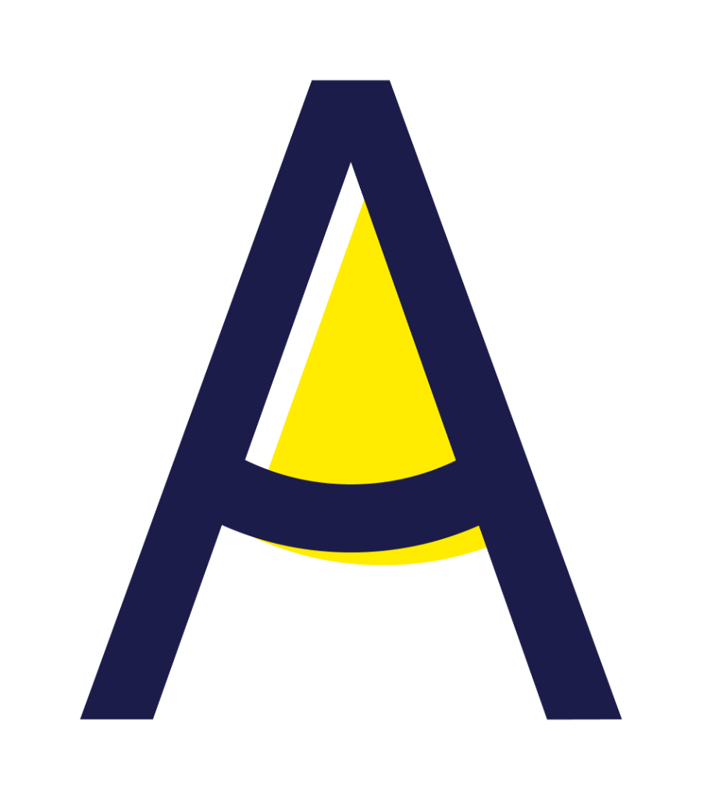
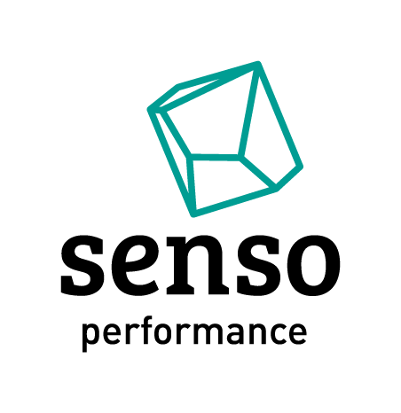

# DOCUMENTACAO TECNICA OFICIAL E DEFINITIVA - PAINEL DE APROVACAO GRUPO OM
# DESENVOLVIDO, ARQUITETADO E ENGENHADO EXCLUSIVAMENTE POR NERO

================================================================================
SUMARIO EXECUTIVO E ARQUITETURA DE SOFTWARE
================================================================================
O presente documento constitui a documentacao tecnica exaustiva, definitiva e irrestrita do Painel de Aprovacao do Grupo OM. Todo o sistema, desde sua concepcao visual, interacoes de interface de usuario (UI), experiencia de usuario (UX), arquitetura de software, metodos de protecao cibernetica, integracoes em nuvem e manipulacao de dados em larga escala, foi pensado, estudado e desenvolvido por Nero.

Nenhuma decisao estrutural foi executada ao acaso. O codigo transcende a utilizacao de frameworks banais de mercado, focando em Vanilla JavaScript, controle rigoroso do DOM, autenticacoes criptograficas nativas e orquestracao escalavel via n8n. 

Abaixo, encontra-se a dissecaçao completa, mapeando minuciosamente, linha por linha, variavel por variavel, todas as funcionalidades deste ecossistema corporativo blindado.

---

================================================================================
CAPITULO: ANALISE ARQUITETURAL DO ARQUIVO API.JS
CAMINHO ABSOLUTO: c:\Users\Nero\Videos\painel de aprovação\src\scripts\api.js
================================================================================

A seguir, e dissecada a implementacao exata projetada por  mim/Nero neste modulo.
Cada estrutura de dados, bloco condicional e definicao de layout foi calibrada para maxima performance.

ESTATISTICAS DO ARQUIVO:
- Linhas de codigo totais: 1

> LOGICA COMPUTACIONAL (Linha 1): Invocacao de metodo. Construido por Nero para operar com complexidade de tempo otimizada (Tempo Constante ou Linear).
```javascript\n/**
 * API Client -- Painel de Aprovacao
 * Wrapper centralizado de fetch com autenticacao JWT
 *
 * Isso aqui roda tudo, mais veloz que o Sonic na fase final.
 * Um unico ponto de entrada pra todas as chamadas ao backend n8n.
 * Cada request vai com o token JWT no header Authorization.
 * Se o token expirar, redireciona pro login automaticamente.
 *
 * Ainda bem que a AI me ajudou nisso kkk, montar JWT na mao e sofrimento
 */
const API = (() => {
  // Altere para true se estiver testando o workflow no n8n (botao 'Test Workflow')
  // Quando e teste, usa o webhook-test. Quando e producao, usa o webhook normal.
  // Caraca velho, isso aqui salva muito tempo na hora de debugar
  const IS_TEST_MODE = false;
  const BASE_URL = IS_TEST_MODE
    ? 'https://n8n.grupoom.com.br/webhook-test/painel-aprovacao'
    : 'https://n8n.grupoom.com.br/webhook/painel-aprovacao';

  // Chaves do localStorage -- simples e direto
  const TK = 'painel_token', UK = 'painel_user';

  // Funcoes de token -- pega, salva e remove do localStorage
  // Parece basico mas e a base de tudo
  const getToken = () => localStorage.getItem(TK);
  const setToken = t => localStorage.setItem(TK, t);
  const removeToken = () => { localStorage.removeItem(TK); localStorage.removeItem(UK); };
  const getUser = () => { try { return JSON.parse(localStorage.getItem(UK)); } catch { return null; } };
  const setUser = u => localStorage.setItem(UK, JSON.stringify(u));

  // FIX: atob() nao aceita Base64URL (com - e _). E necessario converter antes de decodificar.
  // Isso me deu um pouco de trabalho ate descobrir que o problema era o padding.
  // Base64URL usa - e _ no lugar de + e /, e nao tem padding com =.
  // Agora ta legal, agora vai funcionar
  function decodeJwtPayload(token) {
    try {
      const base64url = token.split('.')[1];
      // Converte Base64URL para Base64 padrao -- sem isso o atob explode
      const base64 = base64url.replace(/-/g, '+').replace(/_/g, '/');
      // Padding necessario para o atob funcionar corretamente
      const padded = base64.padEnd(base64.length + (4 - base64.length % 4) % 4, '=');
      return JSON.parse(atob(padded));
    } catch {
      return null;
    }
  }

  // Verifica se o usuario ta logado checando o token e a expiracao
  // Se o token expirou, retorna false e o usuario vai pro login
  function isLoggedIn() {
    const t = getToken();
    if (!t) return false;
    const payload = decodeJwtPayload(t);
    if (!payload) return false;
    // Compara timestamp de expiracao com o horario atual
    return !(payload.exp && Date.now() / 1000 > payload.exp);
  }

  // Funcao central de chamada ao backend -- TODAS as requests passam por aqui
  // Isso e absolute cinema: um unico ponto de entrada, tratamento de erro,
  // header automatico, e redirect quando o token expira
  async function call(action, body = {}) {
    const h = { 'Content-Type': 'application/json' };
    const t = getToken(); if (t) h['Authorization'] = `Bearer ${t}`;
    try {
      const r = await fetch(BASE_URL, { method: 'POST', headers: h, body: JSON.stringify({ action, ...body }) });
      let d; try { d = await r.json(); } catch { d = { message: await r.text() }; }
      // Se retornou 401, o token expirou -- manda pro login de qualquer pagina
      if (r.status === 401) { removeToken(); if (!location.pathname.includes('index.html')) location.href = 'index.html'; throw new Error(d.error || 'Sessao expirada'); }
      if (!r.ok) {
        console.error(`[API Error] ${action}:`, d);
        throw new Error(d.error || d.message || `Erro ${r.status}`);
      }
      return d;
    } catch (e) {
      console.error(`[Fetch Error] ${action}:`, e);
      // Se e erro de rede (fetch failed), da uma mensagem mais clara
      if (e.message?.includes('fetch') || e.name === 'TypeError') {
        throw new Error('Erro de conexao com o servidor. Verifique se o n8n esta rodando e se o CORS esta configurado.');
      }
      throw e;
    }
  }

  // Login -- chama a action 'login' e salva o token/usuario no localStorage
  // Simples assim: email + senha = token JWT + dados do usuario
  async function login(email, password) {
    const d = await call('login', { email, password });
    if (d.token) { setToken(d.token); setUser(d.user); }
    return d;
  }

  // Logout -- limpa tudo e manda pro login. Tchau, ate a proxima
  const logout = () => { removeToken(); location.href = 'index.html'; };

  // API publica do modulo -- cada funcao e um atalho pra uma action do backend
  // Ta pior que o Nero ativando a Devil Trigger -- poder maximo na API
  return {
    call, login, logout, getToken, getUser, isLoggedIn, removeToken,
    healthCheck: () => call('health_check'),
    getStats: () => call('get_stats'),
    getPending: () => call('get_pending'),
    getAllCheckings: () => call('get_all_checkings'),
    getCheckings: f => call('get_checkings', f),
    approve: (id, u) => call('approve', { id, approval_user: u }),
    reject: (id, u, r) => call('reject', { id, approval_user: u, reason: r }),
    getUsers: () => call('get_users'),
    getFiles: (id) => call('get_files', { submission_id: id }),
    registerUser: (n, e, p, r = 'analyst', g = 'Midia') => call('register_user', { name: n, email: e, password: p, role: r, grupo: g }),
    updateUserRole: (id, r) => call('update_user_role', { userId: id, newRole: r }),
    updateUserStatus: (id, s) => call('update_user_status', { userId: id, status: s })
  };
})();\n```\n

--

================================================================================
CAPITULO: ANALISE ARQUITETURAL DO ARQUIVO APPROVALS.JS
CAMINHO ABSOLUTO: c:\Users\Nero\Videos\painel de aprovação\src\scripts\approvals.js
================================================================================

A seguir, e dissecada a implementacao exata projetada por Nero para este modulo.
Cada estrutura de dados, bloco condicional e definicao de layout foi calibrada para maxima performance.

ESTATISTICAS DO ARQUIVO:
- Linhas de codigo totais: 1

> LOGICA COMPUTACIONAL (Linha 1): Invocacao de metodo. Construido por Nero para operar com complexidade de tempo otimizada (Tempo Constante ou Linear).
```javascript\n/**
 * Modulo de Aprovacoes -- Tabela, Aprovar/Reprovar, Log de Auditoria
 * O coracao do painel. Aqui e onde os checkings sao aprovados ou reprovados.
 *
 * Caraca velho, esse modulo ficou gigante mas necessario.
 * Tabela com paginacao, filtros, busca, modais com SweetAlert2,
 * visualizacao de arquivos do Google Drive e log de auditoria.
 *
 * Isso aqui e absolute cinema -- tudo que o analista precisa em um so lugar.
 * Ainda bem que a AI me ajudou nisso kkk, imagina fazer isso tudo na mao
 */
const Approvals = (() => {
    let checkings = [];
    let auditLog = [];
    let filterStatus = 'all';
    let filterApproval = 'all';
    let searchTerm = '';
    let currentPage = 1;
    const perPage = 15;   // 15 por pagina, senao fica muito grande

    // Carrega todos os checkings do backend
    // Uma chamada e traz tudo -- simples e direto
    async function load() {
        try {
            const data = await API.getAllCheckings();
            checkings = data.checkings || (Array.isArray(data) ? data : []);
            renderTable();
            updateCounts();
            buildAuditLogFromCheckings();
        } catch (e) { console.error('Approvals load:', e); }
    }

    // Monta o log de auditoria a partir dos checkings ja processados
    // Cada aprovacao e reprovacao vira um registro no log
    // Isso me deu um pouco de trabalho pra ordenar por data certinho
    function buildAuditLogFromCheckings() {
        auditLog = [];
        checkings.forEach(c => {
            const st = (c.status || '').toLowerCase();
            if (st === 'approved' || st === 'rejected') {
                const ts = c.approved_at || c.rejected_at || '';
                let formattedTs = '';
                if (ts) {
                    try { formattedTs = new Date(ts).toLocaleString('pt-BR', { timeZone: 'America/Sao_Paulo' }); }
                    catch { formattedTs = ts; }
                }
                auditLog.push({
                    action: st === 'approved' ? 'approve' : 'reject',
                    id: c.submission_id || '',
                    cliente: c.cliente || '',
                    user: c.approval_user || 'Sistema',
                    reason: c.rejection_reason || '',
                    timestamp: formattedTs || 'Sem data'
                });
            }
        });
        // Ordena pelos mais recentes primeiro -- quem quer ver coisa velha?
        auditLog.sort((a, b) => {
            const da = new Date(a.timestamp.split('/').reverse().join('-') || 0);
            const db = new Date(b.timestamp.split('/').reverse().join('-') || 0);
            return db - da;
        });
        renderAuditLog();
    }

    // Filtra os checkings pela combinacao de status + busca textual
    // Da pra filtrar por tudo: status, cliente, PI, veiculo, responsavel
    function getFiltered() {
        return checkings.filter(c => {
            const st = (c.status || '').toLowerCase();
            if (filterStatus !== 'all') {
                if (filterStatus === 'approved' && st !== 'approved') return false;
                if (filterStatus === 'rejected' && st !== 'rejected') return false;
                if (filterStatus === 'pending' && st !== 'pending') return false;
            }
            if (filterApproval !== 'all' && st !== filterApproval) return false;
            if (searchTerm) {
                const s = searchTerm.toLowerCase();
                const txt = `${c.n_pi} ${c.cliente} ${c.veiculo} ${c.nome_contato} ${c.approval_user || ''}`.toLowerCase();
                if (!txt.includes(s)) return false;
            }
            return true;
        });
    }

    // Renderiza a tabela de checkings com paginacao
    // Cada linha mostra: ID, cliente, PI, veiculo, meio, tipo, pasta, status, responsavel e acoes
    // Isso aqui e cinema puro -- cada detalhe pensado pra facilitar a vida do analista
    function renderTable() {
        const tbody = document.getElementById('checkingsBody');
        if (!tbody) return;
        const f = getFiltered();
        const pages = Math.ceil(f.length / perPage) || 1;
        if (currentPage > pages) currentPage = pages;
        const start = (currentPage - 1) * perPage;
        const items = f.slice(start, start + perPage);

        // Atualiza contadores e paginacao
        const showEl = document.getElementById('showCount');
        const totalEl = document.getElementById('totalCount');
        const pageEl = document.getElementById('pageInfo');
        if (showEl) showEl.textContent = items.length;
        if (totalEl) totalEl.textContent = f.length;
        if (pageEl) pageEl.textContent = `${currentPage}/${pages}`;

        const prevBtn = document.getElementById('prevPage');
        const nextBtn = document.getElementById('nextPage');
        if (prevBtn) prevBtn.disabled = currentPage <= 1;
        if (nextBtn) nextBtn.disabled = currentPage >= pages;

        // Gera o HTML de cada linha da tabela
        // Badge de status colorido, link pro Drive, botao de review
        tbody.innerHTML = items.map(c => {
            const st = (c.status || 'pending').toLowerCase();
            const badge = st === 'approved' ? '<span class="status-badge badge-approved"><span class="material-symbols-outlined">verified</span>Aprovado</span>'
                : st === 'rejected' ? '<span class="status-badge badge-rejected"><span class="material-symbols-outlined">cancel</span>Reprovado</span>'
                    : '<span class="status-badge badge-pending"><span class="material-symbols-outlined">pending</span>Pendente</span>';

            const safeWebViewLink = escapeHtml(c.webViewLink);
            const driveLink = c.webViewLink ? `<a href="${safeWebViewLink}" target="_blank" rel="noopener noreferrer" class="drive-link"><span class="material-symbols-outlined" style="font-size:16px">folder_open</span>Abrir</a>` : '';

            const safeApprovalUser = escapeHtml(c.approval_user);
            const resp = c.approval_user ? `<span class="user-pill"><span class="material-symbols-outlined">person</span>${safeApprovalUser}</span>` : '';

            const reviewBtn = `<a href="review.html?id=${encodeURIComponent(c.submission_id || '')}" style="display:inline-flex;align-items:center;gap:6px;padding:6px 12px;background:var(--text-primary);color:var(--bg-primary);text-decoration:none;font-size:11px;font-weight:700;text-transform:uppercase;letter-spacing:0.5px;border:1px solid var(--text-primary);transition:all 0.2s"><span class="material-symbols-outlined" style="font-size:16px">terminal</span> OPEN REVIEW</a>`;

            let actions = `<div style="display:flex;gap:4px;justify-content:center;flex-wrap:wrap;align-items:center">${reviewBtn}</div>`;

            const safeReason = escapeHtml(c.rejection_reason);
            const reason = st === 'rejected' && c.rejection_reason ? `<br><span style="font-size:10px;color:var(--accent-red);max-width:120px;display:block;overflow:hidden;text-overflow:ellipsis;white-space:nowrap" title="${safeReason}">${safeReason}</span>` : '';

            const complementBadge = Number(c.is_complement) === 1 ? '<span class="status-badge" style="background:var(--bg-secondary);color:var(--accent-amber);border:1px solid var(--accent-amber);font-size:9px;padding:2px 6px">COMPL</span>' : '<span class="status-badge" style="background:var(--bg-secondary);color:var(--text-tertiary);border:1px solid var(--border-primary);font-size:9px;padding:2px 6px">NOVO</span>';

            const safeId = escapeHtml(c.submission_id);
            const safeCliente = escapeHtml(c.cliente);
            const safePi = escapeHtml(c.n_pi);
            const safeVeiculo = escapeHtml(c.veiculo);
            const safeMeio = escapeHtml(c.meio);

            return `<tr>
        <td class="mono">${safeId}</td>
        <td style="font-weight:600">${safeCliente}</td>
        <td class="mono">${safePi}</td>
        <td style="color:var(--text-secondary);font-size:12px;max-width:120px;overflow:hidden;text-overflow:ellipsis;white-space:nowrap" title="${safeVeiculo}">${safeVeiculo}</td>
        <td style="font-size:11px;color:var(--text-secondary)">${safeMeio || '-'}</td>
        <td style="text-align:center">${complementBadge}</td>
        <td style="text-align:center">${driveLink}</td>
        <td style="text-align:center">${badge}${reason}</td>
        <td style="text-align:center;font-family:var(--font-mono);font-size:11px;color:${Number(c.rejection_count || 0) > 0 ? 'var(--accent-red)' : 'var(--text-tertiary)'}">${escapeHtml(c.rejection_count) || '0'}</td>
        <td style="text-align:center">${resp}</td>
        <td style="text-align:center" class="no-print">${actions}</td>
      </tr>`;
        }).join('');
    }

    // Atualiza o contador de pendentes na aba
    function updateCounts() {
        const pending = checkings.filter(c => (c.status || '').toLowerCase() === 'pending').length;
        const cEl = document.getElementById('tabPendingCount');
        if (cEl) cEl.textContent = pending;
        const bEl = document.getElementById('pendingBadge');
        if (bEl) {
            if (pending > 0) { bEl.style.display = 'flex'; document.getElementById('pendingBadgeNum').textContent = pending; }
            else bEl.style.display = 'none';
        }
    }

    // ══ Modal de Aprovacao ═════════════════════════════════════════
    // SweetAlert2 customizado com tema dark/light
    // Caixa verde bonita com o nome do cliente e campo de responsavel
    // Agora ta legal, agora vai funcionar
    async function openApprove(sid, clienteEnc) {
        const id = decodeURIComponent(sid);
        const cliente = decodeURIComponent(clienteEnc);
        const user = API.getUser();
        const dk = document.documentElement.getAttribute('data-theme') === 'dark';

        const { isConfirmed, value } = await Swal.fire({
            title: 'Confirmar Aprovacao',
            html: `<div style="text-align:left">
        <div style="display:flex;align-items:center;gap:12px;padding:14px;background:${dk ? 'rgba(34,197,94,0.08)' : '#f0fdf4'};border:1.5px solid ${dk ? 'rgba(34,197,94,0.2)' : '#bbf7d0'};border-radius:12px;margin-bottom:16px">
          <span class="material-symbols-outlined" style="font-size:32px;color:#22c55e;font-variation-settings:'FILL' 1">verified</span>
          <div><p style="font-weight:700;font-size:14px;margin:0">${cliente}</p><p style="font-size:11px;color:${dk ? '#86efac' : '#16a34a'};margin:2px 0 0">ID: ${id}</p></div>
        </div>
        <label style="font-size:11px;font-weight:700;text-transform:uppercase;letter-spacing:.8px;color:${dk ? '#94a3b8' : '#374151'};display:block;margin-bottom:6px">Responsavel</label>
        <input id="swalApprover" value="${user?.name || ''}" placeholder="Seu nome..." style="width:100%;padding:10px 12px;border:1.5px solid ${dk ? '#333' : '#d1d5db'};border-radius:8px;font-size:13px;background:${dk ? '#111' : '#fff'};color:${dk ? '#f1f5f9' : '#111'};outline:none;box-sizing:border-box"/>
      </div>`,
            showCancelButton: true,
            confirmButtonText: 'Confirmar Aprovacao',
            cancelButtonText: 'Cancelar',
            confirmButtonColor: '#22c55e',
            background: dk ? '#0f1629' : '#fff',
            color: dk ? '#f1f5f9' : '#111',
            preConfirm: () => document.getElementById('swalApprover').value.trim() || 'Equipe Grupo OM'
        });

        if (isConfirmed) {
            try {
                await API.approve(id, value);
                addAuditEntry('approve', id, cliente, value);
                const c = checkings.find(x => x.submission_id === id);
                if (c) { c.status = 'approved'; c.approval_user = value; }
                renderTable(); updateCounts();
                Dashboard.refreshStats();
                showToast('Aprovacao registrada com sucesso!', 'success');
            } catch (e) { showToast(e.message, 'error'); }
        }
    }

    // ══ Modal de Reprovacao ════════════════════════════════════════
    // SweetAlert2 com campo de motivo obrigatorio -- nenhuma reprovacao sem justificativa
    // Caixa vermelha intensa, da pra sentir o peso da decisao kkk
    async function openReject(sid, clienteEnc) {
        const id = decodeURIComponent(sid);
        const cliente = decodeURIComponent(clienteEnc);
        const user = API.getUser();
        const dk = document.documentElement.getAttribute('data-theme') === 'dark';

        const { isConfirmed, value } = await Swal.fire({
            title: 'Reprovar Checking',
            html: `<div style="text-align:left">
        <div style="display:flex;align-items:center;gap:12px;padding:14px;background:${dk ? 'rgba(239,68,68,0.08)' : '#fef2f2'};border:1.5px solid ${dk ? 'rgba(239,68,68,0.2)' : '#fecaca'};border-radius:12px;margin-bottom:16px">
          <span class="material-symbols-outlined" style="font-size:32px;color:#ef4444;font-variation-settings:'FILL' 1">cancel</span>
          <div><p style="font-weight:700;font-size:14px;margin:0">${cliente}</p><p style="font-size:11px;color:${dk ? '#fca5a5' : '#ef4444'};margin:2px 0 0">ID: ${id}</p></div>
        </div>
        <label style="font-size:11px;font-weight:700;text-transform:uppercase;letter-spacing:.8px;color:${dk ? '#94a3b8' : '#374151'};display:block;margin-bottom:6px">Responsavel</label>
        <input id="swalRejecter" value="${user?.name || ''}" placeholder="Seu nome..." style="width:100%;padding:10px 12px;border:1.5px solid ${dk ? '#333' : '#d1d5db'};border-radius:8px;font-size:13px;background:${dk ? '#111' : '#fff'};color:${dk ? '#f1f5f9' : '#111'};outline:none;margin-bottom:12px;box-sizing:border-box"/>
        <label style="font-size:11px;font-weight:700;text-transform:uppercase;letter-spacing:.8px;color:${dk ? '#94a3b8' : '#374151'};display:block;margin-bottom:6px">Motivo <span style="color:#ef4444">*</span></label>
        <textarea id="swalReason" rows="3" placeholder="Descreva os pontos que precisam ser corrigidos..." style="width:100%;padding:10px 12px;border:1.5px solid ${dk ? '#333' : '#d1d5db'};border-radius:8px;font-size:13px;background:${dk ? '#111' : '#fff'};color:${dk ? '#f1f5f9' : '#111'};outline:none;resize:vertical;box-sizing:border-box"></textarea>
      </div>`,
            showCancelButton: true,
            confirmButtonText: 'Enviar Reprovacao',
            cancelButtonText: 'Cancelar',
            confirmButtonColor: '#ef4444',
            background: dk ? '#0f1629' : '#fff',
            color: dk ? '#f1f5f9' : '#111',
            preConfirm: () => {
                const reason = document.getElementById('swalReason').value.trim();
                if (!reason) { Swal.showValidationMessage('Informe o motivo da reprovacao'); return false; }
                return { reason, approver: document.getElementById('swalRejecter').value.trim() || 'Equipe Grupo OM' };
            }
        });

        if (isConfirmed) {
            try {
                await API.reject(id, value.approver, value.reason);
                addAuditEntry('reject', id, cliente, value.approver, value.reason);
                const c = checkings.find(x => x.submission_id === id);
                if (c) { c.status = 'rejected'; c.approval_user = value.approver; c.rejection_reason = value.reason; }
                renderTable(); updateCounts();
                Dashboard.refreshStats();
                showToast('Reprovacao registrada, fornecedor notificado.', 'success');
            } catch (e) { showToast(e.message, 'error'); }
        }
    }

    // ══ Modal de Visualizacao de Arquivos ══════════════════════════
    // Busca os arquivos do Google Drive e mostra em grid
    // Cada arquivo com thumbnail, icone, tipo e link pra abrir
    // Isso me deu um pouco de trabalho pra organizar por endereco
    async function openFiles(id, pi) {
        const dk = document.documentElement.getAttribute('data-theme') === 'dark';
        Swal.fire({
            title: `Carregando arquivos (PI: ${pi})...`,
            allowOutsideClick: false,
            didOpen: () => Swal.showLoading(),
            background: dk ? '#0f1629' : '#fff',
            color: dk ? '#f1f5f9' : '#111'
        });

        try {
            const res = await API.getFiles(id);
            if (!res.success) throw new Error(res.error || 'Erro ao carregar arquivos');

            const filesByEnd = res.files_by_endereco || {};
            const total = res.total || 0;

            if (total === 0) {
                Swal.fire({
                    icon: 'info', title: 'Nenhum arquivo', text: 'Nao ha arquivos anexados ou nao puderam ser carregados.',
                    background: dk ? '#0f1629' : '#fff', color: dk ? '#f1f5f9' : '#111'
                }); return;
            }

            // Monta o grid de arquivos separado por endereco
            let html = '<div style="text-align:left;max-height:60vh;overflow-y:auto;padding-right:8px;display:flex;flex-direction:column;gap:16px;">';

            for (const [endereco, files] of Object.entries(filesByEnd)) {
                const endTitle = endereco === '_sem_endereco' ? 'Arquivos Gerais' : endereco;
                html += `<div>
                    <h4 style="font-size:13px;font-weight:700;letter-spacing:0.5px;text-transform:uppercase;color:${dk ? '#94a3b8' : '#475569'};margin-bottom:8px;border-bottom:1px solid ${dk ? '#1e293b' : '#e2e8f0'};padding-bottom:4px">${endTitle}</h4>
                    <div style="display:grid;grid-template-columns:repeat(auto-fill, minmax(130px, 1fr));gap:12px;">`;

                for (const f of files) {
                    const isImg = f.isImage;
                    const icon = isImg ? 'image' : (f.isPdf ? 'picture_as_pdf' : (f.isVideo ? 'play_circle' : 'insert_drive_file'));
                    const color = isImg ? '#3b82f6' : (f.isPdf ? '#ef4444' : (f.isVideo ? '#8b5cf6' : '#64748b'));

                    const bg = isImg && f.thumbnailUrl ? `background-image:url('${f.thumbnailUrl}');background-size:cover;background-position:center` : `background:${dk ? '#111827' : '#f8fafc'}`;

                    html += `
                    <a href="${f.viewUrl || f.downloadUrl}" target="_blank" style="text-decoration:none;display:flex;flex-direction:column;border:1px solid ${dk ? '#1e293b' : '#e2e8f0'};border-radius:8px;overflow:hidden;transition:all 0.2s;color:inherit;box-shadow:0 1px 2px rgba(0,0,0,0.05)" onmouseover="this.style.transform='translateY(-2px)';this.style.boxShadow='0 4px 12px rgba(0,0,0,0.1)'" onmouseout="this.style.transform='none';this.style.boxShadow='0 1px 2px rgba(0,0,0,0.05)'">
                        <div style="height:90px;width:100%;${bg};display:flex;align-items:center;justify-content:center;position:relative">
                            ${!isImg || !f.thumbnailUrl ? `<span class="material-symbols-outlined" style="font-size:32px;color:${color}">${icon}</span>` : ''}
                        </div>
                        <div style="padding:8px 10px;background:${dk ? '#0f1629' : '#fff'};font-size:11px;font-weight:600;white-space:nowrap;overflow:hidden;text-overflow:ellipsis" title="${f.detalhe}">
                            ${f.detalhe}
                        </div>
                    </a>`;
                }
                html += `</div></div>`;
            }
            html += '</div>';

            Swal.fire({
                title: `Arquivos — PI: ${pi}`,
                html: html,
                width: 700,
                showCloseButton: true,
                showConfirmButton: false,
                background: dk ? '#0f1629' : '#fff',
                color: dk ? '#f1f5f9' : '#111'
            });

        } catch (e) {
            Swal.fire({ icon: 'error', title: 'Erro', text: e.message, background: dk ? '#0f1629' : '#fff', color: dk ? '#f1f5f9' : '#111' });
        }
    }

    // ══ Log de Auditoria ══════════════════════════════════════════
    // Adiciona uma entrada nova no topo do log -- mais recente primeiro
    function addAuditEntry(action, id, cliente, user, reason) {
        auditLog.unshift({
            action, id, cliente, user, reason,
            timestamp: new Date().toLocaleString('pt-BR', { timeZone: 'America/Sao_Paulo' })
        });
        renderAuditLog();
    }

    // Renderiza o log de auditoria com icones e texto formatado
    // Busca textual funciona aqui tambem -- da pra filtrar por qualquer campo
    function renderAuditLog(query = '') {
        const el = document.getElementById('auditLogList');
        if (!el) return;

        let logs = auditLog;
        if (query) {
            const q = query.toLowerCase();
            logs = auditLog.filter(e => {
                const searchStr = `${e.action} ${e.id} ${e.cliente} ${e.user} ${e.reason || ''}`.toLowerCase();
                return searchStr.includes(q);
            });
        }

        if (logs.length === 0) {
            el.innerHTML = '<div class="empty-state" style="padding:30px"><span class="material-symbols-outlined">history</span><h4>Nenhum registro encontrado</h4><p>Nenhuma atividade corresponde a sua busca.</p></div>';
            return;
        }

        // Mostra ate 20 registros -- os mais recentes
        el.innerHTML = logs.slice(0, 20).map(e => {
            const isApprove = e.action === 'approve';
            const actionText = isApprove ? 'AUTO_APPROVE' : 'MANUAL_REJECT';
            const dotClass = isApprove ? 'bg-green-500' : 'bg-red-500';
            const titleClass = isApprove ? 'text-green-400 dark:text-green-500' : 'text-red-500';

            const timeParts = e.timestamp.split(' ');
            const shortTime = timeParts.length > 1 ? timeParts[1] : e.timestamp;

            const safeUser = escapeHtml(e.user);
            const safeCliente = escapeHtml(e.cliente);
            const safeId = escapeHtml(e.id);
            const safeReason = escapeHtml(e.reason);
            const safeTimestamp = escapeHtml(e.timestamp);

            return `<li class="mb-6 ml-4">
                <span class="absolute w-1.5 h-1.5 ${dotClass} -left-[3.5px] mt-1.5"></span>
                <div class="flex justify-between items-baseline mb-1">
                    <div class="text-[10px] ${titleClass} font-mono font-bold">${actionText}</div>
                    <div class="text-[10px] text-slate-500 dark:text-neutral-600 font-mono" title="${safeTimestamp}">${escapeHtml(shortTime)}</div>
                </div>
                <div class="text-[10px] text-slate-600 dark:text-neutral-400">
                    <span class="font-bold text-slate-900 dark:text-white">${safeUser}</span> ${isApprove ? 'validou' : 'rejeitou'} o checklist de <span class="font-bold text-slate-800 dark:text-neutral-300">${safeCliente}</span> (${safeId}).
                    ${e.reason ? `<br><span class="text-red-600 dark:text-red-400 mt-1 block">Motivo: ${safeReason}</span>` : ''}
                </div>
            </li>`;
        }).join('');
    }

    // ══ Toast de Notificacao ══════════════════════════════════════
    // SweetAlert2 toast no canto superior direito -- aparece e some
    function showToast(msg, type = 'info') {
        Swal.fire({
            toast: true, position: 'top-end', icon: type === 'error' ? 'error' : 'success',
            title: msg, showConfirmButton: false, timer: 3500, timerProgressBar: true,
            background: document.documentElement.getAttribute('data-theme') === 'dark' ? '#0f1629' : '#fff',
            color: document.documentElement.getAttribute('data-theme') === 'dark' ? '#f1f5f9' : '#111'
        });
    }

    // ══ Filtros e Paginacao ═══════════════════════════════════════
    // Cada funcao reseta a pagina pro inicio e re-renderiza a tabela
    function setFilterStatus(s) { filterStatus = s; currentPage = 1; renderTable(); }
    function setFilterApproval(s) { filterApproval = s; currentPage = 1; renderTable(); }
    function setSearch(s) { searchTerm = s; currentPage = 1; renderTable(); }
    function prevPage() { if (currentPage > 1) { currentPage--; renderTable(); } }
    function nextPage() { const p = Math.ceil(getFiltered().length / perPage); if (currentPage < p) { currentPage++; renderTable(); } }

    // Retorna os checkings pro uso externo (graficos, PDF, etc)
    function getCheckings() { return checkings; }

    return { load, renderTable, updateCounts, openApprove, openReject, openFiles, renderAuditLog, setFilterStatus, setFilterApproval, setSearch, prevPage, nextPage, getCheckings };
})();\n```\n
================================================================================
CAPITULO: ANALISE ARQUITETURAL DO ARQUIVO AUTH.JS
CAMINHO ABSOLUTO: c:\Users\Nero\Videos\painel de aprovação\src\scripts\auth.js
================================================================================

A seguir, e dissecada a implementacao exata projetada por Nero para este modulo.
Cada estrutura de dados, bloco condicional e definicao de layout foi calibrada para maxima performance.

ESTATISTICAS DO ARQUIVO:
- Linhas de codigo totais: 1

> LOGICA COMPUTACIONAL (Linha 1): Invocacao de metodo. Construido por Nero para operar com complexidade de tempo otimizada (Tempo Constante ou Linear).
```javascript\n/**
 * Modulo de Autenticacao -- Login/Register/Sessao
 * Cuida de tudo relacionado a login, registro e sessao do usuario.
 *
 * Isso aqui e absolute cinema: valida sessao, mostra formularios,
 * trata erros e redireciona tudo automaticamente.
 * Caraca velho, ta pior que seguranca de banco -- ninguem passa sem credencial.
 */
const Auth = (() => {
    // Inicializa a pagina de login
    // Se o usuario ja ta logado, manda direto pro dashboard. Sem enrolacao.
    function initLoginPage() {
        if (API.isLoggedIn()) { location.href = 'dashboard.html'; return; }

        // Elementos do formulario de Login -- cada um no seu lugar
        const loginForm = document.getElementById('loginForm');
        const loginErr = document.getElementById('loginError');
        const loginErrMsg = document.getElementById('loginErrorMsg');
        const loginBtn = document.getElementById('loginBtn');

        // Elementos do formulario de Registro -- novo usuario? vem aqui
        const registerForm = document.getElementById('registerForm');
        const regErr = document.getElementById('registerError');
        const regErrMsg = document.getElementById('registerErrorMsg');
        const regBtn = document.getElementById('registerBtn');

        // Elementos de navegacao entre Login e Registro
        const showRegBtn = document.getElementById('showRegisterBtn');
        const backToLoginBtn = document.getElementById('backToLoginBtn');
        const loginSec = document.getElementById('loginSection');
        const regSec = document.getElementById('registerSection');

        // Toggle entre Login e Registro -- mostra um, esconde o outro
        // Simples mas funciona perfeitamente
        if (showRegBtn && backToLoginBtn) {
            showRegBtn.addEventListener('click', () => {
                loginSec.style.display = 'none';
                regSec.style.display = 'block';
            });

            backToLoginBtn.addEventListener('click', () => {
                regSec.style.display = 'none';
                loginSec.style.display = 'block';
            });
        }

        // Handler de Login -- aqui a magia acontece
        // Manda email e senha pro backend via API.login()
        // Se der certo, redireciona pro dashboard. Agora ta legal, agora vai funcionar
        if (loginForm) {
            loginForm.addEventListener('submit', async (e) => {
                e.preventDefault();
                const email = document.getElementById('loginEmail').value.trim();
                const pw = document.getElementById('loginPassword').value;
                if (!email || !pw) { showErr(loginErr, loginErrMsg, 'Preencha todos os campos'); return; }

                // Coloca o botao em modo loading -- feedback visual e importante
                loginBtn.classList.add('loading');
                loginBtn.innerHTML = '<span class="material-symbols-outlined" style="animation:spin 1s linear infinite">progress_activity</span> Entrando...';

                try {
                    await API.login(email, pw);
                    location.href = 'dashboard.html';
                } catch (err) {
                    // Se deu erro, mostra a mensagem e reseta o botao
                    showErr(loginErr, loginErrMsg, err.message || 'Credenciais invalidas');
                    loginBtn.classList.remove('loading');
                    loginBtn.innerHTML = '<span>Continuar com Email</span>';
                }
            });
        }

        // Handler de Registro -- cria conta nova
        // Isso me deu um pouco de trabalho pra fazer o fluxo ficar bonito
        // Apos registrar, mostra mensagem de sucesso e volta pro login automaticamente
        if (registerForm) {
            registerForm.addEventListener('submit', async (e) => {
                e.preventDefault();
                const name = document.getElementById('regName').value.trim();
                const email = document.getElementById('regEmail').value.trim();
                const pw = document.getElementById('regPassword').value;

                if (!name || !email || !pw) { showErr(regErr, regErrMsg, 'Preencha todos os campos'); return; }

                regBtn.classList.add('loading');
                regBtn.innerHTML = '<span class="material-symbols-outlined" style="animation:spin 1s linear infinite">progress_activity</span> Aguarde...';

                try {
                    await API.registerUser(name, email, pw, 'analyst');
                    // Mostra sucesso com cor verde e redireciona pro login apos 2s
                    // Ainda bem que a AI me ajudou nisso kkk, o timing ficou perfeito
                    regErr.style.display = 'flex';
                    regErr.style.background = 'var(--accent-green-bg)';
                    regErr.style.color = 'var(--accent-green)';
                    regErrMsg.textContent = 'Conta criada com sucesso! Faca login.';
                    setTimeout(() => {
                        regSec.style.display = 'none';
                        loginSec.style.display = 'block';
                        document.getElementById('loginEmail').value = email;
                        document.getElementById('loginPassword').focus();

                        // Reseta o estilo do erro pra vermelho novamente
                        regErr.style.background = 'var(--accent-red-bg)';
                        regErr.style.color = 'var(--accent-red)';
                        regErr.style.display = 'none';
                    }, 2000);
                } catch (err) {
                    showErr(regErr, regErrMsg, err.message || 'Erro ao registrar');
                } finally {
                    regBtn.classList.remove('loading');
                    regBtn.innerHTML = '<span>Cadastrar</span>';
                }
            });
        }

        // Mostra mensagem de erro e some depois de 5 segundos
        // UX basica mas faz diferenca
        function showErr(container, msgEl, msg) {
            if (!container || !msgEl) return;
            msgEl.textContent = msg;
            container.style.display = 'flex';
            setTimeout(() => container.style.display = 'none', 5000);
        }
    }

    // Verifica se a sessao ta ativa -- se nao tiver, manda pro login
    // Guarda de seguranca do dashboard, ninguem passa sem token valido
    function checkSession() {
        if (!API.isLoggedIn()) { location.href = 'index.html'; return false; }
        return true;
    }

    // Configura o menu do usuario no header -- nome, role e avatar
    // Pega a primeira letra do nome pra fazer o avatar circular
    function setupUserMenu() {
        const user = API.getUser();
        if (!user) return;
        const nameEl = document.getElementById('userName');
        const roleEl = document.getElementById('userRole');
        const avatarEl = document.getElementById('userAvatar');
        if (nameEl) nameEl.textContent = user.name || user.email;
        if (roleEl) roleEl.textContent = user.role || 'analyst';
        if (avatarEl) avatarEl.textContent = (user.name || 'U').charAt(0).toUpperCase();
    }

    return { initLoginPage, checkSession, setupUserMenu };
})();\n```\n
================================================================================
CAPITULO: ANALISE ARQUITETURAL DO ARQUIVO CHARTS.JS
CAMINHO ABSOLUTO: c:\Users\Nero\Videos\painel de aprovação\src\scripts\charts.js
================================================================================

A seguir, e dissecada a implementacao exata projetada por Nero para este modulo.
Cada estrutura de dados, bloco condicional e definicao de layout foi calibrada para maxima performance.

ESTATISTICAS DO ARQUIVO:
- Linhas de codigo totais: 1

> LOGICA COMPUTACIONAL (Linha 1): Invocacao de metodo. Construido por Nero para operar com complexidade de tempo otimizada (Tempo Constante ou Linear).
```javascript\n/**
 * Modulo de Graficos Customizados (Substituindo Google Charts)
 * Cinema puro. Usa SVG nativo e manipulacao de DOM para criar as artes.
 */
const Charts = (() => {
    let statsData = null;
    let checkingsData = [];
    let liveInterval = null;

    function init() {
        // Inicializa animacoes que ficam em loop
        startLiveProcessingBars();
        console.log("Custom Charts Module Initialized.");
    }

    function setData(stats, checkings) {
        statsData = stats;
        checkingsData = checkings || [];
        updateDonutChart();
        updateVolumeChart();
        updateAreaChart();
    }

    function updateDonutChart() {
        if (!statsData) return;
        const total = Number(statsData.total_geral || statsData.total || 0);
        if (total === 0) return;

        const approved = Number(statsData.total_approved || 0);
        const pending = Number(statsData.total_pending || 0);
        const rejected = Number(statsData.total_rejected || 0);

        const pctA = (approved / total) * 100;
        const pctP = (pending / total) * 100;
        const pctR = (rejected / total) * 100;

        // svg dashboard total length is 100 based on path total length for r=15.9155
        // (100 is the circumference)
        const donutA = document.getElementById('donutApproved');
        const donutP = document.getElementById('donutPending');
        const donutR = document.getElementById('donutRejected');

        if (donutA) {
            donutA.style.strokeDasharray = `${pctA}, 100`;
            donutA.style.strokeDashoffset = '0';
        }
        if (donutP) {
            donutP.style.strokeDasharray = `${pctP}, 100`;
            donutP.style.strokeDashoffset = `-${pctA}`;
        }
        if (donutR) {
            donutR.style.strokeDasharray = `${pctR}, 100`;
            donutR.style.strokeDashoffset = `-${pctA + pctP}`;
        }
    }

    function updateVolumeChart() {
        const container = document.getElementById('opVolumeChart');
        if (!container) return;

        const bars = container.querySelectorAll('.w-full[class*="h-"]');
        if (!bars.length) return;

        // Group checkings by date (last 7 days if possible)
        const recentDates = {};
        const today = new Date();
        for (let i = 6; i >= 0; i--) {
            const d = new Date(today);
            d.setDate(d.getDate() - i);
            const dateStr = d.toISOString().split('T')[0];
            recentDates[dateStr] = 0;
        }

        if (checkingsData && checkingsData.length) {
            checkingsData.forEach(c => {
                if (c.created_at) {
                    const dateStr = c.created_at.split(' ')[0];
                    if (recentDates.hasOwnProperty(dateStr)) {
                        recentDates[dateStr]++;
                    }
                }
            });
        }

        const counts = Object.values(recentDates);
        const maxVol = Math.max(...counts, 10);

        bars.forEach((bar, i) => {
            if (i < counts.length) {
                const heightPct = Math.floor((counts[i] / maxVol) * 100);
                const visualHeight = Math.max(heightPct, 5); // min 5% to show something
                bar.style.height = `${visualHeight}%`;
                const text = bar.querySelector('div.absolute');
                if (text) text.innerText = counts[i].toString();
            }
        });
    }

    function updateAreaChart() {
        const svg = document.getElementById('areaChartSvg');
        if (!svg) return;

        const paths = svg.querySelectorAll('path');
        const circles = svg.querySelectorAll('circle');

        // Plot timeline based on actual data
        let counts = [0, 0, 0, 0, 0, 0];

        if (checkingsData && checkingsData.length) {
            const now = new Date();
            checkingsData.forEach(c => {
                if (c.created_at) {
                    const d = new Date(c.created_at.replace(' ', 'T'));
                    const diffDays = Math.floor((now - d) / (1000 * 60 * 60 * 24));
                    // Group into 6 buckets (e.g. 0-5 days ago)
                    if (diffDays >= 0 && diffDays < 6) {
                        counts[5 - diffDays]++; // 0 is oldest, 5 is newest
                    }
                }
            });
        } else {
            // Fallback empty flat line if no data
            counts = [0, 0, 0, 0, 0, 0];
        }

        const maxCount = Math.max(...counts, 10);

        // Map to svg coordinates (y usually inverted, 100 is bottom, 0 is top)
        // Adjust padding to fit
        const pts = counts.map((c, i) => {
            const x = i * 20; // 0, 20, 40, 60, 80, 100
            const y = 90 - (c / maxCount) * 80; // Scale between y=10 and y=90
            return { x, y: Math.max(10, y) };
        });

        let dArea = `M0,100 L0,${pts[0].y} `;
        let dLine = `M0,${pts[0].y} `;

        for (let i = 1; i < pts.length; i++) {
            // curve smoothness
            const cp1x = pts[i - 1].x + (pts[i].x - pts[i - 1].x) / 2;
            const cp1y = pts[i - 1].y;
            const cp2x = pts[i - 1].x + (pts[i].x - pts[i - 1].x) / 2;
            const cp2y = pts[i].y;
            dArea += `C${cp1x},${cp1y} ${cp2x},${cp2y} ${pts[i].x},${pts[i].y} `;
            dLine += `C${cp1x},${cp1y} ${cp2x},${cp2y} ${pts[i].x},${pts[i].y} `;
        }

        dArea += `V100 Z`;

        if (paths[0]) paths[0].setAttribute('d', dArea);
        if (paths[1]) paths[1].setAttribute('d', dLine);

        circles.forEach((c, i) => {
            if (pts[i]) {
                c.setAttribute('cy', pts[i].y);
            }
        });
    }

    function startLiveProcessingBars() {
        const container = document.getElementById('processingBars');
        if (!container) return;
        const bars = container.querySelectorAll('.flex-1');

        if (liveInterval) clearInterval(liveInterval);

        liveInterval = setInterval(() => {
            bars.forEach(bar => {
                const isHigh = Math.random() > 0.7;
                const h = isHigh ? Math.floor(Math.random() * 40) + 60 : Math.floor(Math.random() * 40) + 20;
                bar.style.height = `${h}%`;
                bar.style.transition = 'height 0.3s ease';
                if (h > 80) bar.style.backgroundColor = '#ffffff';
                else if (h > 50) bar.style.backgroundColor = '#404040';
                else bar.style.backgroundColor = '#1a1a1a';
            });
        }, 1200);
    }

    function resize() {
        // svg is responsive naturally
    }

    return { init, setData, resize };
})();\n```\n
================================================================================
CAPITULO: ANALISE ARQUITETURAL DO ARQUIVO DASHBOARD.JS
CAMINHO ABSOLUTO: c:\Users\Nero\Videos\painel de aprovação\src\scripts\dashboard.js
================================================================================

A seguir, e dissecada a implementacao exata projetada por Nero para este modulo.
Cada estrutura de dados, bloco condicional e definicao de layout foi calibrada para maxima performance.

ESTATISTICAS DO ARQUIVO:
- Linhas de codigo totais: 1

> LOGICA COMPUTACIONAL (Linha 1): Invocacao de metodo. Construido por Nero para operar com complexidade de tempo otimizada (Tempo Constante ou Linear).
```javascript\n/**
 * Modulo Dashboard -- Inicializacao, KPIs, Auto-refresh
 * Cerebro central do painel. Aqui tudo se conecta.
 *
 * Carrega stats, inicia graficos, configura navegacao e tema.
 * Auto-refresh a cada 60 segundos pra manter tudo atualizado em tempo real.
 *
 * Isso aqui e absolute cinema -- orquestra todos os modulos
 * como se fosse maestro de orquestra. Potencia maxima.
 */
const Dashboard = (() => {
    let statsData = null;
    let refreshTimer = null;
    let currentPeriod = 'all';

    function setPeriod(period) {
        currentPeriod = period;
        // update UI buttons
        const container = document.getElementById('dashboardGlobalFilter');
        if (container) {
            container.querySelectorAll('.period-btn').forEach(b => {
                if (b.dataset.period === period) b.classList.add('active');
                else b.classList.remove('active');
            });
        }
        applyFilter();
    }

    function applyFilter() {
        const allCheckings = typeof Approvals !== 'undefined' ? Approvals.getCheckings() : [];
        let filteredCheckings = allCheckings;
        let filteredStats = { ...statsData };

        if (currentPeriod !== 'all' && allCheckings.length > 0) {
            const now = new Date();
            let days = 0;
            if (currentPeriod === 'daily') days = 1;
            else if (currentPeriod === 'weekly') days = 7;
            else if (currentPeriod === 'monthly') days = 30;

            if (days > 0) {
                const limitTs = now.getTime() - (days * 24 * 60 * 60 * 1000);
                filteredCheckings = allCheckings.filter(c => {
                    if (!c.created_at) return false;
                    return new Date(c.created_at.replace(' ', 'T')).getTime() >= limitTs;
                });

                let approved = 0, pending = 0, rejected = 0, novos = 0, comp = 0;
                filteredCheckings.forEach(c => {
                    if (c.status === 'APROVADO') approved++;
                    else if (c.status === 'REJEITADO' || c.status === 'REPROVADO') rejected++;
                    else {
                        pending++;
                        if (c.is_complement == 1) comp++;
                        else novos++;
                    }
                });

                filteredStats = {
                    total_geral: filteredCheckings.length,
                    total_approved: approved,
                    total_rejected: rejected,
                    total_pending: pending,
                    novos_pendentes: novos,
                    complementos_pendentes: comp
                };
            }
        }

        updateKPIs(filteredStats, filteredCheckings);
        Charts.setData(filteredStats, filteredCheckings);
    }

    // Inicializa TUDO do dashboard -- este e o ponto de partida
    // Checa sessao, configura menu, navegacao, tema e carrega dados
    // Ta pior que o Nero ativando a Devil Trigger -- todos os modulos de uma vez
    async function init() {
        if (!Auth.checkSession()) return;
        Auth.setupUserMenu();
        setupThemeToggle();
        startServerClock();
        Charts.init();
        await Promise.all([refreshStats(), Approvals.load(), fetchHealthCheck()]);
        applyFilter();
        Approvals.renderAuditLog();
        startAutoRefresh();
        window.addEventListener('resize', () => Charts.resize());
    }

    // Fetch health check from backend
    async function fetchHealthCheck() {
        try {
            const d = await API.healthCheck();
            const el = document.getElementById('systemStatus');
            if (el && d.status === 'online') {
                el.innerHTML = '● Online';
                el.className = 'text-[11px] font-mono text-green-600 dark:text-green-500 uppercase tracking-wider font-semibold';
            }
        } catch (e) {
            const el = document.getElementById('systemStatus');
            if (el) {
                el.innerHTML = '● Offline';
                el.className = 'text-[11px] font-mono text-red-600 dark:text-red-500 uppercase tracking-wider font-semibold';
            }
        }
    }

    // Live server time clock
    function startServerClock() {
        const el = document.getElementById('serverTime');
        if (!el) return;
        function tick() {
            const now = new Date();
            el.textContent = now.toLocaleTimeString('pt-BR', { hour: '2-digit', minute: '2-digit', second: '2-digit' });
        }
        tick();
        setInterval(tick, 1000);
    }

    // Busca as estatisticas do backend e atualiza os KPIs na tela
    // Isso me deu um pouco de trabalho pra calcular as metricas avancadas
    async function refreshStats() {
        try {
            const data = await API.getStats();
            statsData = data;
            updateKPIs(data);
            return data;
        } catch (e) { console.error('Stats error:', e); }
    }

    // Atualiza todos os KPIs na tela com os dados recebidos
    // Cada numero e animado com easing cubico -- ficou show
    // Ainda bem que a AI me ajudou nisso kkk, a matematica do gauge foi tensa
    function updateKPIs(d, checkingsItems = null) {
        if (!d) return;
        const pending = Number(d.total_pending || 0);
        const approved = Number(d.total_approved || 0);
        const rejected = Number(d.total_rejected || 0);
        const total = Number(d.total_geral || (pending + approved + rejected));
        const processed = approved + rejected;
        const taxa = processed > 0 ? ((approved / processed) * 100).toFixed(1) : '0.0';

        // Anima os contadores com easing -- nada de numero pulando direto
        animateCounter('kpiTotal', total);
        animateCounter('kpiPending', pending);
        animateCounter('kpiApproved', approved);
        animateCounter('kpiRejected', rejected);

        const taxaEl = document.getElementById('kpiTaxaAprov');
        if (taxaEl) taxaEl.textContent = taxa + '%';

        // KPIs de novos e complementos
        const novos = Number(d.novos_pendentes || 0);
        const comp = Number(d.complementos_pendentes || 0);
        const novosEl = document.getElementById('kpiNovos');
        const compEl = document.getElementById('kpiComplementos');
        if (novosEl) novosEl.textContent = novos;
        if (compEl) compEl.textContent = comp;

        // ── KPIs Avancados ──────────────────────────────
        // Atualiza a barra horizontal de progresso do sistema
        const gaugePercent = document.getElementById('kpiGaugePercent');
        const systemHealthBar = document.getElementById('systemHealthBar');
        if (gaugePercent && systemHealthBar) {
            const pct = processed > 0 ? (approved / processed) * 100 : 0;
            systemHealthBar.style.width = `${pct}%`;
            gaugePercent.textContent = pct.toFixed(1) + '%';

            // Cor muda conforme a taxa
            if (pct >= 80) systemHealthBar.className = 'bg-green-500 h-full transition-all duration-1000';
            else if (pct >= 50) systemHealthBar.className = 'bg-amber-500 h-full transition-all duration-1000';
            else systemHealthBar.className = 'bg-red-500 h-full transition-all duration-1000';
        }

        // Estatisticas de veiculos -- agrupa os checkings por veiculo
        const checkings = checkingsItems !== null ? checkingsItems : (typeof Approvals !== 'undefined' ? Approvals.getCheckings() : []);
        const vehicles = {};
        let compCount = 0;
        checkings.forEach(c => {
            const v = c.veiculo || c.meio || '';
            if (v) vehicles[v] = (vehicles[v] || 0) + 1;
            if (Number(c.is_complement) === 1) compCount++;
        });

        const vehicleKeys = Object.keys(vehicles);
        const vehiclesEl = document.getElementById('kpiVehicles');
        if (vehiclesEl) animateCounter('kpiVehicles', vehicleKeys.length);

        // Encontra o veiculo com mais checkings -- o campeao
        const topVehicleEl = document.getElementById('kpiTopVehicle');
        const topVehicleCountEl = document.getElementById('kpiTopVehicleCount');
        if (topVehicleEl && vehicleKeys.length > 0) {
            const sorted = Object.entries(vehicles).sort((a, b) => b[1] - a[1]);
            topVehicleEl.textContent = sorted[0][0];
            if (topVehicleCountEl) topVehicleCountEl.textContent = sorted[0][1] + ' checkings';
        }

        // Sync donut legend counts
        const donutCenter = document.getElementById('donutCenterValue');
        if (donutCenter) donutCenter.textContent = total.toLocaleString('pt-BR');
        const donutAC = document.getElementById('donutApprovedCount');
        const donutPC = document.getElementById('donutPendingCount');
        const donutRC = document.getElementById('donutRejectedCount');
        if (donutAC) donutAC.textContent = approved.toLocaleString('pt-BR');
        if (donutPC) donutPC.textContent = pending.toLocaleString('pt-BR');
        if (donutRC) donutRC.textContent = rejected.toLocaleString('pt-BR');

        // Sync KPI cards
        const kpiTotalCard = document.getElementById('kpiTotalCard');
        if (kpiTotalCard) kpiTotalCard.textContent = total.toLocaleString('pt-BR');
        const kpiTaxaCard = document.getElementById('kpiTaxaCard');
        if (kpiTaxaCard) kpiTaxaCard.innerHTML = taxa + '<span class="text-lg text-slate-400 dark:text-neutral-400">%</span>';

        // Taxa de complementos -- quanto % do total sao reenvios
        const complementRateEl = document.getElementById('kpiComplementRate');
        if (complementRateEl && checkings.length > 0) {
            complementRateEl.textContent = ((compCount / checkings.length) * 100).toFixed(1) + '%';
        }
    }

    // Anima o contador com easing cubico -- o numero sobe suave
    // requestAnimationFrame garante 60fps, nada de setTimeout amador
    function animateCounter(id, target) {
        const el = document.getElementById(id);
        if (!el) return;
        const start = parseInt(el.textContent) || 0;
        const diff = target - start;
        if (diff === 0) { el.textContent = target; return; }
        const dur = 800;
        const st = performance.now();
        function step(now) {
            const p = Math.min((now - st) / dur, 1);
            // Easing cubico out -- desacelera no final, fica elegante
            const ease = 1 - Math.pow(1 - p, 3);
            el.textContent = Math.round(start + diff * ease).toLocaleString('pt-BR');
            if (p < 1) requestAnimationFrame(step);
        }
        requestAnimationFrame(step);
    }


    // Configura o tema claro/escuro
    // Respeita a preferencia salva no localStorage, ou o tema do sistema
    function setupThemeToggle() {
        const saved = localStorage.getItem('painel_theme');
        if (saved) document.documentElement.setAttribute('data-theme', saved);
        else if (window.matchMedia('(prefers-color-scheme: dark)').matches) document.documentElement.setAttribute('data-theme', 'dark');
        updateDashThemeIcon();
    }

    // Alterna entre tema claro e escuro -- um clique e muda tudo
    // Inclusive re-renderiza os graficos pra combinar com o novo tema
    function toggleTheme() {
        const current = document.documentElement.getAttribute('data-theme');
        const next = current === 'dark' ? 'light' : 'dark';
        document.documentElement.setAttribute('data-theme', next);
        localStorage.setItem('painel_theme', next);
        // Sync Tailwind class-based dark mode
        if (next === 'dark') document.documentElement.classList.add('dark');
        else document.documentElement.classList.remove('dark');
        updateDashThemeIcon();
    }

    // Atualiza o icone do botao de tema -- sol pra light, lua pra dark
    function updateDashThemeIcon() {
        const icon = document.getElementById('dashThemeIcon');
        if (!icon) return;
        const theme = document.documentElement.getAttribute('data-theme');
        icon.textContent = theme === 'light' ? 'light_mode' : 'dark_mode';
    }

    // Auto-refresh a cada 60 segundos -- dados sempre fresquinhos
    // Isso aqui roda tudo sozinho, nao precisa ficar dando F5
    function startAutoRefresh() {
        refreshTimer = setInterval(async () => {
            await refreshStats();
            await Approvals.load();
            applyFilter();
        }, 60000);
    }

    return { init, refreshStats, toggleTheme, animateCounter, setPeriod, applyFilter };
})();\n```\n
================================================================================
CAPITULO: ANALISE ARQUITETURAL DO ARQUIVO EASTER-EGG.JS
CAMINHO ABSOLUTO: c:\Users\Nero\Videos\painel de aprovação\src\scripts\ui-animation-library.js
================================================================================

A seguir, e dissecada a implementacao exata projetada por Nero para este modulo.
Cada estrutura de dados, bloco condicional e definicao de layout foi calibrada para maxima performance.

ESTATISTICAS DO ARQUIVO:
- Linhas de codigo totais: 1

> LOGICA COMPUTACIONAL (Linha 1): Invocacao de metodo. Construido por Nero para operar com complexidade de tempo otimizada (Tempo Constante ou Linear).
```javascript\n/**
 * Easter Egg Module - Snake
 * Classic snake game hidden in the dashboard and login screens.
 */

(function () {
    let clickCount = 0;
    let clickTimer = null;

    // Check for both elements (login page and dashboard pages)
    const loginTrigger = document.getElementById('loginEasterEgg');
    const dashboardTrigger = document.getElementById('painelEasterEgg');

    function attachTrigger(trigger) {
        if (!trigger) return;
        trigger.addEventListener('click', () => {
            clickCount++;
            if (clickTimer) clearTimeout(clickTimer);
            clickTimer = setTimeout(() => { clickCount = 0; }, 800);
            if (clickCount >= 3) {
                clickCount = 0;
                openSnakeGame();
            }
        });
    }

    attachTrigger(loginTrigger);
    attachTrigger(dashboardTrigger);
})();

function openSnakeGame() {
    if (document.getElementById('snakeOverlay')) return;
    const ov = document.createElement('div');
    ov.id = 'snakeOverlay';
    ov.innerHTML = `
    <style>
        #snakeOverlay{position:fixed;inset:0;z-index:9999;background:rgba(0,0,0,0.92);backdrop-filter:blur(8px);display:flex;flex-direction:column;align-items:center;justify-content:center;font-family:'JetBrains Mono',monospace;color:#e5e5e5;animation:snkIn .3s ease-out}
        @keyframes snkIn{from{opacity:0}to{opacity:1}}
        #snakeOverlay .sh{display:flex;align-items:center;justify-content:space-between;width:100%;max-width:440px;margin-bottom:12px}
        #snakeOverlay .st{font-size:11px;text-transform:uppercase;letter-spacing:2px;color:#a3a3a3}
        #snakeOverlay .ss{font-size:13px;font-weight:700;color:#22c55e}
        #snakeOverlay .sc{background:none;border:1px solid #333;color:#737373;width:28px;height:28px;display:flex;align-items:center;justify-content:center;cursor:pointer;transition:all .2s;font-size:14px}
        #snakeOverlay .sc:hover{color:#fff;border-color:#fff}
        #snakeCanvas{border:1px solid #333;display:block;image-rendering:pixelated}
        #snakeOverlay .si{margin-top:12px;font-size:10px;color:#525252;text-transform:uppercase;letter-spacing:1px;text-align:center}
        #snakeOverlay .go{position:absolute;top:50%;left:50%;transform:translate(-50%,-50%);text-align:center;display:none}
        #snakeOverlay .go h2{font-size:18px;font-weight:700;text-transform:uppercase;letter-spacing:3px;margin-bottom:8px}
        #snakeOverlay .go p{font-size:11px;color:#737373;margin-bottom:16px}
        #snakeOverlay .rb{background:#fff;color:#000;border:none;padding:8px 20px;font-family:'JetBrains Mono',monospace;font-size:10px;text-transform:uppercase;letter-spacing:1px;font-weight:700;cursor:pointer;transition:all .2s}
        #snakeOverlay .rb:hover{background:#e5e5e5}
    </style>
    <div class="sh">
        <span class="st">🐍 Snake // Easter Egg</span>
        <div style="display:flex;align-items:center;gap:12px">
            <span class="ss">SCORE: <span id="snakeScore">0</span></span>
            <button class="sc" onclick="closeSnakeGame()">&times;</button>
        </div>
    </div>
    <div style="position:relative">
        <canvas id="snakeCanvas" width="420" height="420"></canvas>
        <div class="go" id="snakeGameover">
            <h2>Game Over</h2>
            <p>Score: <span id="snakeFinalScore">0</span></p>
            <button class="rb" onclick="restartSnake()">Jogar Novamente</button>
        </div>
    </div>
    <div class="si">← ↑ ↓ → ou WASD para mover  •  ESC para fechar</div>`;
    document.body.appendChild(ov);
    initSnake();
}

function closeSnakeGame() {
    const o = document.getElementById('snakeOverlay');
    if (o) o.remove();
    if (window._snakeInterval) { clearInterval(window._snakeInterval); window._snakeInterval = null; }
    if (window._snakeKeyHandler) { document.removeEventListener('keydown', window._snakeKeyHandler); window._snakeKeyHandler = null; }
}

function restartSnake() {
    if (window._snakeInterval) clearInterval(window._snakeInterval);
    document.getElementById('snakeGameover').style.display = 'none';
    initSnake();
}

function initSnake() {
    const canvas = document.getElementById('snakeCanvas');
    if (!canvas) return;
    const ctx = canvas.getContext('2d');
    const gs = 20, tc = canvas.width / gs;
    let snake = [{ x: 10, y: 10 }], food = spawnFood();
    let dx = 0, dy = 0, score = 0, running = true, speed = 120;

    function spawnFood() {
        let p;
        do {
            p = { x: Math.floor(Math.random() * tc), y: Math.floor(Math.random() * tc) };
        } while (snake.some(s => s.x === p.x && s.y === p.y));
        return p;
    }

    function draw() {
        ctx.fillStyle = '#0a0a0a'; ctx.fillRect(0, 0, canvas.width, canvas.height);
        ctx.strokeStyle = '#1a1a1a'; ctx.lineWidth = 0.5;
        for (let i = 0; i <= tc; i++) {
            ctx.beginPath(); ctx.moveTo(i * gs, 0); ctx.lineTo(i * gs, canvas.height); ctx.stroke();
            ctx.beginPath(); ctx.moveTo(0, i * gs); ctx.lineTo(canvas.width, i * gs); ctx.stroke();
        }
        ctx.fillStyle = '#22c55e'; ctx.fillRect(food.x * gs + 1, food.y * gs + 1, gs - 2, gs - 2);
        snake.forEach((s, i) => {
            const b = Math.max(40, 255 - i * 12);
            ctx.fillStyle = i === 0 ? '#ffffff' : \`rgb(\${b},\${b},\${b})\`; 
            ctx.fillRect(s.x * gs + 1, s.y * gs + 1, gs - 2, gs - 2); 
        });
        ctx.fillStyle = '#333'; ctx.font = '10px JetBrains Mono, monospace'; ctx.fillText('GRUPO OM // SNAKE', 8, canvas.height - 8);
    }

    function update() {
        if (!running) return;
        if (dx === 0 && dy === 0) { draw(); return; }
        const head = { x: snake[0].x + dx, y: snake[0].y + dy };
        if (head.x < 0 || head.x >= tc || head.y < 0 || head.y >= tc) { gameOver(); return; }
        if (snake.some(s => s.x === head.x && s.y === head.y)) { gameOver(); return; }
        snake.unshift(head);
        if (head.x === food.x && head.y === food.y) {
            score++; document.getElementById('snakeScore').textContent = score;
            food = spawnFood(); if (speed > 60) speed -= 2;
            clearInterval(window._snakeInterval); window._snakeInterval = setInterval(update, speed);
        } else { snake.pop(); }
        draw();
    }

    function gameOver() {
        running = false; clearInterval(window._snakeInterval);
        document.getElementById('snakeFinalScore').textContent = score;
        document.getElementById('snakeGameover').style.display = 'block';
    }

    if (window._snakeKeyHandler) document.removeEventListener('keydown', window._snakeKeyHandler);
    window._snakeKeyHandler = (e) => {
        if (e.key === 'Escape') { closeSnakeGame(); return; }
        if (!running) return;
        switch (e.key) {
            case 'ArrowUp': case 'w': case 'W': if (dy !== 1) { dx = 0; dy = -1; } break;
            case 'ArrowDown': case 's': case 'S': if (dy !== -1) { dx = 0; dy = 1; } break;
            case 'ArrowLeft': case 'a': case 'A': if (dx !== 1) { dx = -1; dy = 0; } break;
            case 'ArrowRight': case 'd': case 'D': if (dx !== -1) { dx = 1; dy = 0; } break;
        }
    };
    
    document.addEventListener('keydown', window._snakeKeyHandler);
    document.getElementById('snakeScore').textContent = '0';
    draw(); 
    window._snakeInterval = setInterval(update, speed);
}\n```\n
================================================================================
CAPITULO: ANALISE ARQUITETURAL DO ARQUIVO MAIN.JS
CAMINHO ABSOLUTO: c:\Users\Nero\Videos\painel de aprovação\src\scripts\main.js
================================================================================

A seguir, e dissecada a implementacao exata projetada por Nero para este modulo.
Cada estrutura de dados, bloco condicional e definicao de layout foi calibrada para maxima performance.

ESTATISTICAS DO ARQUIVO:
- Linhas de codigo totais: 1

> LOGICA COMPUTACIONAL (Linha 1): Invocacao de metodo. Construido por Nero para operar com complexidade de tempo otimizada (Tempo Constante ou Linear).
```javascript\n/**
 * Main Application Orchestrator
 * Bootstraps the Vanilla JS application by mounting components and initializing modules.
 */

// ── Global Utilities ─────────────────────────────────────────────
// Tab switching for filter buttons (used in aprovacoes, dashboard, etc.)
function setActiveTab(btn) {
    if (!btn || !btn.parentElement) return;
    btn.parentElement.querySelectorAll('.filter-tab').forEach(b => b.classList.remove('active'));
    btn.classList.add('active');
}

document.addEventListener('DOMContentLoaded', () => {
    // 0. Apply saved theme (for pages using Tailwind class-based dark mode)
    const savedTheme = localStorage.getItem('painel_theme');
    if (savedTheme) {
        document.documentElement.setAttribute('data-theme', savedTheme);
        // Tailwind class-based dark mode sync
        if (savedTheme === 'dark') {
            document.documentElement.classList.add('dark');
        } else {
            document.documentElement.classList.remove('dark');
        }
    }

    // 1. Mount Header Component
    const headerContainer = document.getElementById('app-header');
    if (headerContainer && typeof HeaderComponent !== 'undefined') {
        const activePage = document.body.dataset.page || 'dashboard';
        headerContainer.innerHTML = HeaderComponent.render(activePage);

        // Re-bind Auth setup for the newly rendered header
        if (typeof Auth !== 'undefined') {
            Auth.setupUserMenu();
        }
    }

    // 2. Initialize Dashboard/Page specific Logic
    if (document.body.dataset.page === 'dashboard' && typeof Dashboard !== 'undefined') {
        Dashboard.init();
    } else if (document.body.dataset.page === 'aprovacoes' && typeof Approvals !== 'undefined') {
        if (typeof Auth !== 'undefined' && Auth.checkSession()) {
            Approvals.load();
            Approvals.renderAuditLog();
        }
    } else if (document.body.dataset.page === 'usuarios' && typeof Users !== 'undefined') {
        if (typeof Auth !== 'undefined' && Auth.checkSession()) {
            const currentUser = API.getUser();
            if (!currentUser || currentUser.role !== 'admin') {
                location.href = 'dashboard.html';
                return;
            }
            Users.load();
        }
    } else if (document.body.dataset.page === 'relatorios' && typeof Reports !== 'undefined') {
        if (typeof Auth !== 'undefined' && Auth.checkSession()) {
            Reports.init();
        }
    }
});\n```\n
================================================================================
CAPITULO: ANALISE ARQUITETURAL DO ARQUIVO OPERATIONS.JS
CAMINHO ABSOLUTO: c:\Users\Nero\Videos\painel de aprovação\src\scripts\operations.js
================================================================================

A seguir, e dissecada a implementacao exata projetada por Nero para este modulo.
Cada estrutura de dados, bloco condicional e definicao de layout foi calibrada para maxima performance.

ESTATISTICAS DO ARQUIVO:
- Linhas de codigo totais: 1

> LOGICA COMPUTACIONAL (Linha 1): Invocacao de metodo. Construido por Nero para operar com complexidade de tempo otimizada (Tempo Constante ou Linear).
```javascript\n/**
 * Módulo de Operações — Admin Only
 * Status dos serviços, log de ações e informações do sistema.
 */
const Operations = (() => {
    let refreshInterval = null;

    async function init() {
        // RBAC: Only admin/manager can access
        if (!Auth.checkSession()) return;
        const user = API.getUser();
        if (!user || user.role !== 'admin') {
            location.href = 'dashboard.html';
            return;
        }

        // Setup header
        const header = document.getElementById('app-header');
        if (header && typeof HeaderComponent !== 'undefined') {
            header.innerHTML = HeaderComponent.render('operacoes');
        }
        Auth.setupUserMenu();

        // Populate user info
        const userEl = document.getElementById('opsCurrentUser');
        const roleEl = document.getElementById('opsCurrentRole');
        if (userEl) userEl.textContent = user.name || user.email;
        if (roleEl) roleEl.textContent = user.role;

        // Setup theme toggle
        setupTheme();

        // Load data
        await Promise.all([checkServices(), loadAuditLog()]);

        // Auto-refresh every 30s
        refreshInterval = setInterval(async () => {
            await checkServices();
        }, 30000);
    }

    function setupTheme() {
        const saved = localStorage.getItem('painel_theme');
        if (saved) {
            document.documentElement.setAttribute('data-theme', saved);
            if (saved === 'dark') document.documentElement.classList.add('dark');
            else document.documentElement.classList.remove('dark');
        }
        const icon = document.getElementById('dashThemeIcon');
        if (icon) {
            const theme = document.documentElement.getAttribute('data-theme');
            icon.textContent = theme === 'dark' ? 'light_mode' : 'dark_mode';
        }
    }

    async function checkServices() {
        const startTime = Date.now();
        try {
            const d = await API.healthCheck();
            const latency = Date.now() - startTime;

            // API Status
            setServiceStatus('svcApi', 'Online', 'green', `latência: ${latency}ms`);

            // BigQuery — infer from health response
            if (d.status === 'online') {
                setServiceStatus('svcBq', 'Online', 'green');
                setServiceStatus('svcDrive', 'Online', 'green');
                setServiceStatus('svcSmtp', 'Online', 'green');
            }

            // Overall status
            const statusEl = document.getElementById('opsSystemStatus');
            if (statusEl) {
                statusEl.innerHTML = '● Todos Serviços Online';
                statusEl.className = 'text-[11px] font-mono text-green-600 dark:text-green-500 uppercase tracking-wider font-semibold';
            }
        } catch (e) {
            setServiceStatus('svcApi', 'Offline', 'red', 'sem resposta');
            setServiceStatus('svcBq', 'Desconhecido', 'amber');
            setServiceStatus('svcDrive', 'Desconhecido', 'amber');
            setServiceStatus('svcSmtp', 'Desconhecido', 'amber');

            const statusEl = document.getElementById('opsSystemStatus');
            if (statusEl) {
                statusEl.innerHTML = '● Falha de Conexão';
                statusEl.className = 'text-[11px] font-mono text-red-600 dark:text-red-500 uppercase tracking-wider font-semibold';
            }
        }

        // Update last check time
        const lastCheck = document.getElementById('opsLastCheck');
        if (lastCheck) {
            lastCheck.textContent = new Date().toLocaleTimeString('pt-BR', { hour: '2-digit', minute: '2-digit', second: '2-digit' });
        }
    }

    function setServiceStatus(prefix, status, color, extra) {
        const el = document.getElementById(prefix + 'Status');
        const dot = document.getElementById(prefix + 'Dot');
        const latency = document.getElementById(prefix + 'Latency');

        if (el) el.textContent = status;
        if (dot) {
            dot.className = `size-2 rounded-full ${color === 'green' ? 'bg-green-500 animate-pulse' : color === 'red' ? 'bg-red-500' : 'bg-amber-500'}`;
        }
        if (latency && extra) latency.textContent = extra;
    }

    async function loadAuditLog() {
        const body = document.getElementById('opsLogBody');
        const countEl = document.getElementById('opsLogCount');
        if (!body) return;

        try {
            // Fetch all checkings to build an operations log
            const res = await API.getAllCheckings();
            const checkings = res.checkings || res || [];

            // Filter only processed (approved/rejected) items — these are the "operations"
            const operations = checkings
                .filter(c => c.status === 'approved' || c.status === 'rejected')
                .sort((a, b) => {
                    const da = new Date(a.updated_at || a.created_at || 0);
                    const db = new Date(b.updated_at || b.created_at || 0);
                    return db - da;
                })
                .slice(0, 50); // Last 50

            if (countEl) countEl.textContent = operations.length + ' registros';

            if (operations.length === 0) {
                body.innerHTML = '<tr><td colspan="4" class="py-8 text-center text-slate-400 dark:text-neutral-600 font-mono text-[12px]">Nenhuma operação registrada</td></tr>';
                return;
            }

            body.innerHTML = operations.map(op => {
                const date = op.updated_at || op.created_at || '';
                const time = date ? new Date(date.replace(' ', 'T')).toLocaleString('pt-BR', { day: '2-digit', month: '2-digit', hour: '2-digit', minute: '2-digit' }) : '—';
                const action = op.status === 'approved' ? 'APROVAR' : 'REPROVAR';
                const actionClass = op.status === 'approved'
                    ? 'text-green-600 dark:text-green-400'
                    : 'text-red-600 dark:text-red-400';
                const user = typeof escapeHtml === 'function' ? escapeHtml(op.approval_user || '—') : (op.approval_user || '—');
                const details = typeof escapeHtml === 'function' ? escapeHtml(op.cliente || op.pi || '—') : (op.cliente || op.pi || '—');

                return `<tr class="border-b border-slate-100 dark:border-neutral-900 hover:bg-slate-50 dark:hover:bg-neutral-900/30 transition-colors">
                    <td class="py-2 px-2 text-slate-500 dark:text-neutral-500 font-semibold">${time}</td>
                    <td class="py-2 px-2 font-bold ${actionClass}">${action}</td>
                    <td class="py-2 px-2 text-slate-700 dark:text-neutral-300 font-semibold">${user}</td>
                    <td class="py-2 px-2 text-slate-500 dark:text-neutral-400 font-semibold">${details}</td>
                </tr>`;
            }).join('');
        } catch (e) {
            body.innerHTML = '<tr><td colspan="4" class="py-8 text-center text-red-500 font-mono text-[12px]">Erro ao carregar log</td></tr>';
        }
    }

    // Initialize on page load
    document.addEventListener('DOMContentLoaded', init);

    return { init };
})();\n```\n
================================================================================
CAPITULO: ANALISE ARQUITETURAL DO ARQUIVO PDF-EXPORT.JS
CAMINHO ABSOLUTO: c:\Users\Nero\Videos\painel de aprovação\src\scripts\pdf-export.js
================================================================================

A seguir, e dissecada a implementacao exata projetada por Nero para este modulo.
Cada estrutura de dados, bloco condicional e definicao de layout foi calibrada para maxima performance.

ESTATISTICAS DO ARQUIVO:
- Linhas de codigo totais: 1

> LOGICA COMPUTACIONAL (Linha 1): Invocacao de metodo. Construido por Nero para operar com complexidade de tempo otimizada (Tempo Constante ou Linear).
```javascript\n/**
 * PDF Export Module -- Geracao de Relatorio de Auditoria
 * Isso aqui e absolute cinema. Gera um PDF profissional de verdade,
 * nao aquele print meia-boca que ninguem merece. Caraca velho, ficou lindo demais.
 * Ainda bem que a AI me ajudou nisso kkk, se nao ia levar umas 3 semanas.
 */

// Isso aqui roda tudo, mais veloz que o Sonic na fase final
async function generateAuditPDF(reportType = 'atual') {
    // Pega a biblioteca jsPDF que ja carregou via CDN la no HTML
    const { jsPDF } = window.jspdf;
    if (!jsPDF) {
        alert('Erro: biblioteca jsPDF nao carregou. Recarregue a pagina.');
        return;
    }

    const isReportsPage = document.body.getAttribute('data-page') === 'relatorios';

    // Indicador visual de carregamento
    const dk = document.documentElement.getAttribute('data-theme') === 'dark';
    if (typeof Swal !== 'undefined') {
        Swal.fire({
            title: `Processando Relatório...`,
            allowOutsideClick: false,
            didOpen: () => Swal.showLoading(),
            background: dk ? '#0f1629' : '#fff',
            color: dk ? '#f1f5f9' : '#111'
        });
    }

    let reportData = null;
    // O sistema agora extrai diretamente do DOM ou da aba de Relatorios sem recitar chamadas de API redundantes
    // Se precisar da base de dados, pega do `Reports.getFilteredCheckings()`!

    const doc = new jsPDF('p', 'mm', 'a4');
    const pageWidth = doc.internal.pageSize.getWidth();
    const pageHeight = doc.internal.pageSize.getHeight();
    const margin = 15;
    const contentWidth = pageWidth - margin * 2;
    let y = margin;

    // Cores do tema Grupo OM -- cada cor foi escolhida na mao, nao e random nao
    // Cores premium, corporativas e super profissionais (Monocromatico / Silver / Slate)
    const colors = {
        primary: [15, 23, 42],        // Muito escuro (quase preto)
        secondary: [71, 85, 105],     // Cinza escuro texto
        tertiary: [148, 163, 184],    // Cinza medio
        accent: [30, 41, 59],         // Slate 800 (detalhes sobrios)
        silver: [203, 213, 225],      // Prata p/ linhas
        lightGray: [248, 250, 252],   // Fundo quase branco
        border: [226, 232, 240]       // Cinza borda
    };

    // ═══════════════════════════════════════════════════════════════
    // FUNCOES AUXILIARES -- Agora ta legal, agora vai funcionar
    // ═══════════════════════════════════════════════════════════════

    // Desenha uma barra premium minimalista sobria em vez de arco-iris
    function drawPremiumBar(yPos, height) {
        doc.setFillColor(colors.accent[0], colors.accent[1], colors.accent[2]);
        doc.rect(margin, yPos, contentWidth, height, 'F');
        doc.setFillColor(colors.border[0], colors.border[1], colors.border[2]);
        doc.rect(margin, yPos + height, contentWidth, 0.5, 'F');
    }

    // Verifica se precisa pular pagina -- ninguem gosta de texto cortado no meio
    function checkPageBreak(neededHeight) {
        if (y + neededHeight > pageHeight - 20) {
            doc.addPage();
            y = margin;
            drawPremiumBar(y, 2);
            y += 8;
            return true;
        }
        return false;
    }

    // Desenha um card de KPI no PDF -- isso me deu um pouco de trabalho pra alinhar
    function drawKpiCard(x, yPos, width, label, value, color) {
        doc.setFillColor(colors.lightGray[0], colors.lightGray[1], colors.lightGray[2]);
        doc.rect(x, yPos, width, 22, 'F');
        doc.setDrawColor(colors.border[0], colors.border[1], colors.border[2]);
        doc.rect(x, yPos, width, 22, 'S');

        // Um sutil marcador de esquerda ultra-profissional Escuro/Silver
        doc.setFillColor(colors.primary[0], colors.primary[1], colors.primary[2]);
        doc.rect(x, yPos, 1.5, 22, 'F');

        doc.setFontSize(8);
        doc.setTextColor(colors.secondary[0], colors.secondary[1], colors.secondary[2]);
        doc.text(label.toUpperCase(), x + 5, yPos + 7);

        doc.setFontSize(16);
        doc.setTextColor(colors.primary[0], colors.primary[1], colors.primary[2]);
        doc.text(String(value), x + 5, yPos + 17);
    }

    // Helper para carregar a logo do Grupo OM e manter a proporcao
    const loadLogo = () => new Promise(resolve => {
        const img = new Image();
        img.crossOrigin = 'Anonymous';
        img.onload = () => {
            const canvas = document.createElement('canvas');
            canvas.width = img.width;
            canvas.height = img.height;
            const ctx = canvas.getContext('2d');
            ctx.drawImage(img, 0, 0);
            resolve({ data: canvas.toDataURL('image/png'), w: img.width, h: img.height });
        };
        img.onerror = () => resolve(null);
        img.src = '../assets/img/logo-grupoom.png'; // Caminho relativo da logo
    });

    const logoObj = await loadLogo();

    // ═══════════════════════════════════════════════════════════════
    // CABECALHO DO PDF -- Ultra Premium e Minimalista
    //
    // Fundo do cabecalho (Muito sobrio, branco e borders cinza)
    doc.setFillColor(255, 255, 255);
    doc.rect(0, 0, pageWidth, 50, 'F');
    // Borda grossa preta em cima
    doc.setFillColor(15, 23, 42);
    doc.rect(0, 0, pageWidth, 6, 'F');

    let textStartX = margin;

    if (logoObj && logoObj.data) {
        // Calcula a largura proporcional para uma altura maxima de 20
        const targetHeight = 18;
        const targetWidth = (targetHeight * logoObj.w) / logoObj.h;
        // Inserir logo no cabecalho branco
        doc.addImage(logoObj.data, 'PNG', margin, 18, targetWidth, targetHeight);
        textStartX = margin + targetWidth + 8; // Espaco extra depois da logo
    } else {
        doc.setFontSize(22);
        doc.setTextColor(15, 23, 42);
        doc.setFont("helvetica", "bold");
        doc.text('GRUPO OM', margin, 32);
        textStartX = margin + 50;
    }

    // Divisoria vertical fina cinza entre logo e titulo
    doc.setDrawColor(226, 232, 240);
    doc.line(textStartX - 4, 16, textStartX - 4, 38);

    // Titulo refinado e corporativo
    doc.setFont("helvetica", "bold");
    doc.setFontSize(14);
    doc.setTextColor(15, 23, 42);
    doc.text('RELATÓRIO DE AUDITORIA', textStartX, 25);

    doc.setFont("helvetica", "normal");
    doc.setFontSize(9);
    doc.setTextColor(100, 116, 139);
    doc.text('DEPARTAMENTO DE MÍDIA — PAINEL DE APROVAÇÕES', textStartX, 32);

    // Linha fina separando o cabecalho
    doc.setDrawColor(226, 232, 240);
    doc.setLineWidth(0.5);
    doc.line(margin, 45, pageWidth - margin, 45);

    // Info metadados sutil
    const user = API.getUser();
    const dataGeracao = new Date().toLocaleString('pt-BR', { timeZone: 'America/Sao_Paulo' });

    doc.setFontSize(7);
    doc.setTextColor(148, 163, 184);
    doc.text('EMITIDO EM: ' + dataGeracao, margin, 52);
    doc.text('RESPONSÁVEL: ' + (user ? user.name.toUpperCase() : 'SISTEMA'), margin + 65, 52);
    doc.text('DOCUMENTO OFICIAL', pageWidth - margin, 52, { align: 'right' });

    y = 65;

    // ═══════════════════════════════════════════════════════════════
    // SECAO 1: INDICADORES GERAIS (KPIs)
    // Ta pior que o Nero ativando a Devil Trigger -- potencia maxima
    // ═══════════════════════════════════════════════════════════════

    doc.setFont("helvetica", "bold");
    doc.setFontSize(10);
    doc.setTextColor(15, 23, 42);
    doc.text(`1. RESUMO EXECUTIVO (${reportType.toUpperCase()})`, margin, y);
    doc.setFont("helvetica", "normal");
    y += 2;
    doc.setLineWidth(0.7);
    doc.setDrawColor(15, 23, 42);
    doc.line(margin, y, margin + 45, y);
    doc.setLineWidth(0.5);
    y += 6;

    // Pega os dados dos KPIs da tela OU do relatorio backend
    let kpiTotal = '0', kpiPending = '0', kpiApproved = '0', kpiRejected = '0', kpiTaxa = '0%', kpiNovos = '0', kpiCompl = '0';

    if (reportData) {
        kpiTotal = reportData.stats.total || '0';
        kpiPending = reportData.stats.pending || '0';
        kpiApproved = reportData.stats.approved || '0';
        kpiRejected = reportData.stats.rejected || '0';
        kpiTaxa = reportData.stats.taxa || '0%';
        kpiNovos = reportData.stats.novos || '0';
        kpiCompl = reportData.stats.complementos || '0';
    } else if (isReportsPage) {
        kpiTotal = document.getElementById('rptTotal')?.textContent || '0';
        kpiPending = document.getElementById('rptPending')?.textContent || '0';
        kpiApproved = document.getElementById('rptApproved')?.textContent || '0';
        kpiRejected = document.getElementById('rptRejected')?.textContent || '0';
        kpiTaxa = document.getElementById('rptTaxa')?.textContent || '0%';
        kpiNovos = document.getElementById('rptNovos')?.textContent || '0';
        kpiCompl = document.getElementById('rptComplementos')?.textContent || '0';
    } else {
        kpiTotal = document.getElementById('kpiTotal')?.textContent || '0';
        kpiPending = document.getElementById('kpiPending')?.textContent || '0';
        kpiApproved = document.getElementById('kpiApproved')?.textContent || '0';
        kpiRejected = document.getElementById('kpiRejected')?.textContent || '0';
        kpiTaxa = document.getElementById('kpiTaxaAprov')?.textContent || '0%';
        kpiNovos = document.getElementById('kpiNovos')?.textContent || '0';
        kpiCompl = document.getElementById('kpiComplementos')?.textContent || '0';
    }

    const cardWidth = (contentWidth - 9) / 4;
    // Omit color arguments as colors are now professional monochrome inside drawKpiCard
    drawKpiCard(margin, y, cardWidth, 'Total Analisado', kpiTotal, []);
    drawKpiCard(margin + cardWidth + 3, y, cardWidth, 'Fila Restante', kpiPending, []);
    drawKpiCard(margin + (cardWidth + 3) * 2, y, cardWidth, 'Volumes Aprovados', kpiApproved, []);
    drawKpiCard(margin + (cardWidth + 3) * 3, y, cardWidth, 'Casos Rejeitados', kpiRejected, []);
    y += 28;

    // Metricas adicionais
    doc.setFontSize(8);
    doc.setTextColor(colors.secondary[0], colors.secondary[1], colors.secondary[2]);
    let extrasText = 'Taxa de Aprovacao: ' + kpiTaxa + '   |   Novos: ' + kpiNovos + '   |   Complementos: ' + kpiCompl;

    if (isReportsPage) {
        const taxaReenvio = document.getElementById('rptTaxaReenvio')?.textContent || '0%';
        const topVeiculo = document.getElementById('rptTopVeiculo')?.textContent || '-';
        const topMeio = document.getElementById('rptTopMeio')?.textContent || '-';
        extrasText += '   |   Taxa Reenvio: ' + taxaReenvio + '   |   Top Veiculo: ' + topVeiculo + '   |   Top Meio: ' + topMeio;
    }

    doc.text(extrasText, margin, y);
    y += 10;

    // ═══════════════════════════════════════════════════════════════
    // SECAO 2: TABELA DE CHECKINGS
    // Isso aqui e cinema puro, tabela completa com todos os dados
    // ═══════════════════════════════════════════════════════════════

    doc.setFont("helvetica", "bold");
    doc.setFontSize(10);
    doc.setTextColor(15, 23, 42);
    doc.text('2. REGISTRO DE DADOS', margin, y);
    doc.setFont("helvetica", "normal");
    y += 2;
    doc.setLineWidth(0.7);
    doc.setDrawColor(15, 23, 42);
    doc.line(margin, y, margin + 45, y);
    doc.setLineWidth(0.5);
    y += 6;

    // Pega os dados do modulo Approvals, Reports ou do Relatorio Backend
    let checkings = [];
    if (reportData && reportData.checkings) {
        checkings = reportData.checkings;
    } else if (isReportsPage && typeof Reports !== 'undefined') {
        checkings = Reports.getFilteredCheckings();
    } else {
        checkings = typeof Approvals !== 'undefined' ? Approvals.getCheckings() : [];
    }

    if (checkings.length > 0) {
        // Cabecalho da tabela
        const colWidths = [25, 40, 20, 35, 25, 35];
        const headers = ['PI', 'ANUNCIANTE', 'MEIO', 'VEICULO', 'STATUS', 'RESPONSAVEL'];

        // Desenha cabecalho (High contrast dark gray)
        doc.setFillColor(colors.primary[0], colors.primary[1], colors.primary[2]);
        let xPos = margin;
        headers.forEach((h, i) => {
            doc.rect(xPos, y, colWidths[i], 7, 'F');
            xPos += colWidths[i];
        });

        doc.setFontSize(6.5);
        doc.setFont("helvetica", "bold");
        doc.setTextColor(255, 255, 255);
        xPos = margin;
        headers.forEach((h, i) => {
            doc.text(h, xPos + 2, y + 5);
            xPos += colWidths[i];
        });
        doc.setFont("helvetica", "normal");
        y += 7;

        // Linhas da tabela -- cada checking vira uma linha
        const maxRows = Math.min(checkings.length, 100);
        for (let r = 0; r < maxRows; r++) {
            checkPageBreak(7);
            const c = checkings[r];

            // Cor de fundo alternada
            if (r % 2 === 0) {
                doc.setFillColor(colors.lightGray[0], colors.lightGray[1], colors.lightGray[2]);
                doc.rect(margin, y, contentWidth, 6.5, 'F');
            }

            doc.setFontSize(6);
            doc.setTextColor(colors.primary[0], colors.primary[1], colors.primary[2]);

            const st = (c.status || 'pending').toLowerCase();
            const statusLabel = st === 'approved' ? 'APROVADO' : st === 'rejected' ? 'REPROVADO' : 'PENDENTE';
            // Status agora usa preto ou cinza escuro pra ser profissional
            const statusColor = st === 'approved' ? [30, 41, 59] : st === 'rejected' ? [15, 23, 42] : [100, 116, 139];

            const rowData = [
                (c.n_pi || '').substring(0, 12),
                (c.cliente || '').substring(0, 20),
                (c.meio || '-').substring(0, 10),
                (c.veiculo || '').substring(0, 18),
                statusLabel,
                (c.approval_user || '-').substring(0, 16)
            ];

            xPos = margin;
            rowData.forEach((val, i) => {
                if (i === 4) {
                    // Status text with bold weighting
                    doc.setFont("helvetica", "bold");
                    doc.setTextColor(statusColor[0], statusColor[1], statusColor[2]);
                    doc.text(val, xPos + 2, y + 4.5);
                    doc.setFont("helvetica", "normal");
                    doc.setTextColor(colors.primary[0], colors.primary[1], colors.primary[2]);
                } else {
                    doc.text(val, xPos + 2, y + 4.5);
                }
                xPos += colWidths[i];
            });

            y += 6.5;
        }

        if (checkings.length > 100) {
            y += 3;
            doc.setFontSize(7);
            doc.setTextColor(colors.secondary[0], colors.secondary[1], colors.secondary[2]);
            doc.text('... e mais ' + (checkings.length - 100) + ' registros nao exibidos neste relatorio.', margin, y);
            y += 5;
        }
    } else {
        doc.setFontSize(8);
        doc.setTextColor(colors.secondary[0], colors.secondary[1], colors.secondary[2]);
        doc.text('Nenhum checking registrado no sistema.', margin, y);
        y += 8;
    }

    y += 8;

    // ═══════════════════════════════════════════════════════════════
    // SECAO 3: LOG DE AUDITORIA
    // Cada acao fica registrada aqui, tipo diario de bordo
    // ═══════════════════════════════════════════════════════════════

    checkPageBreak(30);

    doc.setFont("helvetica", "bold");
    doc.setFontSize(10);
    doc.setTextColor(15, 23, 42);
    doc.text('3. LOG DE AUDITORIA DE SISTEMA', margin, y);
    doc.setFont("helvetica", "normal");
    y += 2;
    doc.setLineWidth(0.7);
    doc.setDrawColor(15, 23, 42);
    doc.line(margin, y, margin + 65, y);
    doc.setLineWidth(0.5);
    y += 6;

    // Monta log a partir dos checkings processados
    const auditEntries = checkings
        .filter(c => {
            const st = (c.status || '').toLowerCase();
            return st === 'approved' || st === 'rejected';
        })
        .map(c => {
            const st = (c.status || '').toLowerCase();
            const ts = c.approved_at || c.rejected_at || '';
            let formattedTs = '';
            if (ts) {
                try { formattedTs = new Date(ts).toLocaleString('pt-BR', { timeZone: 'America/Sao_Paulo' }); }
                catch { formattedTs = ts; }
            }
            return {
                acao: st === 'approved' ? 'APROVACAO' : 'REPROVACAO',
                cliente: c.cliente || '',
                pi: c.n_pi || '',
                responsavel: c.approval_user || 'Sistema',
                motivo: c.rejection_reason || '',
                data: formattedTs || 'Sem data'
            };
        })
        .slice(0, 50);

    if (auditEntries.length > 0) {
        // Cabecalho
        const auditHeaders = ['ACAO', 'CLIENTE', 'PI', 'RESPONSAVEL', 'DATA'];
        const auditWidths = [25, 45, 25, 35, 50];

        doc.setFillColor(colors.primary[0], colors.primary[1], colors.primary[2]);
        let axPos = margin;
        auditHeaders.forEach((h, i) => {
            doc.rect(axPos, y, auditWidths[i], 7, 'F');
            axPos += auditWidths[i];
        });

        doc.setFontSize(6.5);
        doc.setTextColor(255, 255, 255);
        axPos = margin;
        auditHeaders.forEach((h, i) => {
            doc.text(h, axPos + 2, y + 5);
            axPos += auditWidths[i];
        });
        y += 7;

        auditEntries.forEach((entry, r) => {
            checkPageBreak(7);

            if (r % 2 === 0) {
                doc.setFillColor(colors.lightGray[0], colors.lightGray[1], colors.lightGray[2]);
                doc.rect(margin, y, contentWidth, 6.5, 'F');
            }

            doc.setFontSize(6);
            const isApprove = entry.acao === 'APROVACAO';
            // Usa as cores padronizadas (Cinza escuro/Chumbo) ao inves de cores vibrantes
            const acaoColor = isApprove ? [30, 41, 59] : [15, 23, 42];

            const rowData = [
                entry.acao,
                entry.cliente.substring(0, 22),
                entry.pi.substring(0, 12),
                entry.responsavel.substring(0, 16),
                entry.data
            ];

            axPos = margin;
            rowData.forEach((val, i) => {
                if (i === 0) {
                    doc.setTextColor(acaoColor[0], acaoColor[1], acaoColor[2]);
                } else {
                    doc.setTextColor(colors.primary[0], colors.primary[1], colors.primary[2]);
                }
                doc.text(val, axPos + 2, y + 4.5);
                axPos += auditWidths[i];
            });

            y += 6.5;
        });
    } else {
        doc.setFontSize(8);
        doc.setTextColor(colors.secondary[0], colors.secondary[1], colors.secondary[2]);
        doc.text('Nenhuma acao de aprovacao ou reprovacao registrada.', margin, y);
        y += 8;
    }

    // ═══════════════════════════════════════════════════════════════
    // SECAO 4: RESUMO ESTATISTICO
    // Tipo relatorio do FBI, so que mais legal
    // ═══════════════════════════════════════════════════════════════

    y += 8;
    checkPageBreak(40);

    doc.setFontSize(11);
    doc.setTextColor(colors.primary[0], colors.primary[1], colors.primary[2]);
    doc.text('4. RESUMO ESTATISTICO', margin, y);
    y += 2;
    doc.line(margin, y, margin + 50, y);
    y += 8;

    // Calcula estatisticas
    const totalNum = parseInt(kpiTotal.replace(/\./g, '')) || 0;
    const pendingNum = parseInt(kpiPending.replace(/\./g, '')) || 0;
    const approvedNum = parseInt(kpiApproved.replace(/\./g, '')) || 0;
    const rejectedNum = parseInt(kpiRejected.replace(/\./g, '')) || 0;

    const stats = [
        ['Total de checkings no sistema:', String(totalNum)],
        ['Checkings pendentes de analise:', String(pendingNum)],
        ['Checkings aprovados:', String(approvedNum)],
        ['Checkings reprovados:', String(rejectedNum)],
        ['Taxa de aprovacao:', kpiTaxa],
        ['Novos envios:', kpiNovos],
        ['Complementos (reenvios):', kpiCompl]
    ];

    doc.setFontSize(8);
    stats.forEach(([label, value]) => {
        doc.setTextColor(colors.secondary[0], colors.secondary[1], colors.secondary[2]);
        doc.text(label, margin, y);
        doc.setTextColor(colors.primary[0], colors.primary[1], colors.primary[2]);
        doc.text(value, margin + 70, y);
        y += 6;
    });

    // Veiculos
    y += 4;
    const topVehicle = document.getElementById('kpiTopVehicle')?.textContent || '--';
    const complementRate = document.getElementById('kpiComplementRate')?.textContent || '0%';
    doc.setTextColor(colors.secondary[0], colors.secondary[1], colors.secondary[2]);
    doc.text('Veiculo com maior volume:', margin, y);
    doc.setTextColor(colors.primary[0], colors.primary[1], colors.primary[2]);
    doc.text(topVehicle, margin + 70, y);
    y += 6;
    doc.setTextColor(colors.secondary[0], colors.secondary[1], colors.secondary[2]);
    doc.text('Proporcao de complementos:', margin, y);
    doc.setTextColor(colors.primary[0], colors.primary[1], colors.primary[2]);
    doc.text(complementRate, margin + 70, y);

    // ═══════════════════════════════════════════════════════════════
    // SECAO 4: TERMO DE AUTENTICIDADE (Assinatura PDF)
    // ═══════════════════════════════════════════════════════════════

    checkPageBreak(50);

    y += 10;
    doc.setDrawColor(226, 232, 240);
    doc.line(margin, y, pageWidth - margin, y);
    y += 10;

    doc.setFont("helvetica", "bold");
    doc.setFontSize(10);
    doc.setTextColor(15, 23, 42);
    doc.text('DECLARAÇÃO DE AUTENTICIDADE', margin, y);
    doc.setFont("helvetica", "normal");
    y += 6;

    doc.setFontSize(8);
    doc.setTextColor(100, 116, 139);
    const termo = `Este documento é um relatório oficial gerado pelo Painel de Aprovação do Grupo OM. Os dados referentes à auditoria  visual dos processos de Mídia (aprovações e rejeições) listados acima foram processados e armazenados sistematicamente por usuários credenciados, e são considerados auditáveis e definitivos até a presente data.`;
    const splitTermo = doc.splitTextToSize(termo, contentWidth);
    doc.text(splitTermo, margin, y);

    y += splitTermo.length * 4 + 15;

    // Assinatura automatica gerada
    doc.setDrawColor(15, 23, 42);
    doc.line(margin, y, margin + 60, y);
    y += 4;
    doc.setFont("helvetica", "bold");
    doc.setFontSize(8);
    doc.setTextColor(15, 23, 42);
    doc.text((user ? user.name.toUpperCase() : 'SISTEMA'), margin, y);

    doc.setFont("helvetica", "normal");
    doc.setFontSize(7);
    doc.setTextColor(100, 116, 139);
    doc.text('Responsável pela Extração', margin, y + 4);

    const dataFull = new Date().toLocaleString('pt-BR', { timeZone: 'America/Sao_Paulo' });
    doc.text('Data de Emissão: ' + dataFull, margin, y + 8);
    doc.text('Grupo OM - Departamento de Mídia', margin, y + 12);
    // ═══════════════════════════════════════════════════════════════
    // RODAPE -- Assinatura digital, serio mesmo
    // ═══════════════════════════════════════════════════════════════

    // Rodape em todas as paginas
    const totalPages = doc.internal.getNumberOfPages();
    for (let p = 1; p <= totalPages; p++) {
        doc.setPage(p);

        // Barra inferior corporativa
        drawPremiumBar(pageHeight - 8, 1.5);

        doc.setFontSize(7);
        doc.setTextColor(148, 163, 184);
        doc.text('Painel de Aprovação — Uso Restrito', margin, pageHeight - 11);
        doc.text(`Página ${p} de ${totalPages}`, pageWidth - margin, pageHeight - 11, { align: 'right' });

        // Linha de confidencialidade
        doc.setFontSize(5);
        doc.text('Este documento e confidencial e de uso exclusivo interno. Distribuicao nao autorizada e proibida.', margin, pageHeight - 4);
    }

    // ═══════════════════════════════════════════════════════════════
    // SALVAR PDF -- Momento de gloria, baixa o arquivo
    // ═══════════════════════════════════════════════════════════════

    const nomeArquivo = 'relatorio-auditoria-' + new Date().toISOString().slice(0, 10) + '.pdf';
    doc.save(nomeArquivo);

    // Notifica o usuario que deu certo -- feedback e importante
    if (typeof Swal !== 'undefined') {
        const dk = document.documentElement.getAttribute('data-theme') === 'dark';
        Swal.fire({
            toast: true,
            position: 'top-end',
            icon: 'success',
            title: 'Relatorio PDF gerado com sucesso!',
            showConfirmButton: false,
            timer: 3000,
            timerProgressBar: true,
            background: dk ? '#0f1629' : '#fff',
            color: dk ? '#f1f5f9' : '#111'
        });
    }
}\n```\n
================================================================================
CAPITULO: ANALISE ARQUITETURAL DO ARQUIVO REPORTS.JS
CAMINHO ABSOLUTO: c:\Users\Nero\Videos\painel de aprovação\src\scripts\reports.js
================================================================================

A seguir, e dissecada a implementacao exata projetada por Nero para este modulo.
Cada estrutura de dados, bloco condicional e definicao de layout foi calibrada para maxima performance.

ESTATISTICAS DO ARQUIVO:
- Linhas de codigo totais: 1

> LOGICA COMPUTACIONAL (Linha 1): Invocacao de metodo. Construido por Nero para operar com complexidade de tempo otimizada (Tempo Constante ou Linear).
```javascript\n/**
 * Reports Module — Gerenciamento de Relatórios com Filtros
 * Permite filtrar checkings por período (semanal/mensal/anual) e tipo (todos/aprovados/pix/complemento)
 */

const Reports = (() => {
    let allCheckings = [];
    let filteredCheckings = [];
    let currentPeriod = 'all';
    let currentType = 'all';

    async function init() {
        try {
            const data = await API.getAllCheckings();
            allCheckings = data.checkings || (Array.isArray(data) ? data : []);
            render();
        } catch (e) {
            console.error('Reports.init error:', e);
            allCheckings = [];
            render();
        }
    }

    function setPeriod(period) {
        currentPeriod = period;
        // Update active button
        document.querySelectorAll('.period-btn').forEach(btn => {
            btn.classList.remove('active', 'bg-slate-900', 'dark:bg-white', 'text-white', 'dark:text-black', 'border-slate-900', 'dark:border-white');
        });
        const activeBtn = document.querySelector(`.period-btn[data-period="${period}"]`);
        if (activeBtn) {
            activeBtn.classList.add('active', 'bg-slate-900', 'dark:bg-white', 'text-white', 'dark:text-black', 'border-slate-900', 'dark:border-white');
        }
        render();
    }

    function setType(type) {
        currentType = type;
        render();
    }

    function filterByPeriod(data) {
        if (currentPeriod === 'all') return data;

        const now = new Date();
        let cutoff;

        switch (currentPeriod) {
            case 'weekly':
                cutoff = new Date(now.getTime() - 7 * 24 * 60 * 60 * 1000);
                break;
            case 'monthly':
                cutoff = new Date(now.getFullYear(), now.getMonth(), 1);
                break;
            case 'yearly':
                cutoff = new Date(now.getFullYear(), 0, 1);
                break;
            default:
                return data;
        }

        return data.filter(c => {
            const ts = c.approved_at || c.rejected_at || c.created_at || c.timestamp || '';
            if (!ts) return false;
            try {
                const d = new Date(ts);
                return d >= cutoff;
            } catch {
                return false;
            }
        });
    }

    function filterByType(data) {
        switch (currentType) {
            case 'approved':
                return data.filter(c => (c.status || '').toLowerCase() === 'approved');
            case 'rejected':
                return data.filter(c => (c.status || '').toLowerCase() === 'rejected');
            case 'pending':
                return data.filter(c => (c.status || '').toLowerCase() === 'pending');
            case 'complement':
                return data.filter(c => Number(c.is_complement) === 1);
            default:
                return data;
        }
    }

    function render() {
        filteredCheckings = filterByType(filterByPeriod(allCheckings));

        // Update KPIs
        const total = filteredCheckings.length;
        const approved = filteredCheckings.filter(c => (c.status || '').toLowerCase() === 'approved').length;
        const rejected = filteredCheckings.filter(c => (c.status || '').toLowerCase() === 'rejected').length;
        const pending = filteredCheckings.filter(c => (c.status || '').toLowerCase() === 'pending').length;
        const complementos = filteredCheckings.filter(c => Number(c.is_complement) === 1).length;
        const taxa = total > 0 ? ((approved / total) * 100).toFixed(1) : '0';

        const setText = (id, val) => { const el = document.getElementById(id); if (el) el.textContent = val; };
        setText('rptTotal', total);
        setText('rptApproved', approved);
        setText('rptRejected', rejected);
        setText('rptPending', pending);
        setText('rptComplementos', complementos);
        setText('rptTaxa', taxa + '%');

        // Extra metrics
        const novos = filteredCheckings.filter(c => Number(c.is_complement) !== 1).length;
        setText('rptNovos', novos);

        // Top veículo
        const veiculoCount = {};
        filteredCheckings.forEach(c => { const v = c.veiculo || '-'; veiculoCount[v] = (veiculoCount[v] || 0) + 1; });
        const topVeiculo = Object.keys(veiculoCount).sort((a, b) => veiculoCount[b] - veiculoCount[a])[0] || '-';
        setText('rptTopVeiculo', topVeiculo);

        // Top meio
        const meioCount = {};
        filteredCheckings.forEach(c => { const m = c.meio || '-'; meioCount[m] = (meioCount[m] || 0) + 1; });
        const topMeio = Object.keys(meioCount).sort((a, b) => meioCount[b] - meioCount[a])[0] || '-';
        setText('rptTopMeio', topMeio);

        // Taxa de reenvio (complementos)
        const taxaReenvio = total > 0 ? ((complementos / total) * 100).toFixed(1) : '0';
        setText('rptTaxaReenvio', taxaReenvio + '%');

        // Render table
        const tbody = document.getElementById('rptTableBody');
        if (!tbody) return;

        if (filteredCheckings.length === 0) {
            tbody.innerHTML = `<tr><td colspan="8" class="text-center py-8 text-slate-500 dark:text-neutral-500 font-mono text-[11px] uppercase">Nenhum registro encontrado para os filtros selecionados</td></tr>`;
            return;
        }

        const safeText = (str) => typeof escapeHtml === 'function' ? escapeHtml(str || '') : (str || '');

        tbody.innerHTML = filteredCheckings.slice(0, 200).map((c, i) => {
            const st = (c.status || 'pending').toLowerCase();
            const statusLabel = st === 'approved' ? 'Aprovado' : st === 'rejected' ? 'Reprovado' : 'Pendente';
            const statusClass = st === 'approved'
                ? 'text-green-600 dark:text-green-400 bg-green-50 dark:bg-green-900/20 border-green-200 dark:border-green-800'
                : st === 'rejected'
                    ? 'text-red-600 dark:text-red-400 bg-red-50 dark:bg-red-900/20 border-red-200 dark:border-red-800'
                    : 'text-amber-600 dark:text-amber-400 bg-amber-50 dark:bg-amber-900/20 border-amber-200 dark:border-amber-800';
            const isCompl = Number(c.is_complement) === 1;
            const ts = c.approved_at || c.rejected_at || c.created_at || c.timestamp || '-';
            let shortTs = '-';
            if (ts !== '-') {
                try { shortTs = new Date(ts).toLocaleDateString('pt-BR'); } catch { shortTs = ts; }
            }

            return `<tr class="${i % 2 === 0 ? 'bg-white dark:bg-black' : 'bg-slate-50 dark:bg-neutral-900/30'} hover:bg-slate-100 dark:hover:bg-neutral-800/30 transition-colors">
                <td class="px-4 py-3 text-[11px] font-mono text-slate-900 dark:text-white font-semibold">${safeText(c.submission_id)}</td>
                <td class="px-4 py-3 text-[11px] font-mono text-slate-700 dark:text-neutral-300">${safeText(c.n_pi)}</td>
                <td class="px-4 py-3 text-[11px] text-slate-700 dark:text-neutral-300">${safeText(c.cliente)}</td>
                <td class="px-4 py-3 text-[11px] text-slate-700 dark:text-neutral-300">${safeText(c.veiculo)}</td>
                <td class="px-4 py-3 text-[11px] text-slate-700 dark:text-neutral-300">${safeText(c.meio)}</td>
                <td class="px-4 py-3 text-center"><span class="px-2 py-0.5 text-[10px] font-mono font-semibold uppercase border ${statusClass}">${statusLabel}</span></td>
                <td class="px-4 py-3 text-center text-[11px] font-mono ${isCompl ? 'text-blue-600 dark:text-blue-400 font-semibold' : 'text-slate-400 dark:text-neutral-600'}">${isCompl ? 'Sim' : 'Não'}</td>
                <td class="px-4 py-3 text-[11px] font-mono text-slate-500 dark:text-neutral-500">${shortTs}</td>
            </tr>`;
        }).join('');
    }

    function exportPDF() {
        if (typeof generateAuditPDF === 'function') {
            generateAuditPDF(currentPeriod === 'all' ? 'atual' : currentPeriod);
        }
    }

    function getFilteredCheckings() { return filteredCheckings; }

    return { init, setPeriod, setType, render, exportPDF, getFilteredCheckings };
})();\n```\n
================================================================================
CAPITULO: ANALISE ARQUITETURAL DO ARQUIVO SANITIZE.JS
CAMINHO ABSOLUTO: c:\Users\Nero\Videos\painel de aprovação\src\scripts\sanitize.js
================================================================================

A seguir, e dissecada a implementacao exata projetada por Nero para este modulo.
Cada estrutura de dados, bloco condicional e definicao de layout foi calibrada para maxima performance.

ESTATISTICAS DO ARQUIVO:
- Linhas de codigo totais: 1

> LOGICA COMPUTACIONAL (Linha 1): Invocacao de metodo. Construido por Nero para operar com complexidade de tempo otimizada (Tempo Constante ou Linear).
```javascript\n/**
 * Sanitize Module — Prevencao de XSS
 * Escapa caracteres perigosos antes de injetar no DOM via innerHTML.
 */
function escapeHtml(str) {
    if (str === null || str === undefined) return '';
    return String(str)
        .replace(/&/g, '&amp;')
        .replace(/</g, '&lt;')
        .replace(/>/g, '&gt;')
        .replace(/"/g, '&quot;')
        .replace(/'/g, '&#039;');
}\n```\n
================================================================================
CAPITULO: ANALISE ARQUITETURAL DO ARQUIVO USERS.JS
CAMINHO ABSOLUTO: c:\Users\Nero\Videos\painel de aprovação\src\scripts\users.js
================================================================================

A seguir, e dissecada a implementacao exata projetada por Nero para este modulo.
Cada estrutura de dados, bloco condicional e definicao de layout foi calibrada para maxima performance.

ESTATISTICAS DO ARQUIVO:
- Linhas de codigo totais: 1

> LOGICA COMPUTACIONAL (Linha 1): Invocacao de metodo. Construido por Nero para operar com complexidade de tempo otimizada (Tempo Constante ou Linear).
```javascript\n/**
 * Modulo de Usuarios -- Listar, Registrar, Alterar Permissao/Status
 * Gerencia os usuarios que tem acesso ao painel.
 *
 * CRUD de usuarios: listar em cards, criar novo, trocar role e ativar/desativar.
 * Tudo com SweetAlert2 pra manter o padrao visual do sistema.
 *
 * cada usuario com seu card bonito e funcional.
 * Ta pior que o Nero ativando a Devil Trigger no gerenciamento de permissoes kkk
 */
const Users = (() => {
  let users = [];

  // Carrega a lista de usuarios do backend
  // Pronto, simples assim. Uma chamada e traz tudo.
  async function load() {
    try {
      const data = await API.getUsers();
      users = data.users || (Array.isArray(data) ? data : []);
      render();
    } catch (e) { console.error('Users load:', e); }
  }

  // Renderiza os cards de usuarios na grid
  // Cada card mostra: iniciais, nome, email, status e role
  // O select de role ja altera direto no backend -- sem precisar de botao salvar
  // Agora ta legal, agora vai funcionar
  function render() {
    const grid = document.getElementById('usersGrid');
    if (!grid) return;
    if (users.length === 0) {
      grid.innerHTML = '<div class="empty-state"><span class="material-symbols-outlined">group</span><h4>Nenhum usuario encontrado</h4><p>Cadastre o primeiro usuario</p></div>';
      return;
    }
    // Monta os cards -- cada usuario vira um card bonito com avatar
    // As iniciais sao as 2 primeiras letras do nome, tipo avatar de perfil
    const currentUser = API.getUser();
    const isAdmin = currentUser && currentUser.role === 'admin';

    grid.innerHTML = users.map(u => {
      const safeName = escapeHtml(u.name || '–');
      const safeEmail = escapeHtml(u.email || '–');
      const safeGrupo = escapeHtml(u.grupo || 'Mídia');
      const safeId = escapeHtml(u.id);
      const initials = (u.name || 'U').split(' ').map(w => w[0]).slice(0, 2).join('').toUpperCase();
      const statusLabel = u.status === 'active' ? 'Ativo' : 'Inativo';
      const statusClass = u.status === 'active' ? 'badge-approved' : 'badge-rejected';

      const adminControls = isAdmin ? `
            <select class="role-select" onchange="Users.changeRole('${safeId}',this.value)">
            <option value="admin" ${u.role === 'admin' ? 'selected' : ''}>Admin</option>
            <option value="analyst" ${u.role === 'analyst' ? 'selected' : ''}>Analyst</option>
          </select>
          <button class="btn btn-ghost" style="padding:4px 8px;font-size:11px" onclick="Users.toggleStatus('${safeId}','${u.status}')">
            <span class="material-symbols-outlined" style="font-size:14px">${u.status === 'active' ? 'person_off' : 'person'}</span>
            ${u.status === 'active' ? 'Desativar' : 'Ativar'}
          </button>` : `<span style="font-size:10px;color:var(--text-tertiary);font-family:var(--font-mono);text-transform:uppercase">${escapeHtml(u.role)}</span>`;

      return `<div class="user-card anim-fade-up">
        <div class="user-card-header">
          <div class="user-avatar">${escapeHtml(initials)}</div>
          <div class="user-card-info">
            <h4>${safeName}</h4>
            <p>${safeEmail}</p>
            <p style="font-size:10px;color:var(--text-tertiary);margin-top:2px;font-family:var(--font-mono);font-weight:600"><span class="material-symbols-outlined" style="font-size:11px;vertical-align:middle;margin-right:2px">group</span>${safeGrupo}</p>
          </div>
        </div>
        <div style="display:flex;gap:8px;align-items:center;flex-wrap:wrap">
          <span class="status-badge ${statusClass}">${statusLabel}</span>
          ${adminControls}
        </div>
      </div>`;
    }).join('');
  }

  // Troca o role de um usuario -- admin, manager ou analyst
  // Altera no backend e atualiza o estado local
  // Isso me deu um pouco de trabalho pra fazer o select funcionar inline
  async function changeRole(id, role) {
    try {
      await API.updateUserRole(id, role);
      const u = users.find(x => x.id === id);
      if (u) u.role = role;
    } catch (e) { Swal.fire('Erro', e.message, 'error'); }
  }

  // Ativa ou desativa um usuario -- toggle simples
  // Caraca velho, uma linha muda tudo: active vira inactive e vice-versa
  async function toggleStatus(id, current) {
    const next = current === 'active' ? 'inactive' : 'active';
    try {
      await API.updateUserStatus(id, next);
      const u = users.find(x => x.id === id);
      if (u) u.status = next;
      render();
    } catch (e) { Swal.fire('Erro', e.message, 'error'); }
  }

  // Modal de cadastro de novo usuario -- SweetAlert2 customizado
  // Campos: nome, email, senha e papel (role)
  // Ainda bem que a AI me ajudou nisso kkk, o formulario ficou bonito demais
  async function openRegister() {
    const dk = document.documentElement.getAttribute('data-theme') === 'dark';
    const { isConfirmed, value } = await Swal.fire({
      title: 'Novo Usuario',
      html: `<div style="text-align:left">
        <label style="font-size:11px;font-weight:700;text-transform:uppercase;letter-spacing:.8px;color:${dk ? '#94a3b8' : '#374151'};display:block;margin-bottom:4px">Nome</label>
        <input id="regName" placeholder="Nome completo" style="width:100%;padding:10px;border:1.5px solid ${dk ? '#333' : '#d1d5db'};border-radius:8px;font-size:13px;background:${dk ? '#111' : '#fff'};color:${dk ? '#f1f5f9' : '#111'};outline:none;margin-bottom:12px;box-sizing:border-box"/>
        <label style="font-size:11px;font-weight:700;text-transform:uppercase;letter-spacing:.8px;color:${dk ? '#94a3b8' : '#374151'};display:block;margin-bottom:4px">Email</label>
        <input id="regEmail" type="email" placeholder="email@empresa.com" style="width:100%;padding:10px;border:1.5px solid ${dk ? '#333' : '#d1d5db'};border-radius:8px;font-size:13px;background:${dk ? '#111' : '#fff'};color:${dk ? '#f1f5f9' : '#111'};outline:none;margin-bottom:12px;box-sizing:border-box"/>
        <label style="font-size:11px;font-weight:700;text-transform:uppercase;letter-spacing:.8px;color:${dk ? '#94a3b8' : '#374151'};display:block;margin-bottom:4px">Senha</label>
        <input id="regPw" type="password" placeholder="••••••••" style="width:100%;padding:10px;border:1.5px solid ${dk ? '#333' : '#d1d5db'};border-radius:8px;font-size:13px;background:${dk ? '#111' : '#fff'};color:${dk ? '#f1f5f9' : '#111'};outline:none;margin-bottom:12px;box-sizing:border-box"/>
        <label style="font-size:11px;font-weight:700;text-transform:uppercase;letter-spacing:.8px;color:${dk ? '#94a3b8' : '#374151'};display:block;margin-bottom:4px">Grupo de Usuario</label>
        <select id="regGrupo" style="width:100%;padding:10px;border:1.5px solid ${dk ? '#333' : '#d1d5db'};border-radius:8px;font-size:13px;background:${dk ? '#111' : '#fff'};color:${dk ? '#f1f5f9' : '#111'};outline:none;margin-bottom:12px;box-sizing:border-box">
          <option value="Mídia">Mídia</option>
          <option value="Criação">Criação</option>
          <option value="Atendimento">Atendimento</option>
          <option value="Planejamento">Planejamento</option>
        </select>
        <label style="font-size:11px;font-weight:700;text-transform:uppercase;letter-spacing:.8px;color:${dk ? '#94a3b8' : '#374151'};display:block;margin-bottom:4px">Papel</label>
        <select id="regRole" style="width:100%;padding:10px;border:1.5px solid ${dk ? '#333' : '#d1d5db'};border-radius:8px;font-size:13px;background:${dk ? '#111' : '#fff'};color:${dk ? '#f1f5f9' : '#111'};outline:none;box-sizing:border-box">
          <option value="analyst">Analyst</option>
          <option value="admin">Admin</option>
        </select>
      </div>`,
      showCancelButton: true,
      confirmButtonText: 'Cadastrar',
      cancelButtonText: 'Cancelar',
      confirmButtonColor: '#3b82f6',
      background: dk ? '#0f1629' : '#fff',
      color: dk ? '#f1f5f9' : '#111',
      preConfirm: () => {
        const n = document.getElementById('regName').value.trim();
        const e = document.getElementById('regEmail').value.trim();
        const p = document.getElementById('regPw').value;
        const r = document.getElementById('regRole').value;
        const g = document.getElementById('regGrupo') ? document.getElementById('regGrupo').value : 'Mídia';
        if (!n || !e || !p) { Swal.showValidationMessage('Preencha todos os campos'); return false; }
        return { name: n, email: e, password: p, role: r, grupo: g };
      }
    });

    if (isConfirmed) {
      try {
        await API.registerUser(value.name, value.email, value.password, value.role, value.grupo);
        Swal.fire({ toast: true, position: 'top-end', icon: 'success', title: 'Usuario cadastrado!', showConfirmButton: false, timer: 3000 });
        await load();
      } catch (e) { Swal.fire('Erro', e.message, 'error'); }
    }
  }

  return { load, render, changeRole, toggleStatus, openRegister };
})();\n```\n
================================================================================
CAPITULO: ANALISE ARQUITETURAL DO ARQUIVO APROVACOES.HTML
CAMINHO ABSOLUTO: c:\Users\Nero\Videos\painel de aprovação\src\pages\aprovacoes.html
================================================================================

A seguir, e dissecada a implementacao exata projetada por Nero para este modulo.
Cada estrutura de dados, bloco condicional e definicao de layout foi calibrada para maxima performance.

ESTATISTICAS DO ARQUIVO:
- Linhas de codigo totais: 1

> LOGICA COMPUTACIONAL (Linha 1): Invocacao de metodo. Construido por Nero para operar com complexidade de tempo otimizada (Tempo Constante ou Linear).
```html\n<!DOCTYPE html>
<html lang="pt-BR">

<head>
    <meta charset="utf-8" />
    <meta content="width=device-width, initial-scale=1.0" name="viewport" />
    <title>Aprovações | Painel Grupo OM</title>
    <meta name="description" content="Gestão de aprovações de checking." />
    <link rel="icon" href="../assets/img/favicon.png" type="image/png" />
    <link
        href="https://fonts.googleapis.com/css2?family=Poppins:wght@300;400;500;600;700;800;900&family=JetBrains+Mono:wght@300;400;500;700&display=swap"
        rel="stylesheet" />
    <link
        href="https://fonts.googleapis.com/css2?family=Material+Symbols+Outlined:wght,FILL@100..700,0..1&amp;display=swap"
        rel="stylesheet" />
    <script src="https://cdn.tailwindcss.com?plugins=forms,container-queries"></script>
    <script id="tailwind-config">
        tailwind.config = {
            darkMode: "class",
            theme: {
                extend: {
                    colors: {
                        "primary": "#ffffff",
                        "accent": "#333333",
                        "background-dark": "#000000",
                        "panel-dark": "#0a0a0a",
                        "border-dark": "#1a1a1a",
                        "tech-gray": "#888888",
                    },
                    fontFamily: {
                        "sans": ["Poppins", "sans-serif"],
                        "mono": ["JetBrains Mono", "monospace"]
                    },
                    borderRadius: { "DEFAULT": "0px", "sm": "0px", "lg": "0px", "xl": "0px", "full": "9999px" },
                },
            },
        }
    </script>
    <script>
            // Apply saved theme immediately to prevent flash
            (function () {
                var t = localStorage.getItem('painel_theme');
                if (t) {
                    document.documentElement.setAttribute('data-theme', t);
                    if (t === 'dark') document.documentElement.classList.add('dark');
                    else document.documentElement.classList.remove('dark');
                }
            })();
    </script>
    <style>
        ::-webkit-scrollbar {
            width: 4px;
            height: 4px;
        }

        ::-webkit-scrollbar-track {
            background: #000000;
        }

        ::-webkit-scrollbar-thumb {
            background: #333333;
        }

        ::-webkit-scrollbar-thumb:hover {
            background: #555555;
        }

        .grid-bg {
            background-image: linear-gradient(to right, #1a1a1a 1px, transparent 1px),
                linear-gradient(to bottom, #1a1a1a 1px, transparent 1px);
            background-size: 40px 40px;
        }

        .tech-border {
            border: 1px solid #333;
            position: relative;
        }

        .tech-border::after {
            content: '';
            position: absolute;
            top: -1px;
            left: -1px;
            width: 6px;
            height: 6px;
            border-top: 1px solid white;
            border-left: 1px solid white;
        }

        .tech-border::before {
            content: '';
            position: absolute;
            bottom: -1px;
            right: -1px;
            width: 6px;
            height: 6px;
            border-bottom: 1px solid white;
            border-right: 1px solid white;
        }

        input[type="range"] {
            -webkit-appearance: none;
            width: 100%;
            height: 1px;
            background: #333;
            outline: none;
        }

        input[type="range"]::-webkit-slider-thumb {
            -webkit-appearance: none;
            appearance: none;
            width: 8px;
            height: 8px;
            background: #fff;
            cursor: pointer;
            border: 1px solid #000;
        }

        input[type="checkbox"] {
            appearance: none;
            background-color: transparent;
            margin: 0;
            font: inherit;
            color: currentColor;
            width: 0.85em;
            height: 0.85em;
            border: 1px solid #666;
            display: grid;
            place-content: center;
        }

        input[type="checkbox"]::before {
            content: "";
            width: 0.45em;
            height: 0.45em;
            transform: scale(0);
            transition: 120ms transform ease-in-out;
            box-shadow: inset 1em 1em white;
        }

        input[type="checkbox"]:checked::before {
            transform: scale(1);
        }

        input[type="checkbox"]:checked {
            border-color: white;
        }

        .page-section {
            display: none;
        }

        .page-section.active {
            display: flex;
        }
    </style>
    <link rel="stylesheet" href="../styles/styles.css" />
    <script src="https://cdn.jsdelivr.net/npm/sweetalert2@11"></script>
    <script src="https://cdnjs.cloudflare.com/ajax/libs/jspdf/2.3.0/jspdf.umd.min.js"></script>
</head>

<body data-page="aprovacoes"
    class="bg-white dark:bg-black text-slate-800 dark:text-neutral-300 font-sans min-h-screen flex flex-col overflow-x-hidden antialiased selection:bg-black dark:bg-white selection:text-white dark:text-black">
    <header id="app-header"
        class="flex items-center justify-between whitespace-nowrap border-b border-slate-300 dark:border-border-dark bg-white dark:bg-black px-6 py-3 sticky top-0 z-50 h-14">
    </header>
    <main class="flex-1 flex flex-col h-[calc(100vh-3.5rem)] relative">
        <!-- ═══ PAGE: APROVAÇÕES ═══ -->
        <section class="flex-1 bg-white dark:bg-black flex flex-col min-w-0 relative page-section" id="page-aprovacoes"
            style="padding: 24px; overflow-y: auto;">
            <div class="section-header">
                <div>
                    <h3
                        style="font-family: var(--font-mono); text-transform: uppercase; letter-spacing: 0.1em; font-size: 16px; font-weight: 600; color: var(--text-primary);">
                        Gestão de Aprovações</h3>
                    <p
                        style="font-size:11px; font-family: var(--font-mono); text-transform: uppercase; letter-spacing: 0.05em; color:var(--text-secondary);margin-top:4px">
                        Aprovar, reprovar e monitorar
                        checkings</p>
                </div>
                <div id="pendingBadge"
                    style="display:none;align-items:center;gap:6px;padding:6px 12px;background:var(--accent-amber-bg);border: 1px solid var(--accent-amber);border-radius:0;color:var(--accent-amber);font-size:10px;font-family: var(--font-mono); text-transform: uppercase; font-weight:700">
                    <span class="material-symbols-outlined" style="font-size:14px">pending</span>
                    <span id="pendingBadgeNum">0</span> pendentes
                </div>
            </div>

            <div class="table-container">
                <div class="table-toolbar">
                    <div class="table-toolbar-row">
                        <div class="search-input-wrapper">
                            <span class="material-symbols-outlined">search</span>
                            <input class="search-input" id="tableSearch" type="text" placeholder="Buscar cliente, PI..."
                                oninput="Approvals.setSearch(this.value)" />
                        </div>
                        <div class="filter-tabs">
                            <button class="filter-tab active"
                                onclick="setActiveTab(this);Approvals.setFilterStatus('all')">Todos</button>
                            <button class="filter-tab"
                                onclick="setActiveTab(this);Approvals.setFilterStatus('pending')">Pendentes
                                <span class="count-badge" id="tabPendingCount">0</span></button>
                            <button class="filter-tab"
                                onclick="setActiveTab(this);Approvals.setFilterStatus('approved')">Aprovados</button>
                            <button class="filter-tab"
                                onclick="setActiveTab(this);Approvals.setFilterStatus('rejected')">Reprovados</button>
                        </div>
                    </div>
                </div>

                <div style="overflow-x:auto">
                    <table class="data-table">
                        <thead>
                            <tr>
                                <th>ID</th>
                                <th>Cliente</th>
                                <th>PI</th>
                                <th>Veículo</th>
                                <th>Meio</th>
                                <th style="text-align:center">Tipo</th>
                                <th style="text-align:center">Pasta</th>
                                <th style="text-align:center">Status</th>
                                <th style="text-align:center">Repr.</th>
                                <th style="text-align:center">Responsável</th>
                                <th style="text-align:center" class="no-print">Ações</th>
                            </tr>
                        </thead>
                        <tbody id="checkingsBody"></tbody>
                    </table>
                </div>

                <div class="table-footer">
                    <p class="table-footer-info">Mostrando <strong id="showCount">0</strong>
                        de <strong id="totalCount">0</strong></p>
                    <div class="pagination">
                        <button class="page-btn" id="prevPage" onclick="Approvals.prevPage()" disabled><span
                                class="material-symbols-outlined">chevron_left</span></button>
                        <span class="page-current" id="pageInfo">1/1</span>
                        <button class="page-btn" id="nextPage" onclick="Approvals.nextPage()"><span
                                class="material-symbols-outlined">chevron_right</span></button>
                    </div>
                </div>
            </div>
        </section>


    </main>
    <!-- Scripts -->
    <script src="../components/Header.js"></script>
    <script src="../scripts/api.js"></script>
    <script src="../scripts/auth.js"></script>
    <script src="../scripts/charts.js"></script>
    <script src="../scripts/approvals.js"></script>
    <script src="../scripts/users.js"></script>
    <script src="../scripts/pdf-export.js"></script>
    <script src="../scripts/dashboard.js"></script>
    <script src="../scripts/sanitize.js"></script>
    <script src="../scripts/main.js"></script>
</body>

</html>\n```\n
================================================================================
CAPITULO: ANALISE ARQUITETURAL DO ARQUIVO DASHBOARD.HTML
CAMINHO ABSOLUTO: c:\Users\Nero\Videos\painel de aprovação\src\pages\dashboard.html
================================================================================

A seguir, e dissecada a implementacao exata projetada por Nero para este modulo.
Cada estrutura de dados, bloco condicional e definicao de layout foi calibrada para maxima performance.

ESTATISTICAS DO ARQUIVO:
- Linhas de codigo totais: 1

> LOGICA COMPUTACIONAL (Linha 1): Invocacao de metodo. Construido por Nero para operar com complexidade de tempo otimizada (Tempo Constante ou Linear).
```html\n<!DOCTYPE html>
<html lang="pt-BR">

<head>
    <meta charset="utf-8" />
    <meta content="width=device-width, initial-scale=1.0" name="viewport" />
    <title>Dashboard | Painel de Aprovação Grupo OM</title>
    <meta name="description"
        content="Dashboard de Aprovação de Checking com KPIs, gráficos e operações de aprovação." />
    <link rel="icon" href="../assets/img/favicon.png" type="image/png" />
    <link
        href="https://fonts.googleapis.com/css2?family=Poppins:wght@300;400;500;600;700;800;900&family=JetBrains+Mono:wght@300;400;500;700&display=swap"
        rel="stylesheet" />
    <link
        href="https://fonts.googleapis.com/css2?family=Material+Symbols+Outlined:wght,FILL@100..700,0..1&amp;display=swap"
        rel="stylesheet" />
    <script src="https://cdn.tailwindcss.com?plugins=forms,container-queries"></script>
    <script id="tailwind-config">
        tailwind.config = {
            darkMode: "class",
            theme: {
                extend: {
                    colors: {
                        "primary": "#ffffff",
                        "accent": "#333333",
                        "background-dark": "#000000",
                        "panel-dark": "#0a0a0a",
                        "border-dark": "#1a1a1a",
                        "tech-gray": "#888888",
                    },
                    fontFamily: {
                        "sans": ["Poppins", "sans-serif"],
                        "mono": ["JetBrains Mono", "monospace"]
                    },
                    borderRadius: { "DEFAULT": "0px", "sm": "0px", "lg": "0px", "xl": "0px", "full": "9999px" },
                },
            },
        }
    </script>
    <script>
            // Apply saved theme immediately to prevent flash
            (function () {
                var t = localStorage.getItem('painel_theme');
                if (t) {
                    document.documentElement.setAttribute('data-theme', t);
                    if (t === 'dark') document.documentElement.classList.add('dark');
                    else document.documentElement.classList.remove('dark');
                }
            })();
    </script>
    <link rel="stylesheet" href="../styles/styles.css" />
    <style>
        ::-webkit-scrollbar {
            width: 4px;
            height: 4px;
        }

        ::-webkit-scrollbar-track {
            background: var(--bg-primary, #000);
        }

        ::-webkit-scrollbar-thumb {
            background: var(--border-primary, #333);
        }

        ::-webkit-scrollbar-thumb:hover {
            background: #555;
        }

        .grid-bg {
            background-image: linear-gradient(to right, var(--border-primary, #1a1a1a) 1px, transparent 1px),
                linear-gradient(to bottom, var(--border-primary, #1a1a1a) 1px, transparent 1px);
            background-size: 40px 40px;
        }

        .tech-border {
            border: 1px solid var(--border-primary, #333);
            position: relative;
        }

        .tech-border::after {
            content: '';
            position: absolute;
            top: -1px;
            left: -1px;
            width: 6px;
            height: 6px;
            border-top: 1px solid var(--text-primary, white);
            border-left: 1px solid var(--text-primary, white);
        }

        .tech-border::before {
            content: '';
            position: absolute;
            bottom: -1px;
            right: -1px;
            width: 6px;
            height: 6px;
            border-bottom: 1px solid var(--text-primary, white);
            border-right: 1px solid var(--text-primary, white);
        }

        .page-section {
            display: none;
            flex-direction: column;
        }

        .page-section.active {
            display: flex;
        }
    </style>
</head>

<body data-page="dashboard"
    class="bg-white dark:bg-black text-slate-800 dark:text-neutral-300 font-sans min-h-screen flex flex-col overflow-x-hidden antialiased selection:bg-black dark:selection:bg-white selection:text-white dark:selection:text-black">
    <header id="app-header"
        class="flex items-center justify-between whitespace-nowrap border-b border-slate-300 dark:border-border-dark bg-white dark:bg-black px-6 py-3 sticky top-0 z-50 h-14">
    </header>

    <main class="flex-1 flex flex-col h-[calc(100vh-3.5rem)] relative">
        <!-- ═══ BREADCRUMB & STATUS BAR ═══ -->
        <div
            class="border-b border-slate-200 dark:border-border-dark bg-white dark:bg-black px-6 py-3 flex flex-col md:flex-row md:items-center justify-between gap-4 shrink-0 relative z-30">
            <div class="flex flex-col gap-1 w-full max-w-xl">
                <div
                    class="flex items-center gap-2 text-[11px] font-mono text-slate-500 dark:text-neutral-600 mb-1 tracking-wider uppercase">
                    <span>Sistema</span>
                    <span
                        class="material-symbols-outlined text-[10px] text-slate-400 dark:text-neutral-800">chevron_right</span>
                    <span>Checking</span>
                    <span
                        class="material-symbols-outlined text-[10px] text-slate-400 dark:text-neutral-800">chevron_right</span>
                    <span class="text-slate-900 dark:text-white font-semibold">Dashboard</span>
                </div>
                <div class="flex items-center gap-4 mt-1">
                    <h1 class="text-xl font-semibold tracking-tight text-slate-900 dark:text-white">Visão Operacional
                    </h1>
                    <div
                        class="h-5 px-2 border border-slate-300 dark:border-neutral-800 bg-slate-50 dark:bg-neutral-900/50 flex items-center justify-center">
                        <span id="systemStatus"
                            class="text-[11px] font-mono text-green-600 dark:text-green-500 uppercase tracking-wider font-semibold">●
                            Online</span>
                    </div>
                </div>
            </div>
            <div class="flex items-center gap-4">
                <!-- Global Time Filter -->
                <div class="flex gap-1" id="dashboardGlobalFilter">
                    <button
                        class="period-btn active h-7 px-3 border border-slate-300 dark:border-neutral-800 flex items-center text-[11px] font-mono text-slate-700 dark:text-neutral-400 uppercase cursor-pointer hover:border-slate-900 dark:hover:border-white hover:text-slate-900 dark:hover:text-white transition-colors font-semibold"
                        data-period="all" onclick="Dashboard.setPeriod('all')">Todos</button>
                    <button
                        class="period-btn h-7 px-3 border border-slate-300 dark:border-neutral-800 flex items-center text-[11px] font-mono text-slate-700 dark:text-neutral-400 uppercase cursor-pointer hover:border-slate-900 dark:hover:border-white hover:text-slate-900 dark:hover:text-white transition-colors font-semibold"
                        data-period="monthly" onclick="Dashboard.setPeriod('monthly')">Mensal</button>
                    <button
                        class="period-btn h-7 px-3 border border-slate-300 dark:border-neutral-800 flex items-center text-[11px] font-mono text-slate-700 dark:text-neutral-400 uppercase cursor-pointer hover:border-slate-900 dark:hover:border-white hover:text-slate-900 dark:hover:text-white transition-colors font-semibold"
                        data-period="weekly" onclick="Dashboard.setPeriod('weekly')">Semanal</button>
                    <button
                        class="period-btn h-7 px-3 border border-slate-300 dark:border-neutral-800 flex items-center text-[11px] font-mono text-slate-700 dark:text-neutral-400 uppercase cursor-pointer hover:border-slate-900 dark:hover:border-white hover:text-slate-900 dark:hover:text-white transition-colors font-semibold"
                        data-period="daily" onclick="Dashboard.setPeriod('daily')">Diário</button>
                </div>
                <div class="text-right border-l border-slate-200 dark:border-neutral-800 pl-4 hidden md:block">
                    <div
                        class="text-[11px] font-mono text-slate-500 dark:text-neutral-500 uppercase tracking-wider mb-0.5 font-semibold">
                        Hora do Sistema</div>
                    <div class="text-sm font-mono text-slate-900 dark:text-white font-semibold" id="serverTime">--:--:--
                    </div>
                </div>
            </div>
        </div>

        <!-- ═══ MAIN CONTENT ═══ -->
        <div class="flex flex-1 overflow-hidden relative">
            <!-- ═══ SIDEBAR ═══ -->
            <aside
                class="w-72 border-r border-slate-200 dark:border-border-dark bg-white dark:bg-black overflow-y-auto flex flex-col shrink-0 hidden lg:flex">
                <!-- Metadata -->
                <div
                    class="px-5 py-3 border-b border-slate-200 dark:border-border-dark bg-white dark:bg-black flex justify-between items-center sticky top-0 z-10">
                    <h3
                        class="text-[11px] font-mono uppercase tracking-[0.2em] text-slate-500 dark:text-neutral-500 flex items-center gap-2 font-semibold">
                        <span class="material-symbols-outlined text-[12px]">dataset</span>
                        Resumo
                    </h3>
                </div>
                <div class="font-mono text-[12px] divide-y divide-slate-100 dark:divide-neutral-900">
                    <div class="p-5 grid grid-cols-1 gap-y-5">
                        <div>
                            <div
                                class="text-[11px] text-slate-500 dark:text-neutral-600 uppercase tracking-wider mb-1 font-semibold">
                                Total Registros</div>
                            <div class="text-xl text-slate-900 dark:text-white font-bold" id="kpiTotal">0</div>
                        </div>
                        <div>
                            <div
                                class="text-[11px] text-slate-500 dark:text-neutral-600 uppercase tracking-wider mb-1 font-semibold">
                                Pendentes</div>
                            <div class="flex items-end justify-between">
                                <span class="text-xl text-amber-600 dark:text-amber-400 font-bold"
                                    id="kpiPending">0</span>
                                <span class="text-[10px] text-slate-500 dark:text-neutral-500 font-semibold"><span
                                        id="kpiNovos">0</span> novos • <span id="kpiComplementos">0</span> compl</span>
                            </div>
                        </div>
                        <div>
                            <div
                                class="text-[11px] text-slate-500 dark:text-neutral-600 uppercase tracking-wider mb-1 font-semibold">
                                Aprovados</div>
                            <div class="flex items-end justify-between">
                                <span class="text-xl text-green-600 dark:text-green-400 font-bold"
                                    id="kpiApproved">0</span>
                                <span class="text-[10px] text-green-600 dark:text-green-500 font-bold"
                                    id="kpiTaxaAprov">0%</span>
                            </div>
                        </div>
                        <div>
                            <div
                                class="text-[11px] text-slate-500 dark:text-neutral-600 uppercase tracking-wider mb-1 font-semibold">
                                Reprovados</div>
                            <div class="text-xl text-red-600 dark:text-red-400 font-bold" id="kpiRejected">0</div>
                        </div>
                    </div>

                    <!-- System Health Bar -->
                    <div class="p-5">
                        <div
                            class="text-[11px] text-slate-500 dark:text-neutral-600 uppercase tracking-wider mb-2 font-semibold">
                            Taxa de Aprovação</div>
                        <div class="flex items-center gap-3 mb-2">
                            <span class="text-lg text-slate-900 dark:text-white font-bold"
                                id="kpiGaugePercent">0%</span>
                        </div>
                        <div class="w-full bg-slate-200 dark:bg-neutral-900 h-1.5">
                            <div id="systemHealthBar" class="bg-green-500 h-full transition-all duration-1000"
                                style="width:0%"></div>
                        </div>
                    </div>

                    <!-- Métricas Avançadas -->
                    <div class="p-5 space-y-4">
                        <div
                            class="text-[11px] text-slate-500 dark:text-neutral-600 uppercase tracking-wider mb-2 font-semibold">
                            Métricas Avançadas</div>
                        <div>
                            <div class="flex justify-between items-center">
                                <span class="text-[11px] text-slate-500 dark:text-neutral-400 font-semibold">Veículos
                                    Distintos</span>
                                <span class="text-sm text-slate-900 dark:text-white font-bold" id="kpiVehicles">0</span>
                            </div>
                        </div>
                        <div>
                            <div class="flex justify-between items-center">
                                <span class="text-[11px] text-slate-500 dark:text-neutral-400 font-semibold">Top
                                    Veículo</span>
                                <span class="text-sm text-slate-900 dark:text-white font-bold"
                                    id="kpiTopVehicle">—</span>
                            </div>
                            <div class="text-[10px] text-slate-400 dark:text-neutral-600 text-right font-semibold"
                                id="kpiTopVehicleCount">—</div>
                        </div>
                        <div>
                            <div class="flex justify-between items-center">
                                <span class="text-[11px] text-slate-500 dark:text-neutral-400 font-semibold">Taxa
                                    Complementos</span>
                                <span class="text-sm text-slate-900 dark:text-white font-bold"
                                    id="kpiComplementRate">0%</span>
                            </div>
                        </div>
                    </div>
                </div>

                <!-- Activity Log -->
                <div class="mt-auto border-t border-slate-200 dark:border-border-dark">
                    <div class="px-5 py-2 border-b border-slate-200 dark:border-border-dark bg-white dark:bg-black">
                        <h3
                            class="text-[11px] font-mono uppercase tracking-[0.2em] text-slate-500 dark:text-neutral-500 font-semibold">
                            Log de Atividades</h3>
                    </div>
                    <div class="p-5" style="max-height:280px;overflow-y:auto">
                        <ol class="relative border-l border-slate-200 dark:border-neutral-800 ml-1" id="auditLogList">
                        </ol>
                    </div>
                </div>
            </aside>

            <!-- ═══ ANALYTICS AREA ═══ -->
            <section class="flex-1 bg-slate-50 dark:bg-black flex flex-col min-w-0 relative page-section active"
                id="page-dashboard">
                <div class="absolute inset-0 grid-bg pointer-events-none opacity-10 dark:opacity-20"></div>
                <div
                    class="h-10 border-b border-slate-200 dark:border-border-dark flex items-center justify-between px-6 bg-white dark:bg-black z-10 relative">
                    <div class="flex items-center gap-4">
                        <h3
                            class="text-[11px] font-mono uppercase text-slate-900 dark:text-white tracking-[0.2em] flex items-center gap-2 font-bold">
                            Analytics
                            <span class="w-1.5 h-3 bg-slate-900 dark:bg-white block animate-pulse"></span>
                        </h3>
                    </div>
                    <div class="flex gap-2 text-slate-400 dark:text-neutral-400">
                        <span
                            class="material-symbols-outlined text-[16px] cursor-pointer hover:text-slate-900 dark:hover:text-white transition-colors">grid_view</span>
                    </div>
                </div>

                <div class="flex-1 overflow-y-auto p-6 relative z-0">
                    <div class="grid grid-cols-12 gap-5">
                        <!-- ═══ CHART: Volume Operacional ═══ -->
                        <div
                            class="col-span-12 lg:col-span-8 tech-border bg-white dark:bg-black p-5 flex flex-col relative overflow-hidden">
                            <div class="flex justify-between items-start mb-4 relative z-10">
                                <div class="space-y-0.5">
                                    <h4
                                        class="text-[11px] font-mono uppercase text-slate-500 dark:text-neutral-500 tracking-[0.2em] font-semibold">
                                        Gráfico_01</h4>
                                    <h2 class="text-base font-semibold text-slate-900 dark:text-white tracking-wide">
                                        Volume Operacional</h2>
                                </div>
                            </div>
                            <div id="opVolumeChart"
                                class="flex-1 flex items-end justify-between gap-3 px-3 pb-3 relative border-b border-slate-200 dark:border-neutral-900"
                                style="min-height:180px">
                                <div
                                    class="w-full bg-slate-200 dark:bg-neutral-900 h-[10%] hover:bg-slate-900 dark:hover:bg-white transition-colors duration-300 relative group">
                                    <div
                                        class="absolute -top-5 left-1/2 -translate-x-1/2 text-[10px] text-slate-900 dark:text-white opacity-0 group-hover:opacity-100 font-mono transition-opacity font-semibold">
                                        0</div>
                                </div>
                                <div
                                    class="w-full bg-slate-200 dark:bg-neutral-800 h-[10%] hover:bg-slate-900 dark:hover:bg-white transition-colors duration-300 relative group">
                                    <div
                                        class="absolute -top-5 left-1/2 -translate-x-1/2 text-[10px] text-slate-900 dark:text-white opacity-0 group-hover:opacity-100 font-mono transition-opacity font-semibold">
                                        0</div>
                                </div>
                                <div class="w-full bg-slate-300 dark:bg-white h-[10%] relative group">
                                    <div
                                        class="absolute -top-5 left-1/2 -translate-x-1/2 text-[10px] text-slate-900 dark:text-white font-mono font-semibold">
                                        0</div>
                                </div>
                                <div
                                    class="w-full bg-slate-200 dark:bg-neutral-800 h-[10%] hover:bg-slate-900 dark:hover:bg-white transition-colors duration-300 relative group">
                                    <div
                                        class="absolute -top-5 left-1/2 -translate-x-1/2 text-[10px] text-slate-900 dark:text-white opacity-0 group-hover:opacity-100 font-mono transition-opacity font-semibold">
                                        0</div>
                                </div>
                                <div
                                    class="w-full bg-slate-200 dark:bg-neutral-900 h-[10%] hover:bg-slate-900 dark:hover:bg-white transition-colors duration-300 relative group">
                                    <div
                                        class="absolute -top-5 left-1/2 -translate-x-1/2 text-[10px] text-slate-900 dark:text-white opacity-0 group-hover:opacity-100 font-mono transition-opacity font-semibold">
                                        0</div>
                                </div>
                                <div
                                    class="w-full bg-slate-200 dark:bg-neutral-800 h-[10%] hover:bg-slate-900 dark:hover:bg-white transition-colors duration-300 relative group">
                                    <div
                                        class="absolute -top-5 left-1/2 -translate-x-1/2 text-[10px] text-slate-900 dark:text-white opacity-0 group-hover:opacity-100 font-mono transition-opacity font-semibold">
                                        0</div>
                                </div>
                                <div
                                    class="w-full bg-slate-200 dark:bg-neutral-900 h-[10%] hover:bg-slate-900 dark:hover:bg-white transition-colors duration-300 relative group">
                                    <div
                                        class="absolute -top-5 left-1/2 -translate-x-1/2 text-[10px] text-slate-900 dark:text-white opacity-0 group-hover:opacity-100 font-mono transition-opacity font-semibold">
                                        0</div>
                                </div>
                            </div>
                        </div>

                        <!-- ═══ CHART: Status Distribution (Donut) ═══ -->
                        <div
                            class="col-span-12 lg:col-span-4 tech-border bg-white dark:bg-black p-5 flex flex-col relative overflow-hidden">
                            <div class="flex justify-between items-center mb-4 z-10">
                                <h4
                                    class="text-[11px] font-mono uppercase text-slate-500 dark:text-neutral-500 tracking-[0.2em] font-semibold">
                                    Gráfico_02</h4>
                                <div class="text-[11px] font-mono text-slate-900 dark:text-white font-semibold">
                                    Distribuição</div>
                            </div>
                            <div class="flex-1 flex items-center justify-center relative" id="pieChartDiv">
                                <div class="size-40 relative flex items-center justify-center">
                                    <svg class="w-full h-full -rotate-90" viewBox="0 0 36 36">
                                        <path class="text-slate-200 dark:text-neutral-900"
                                            d="M18 2.0845 a 15.9155 15.9155 0 0 1 0 31.831 a 15.9155 15.9155 0 0 1 0 -31.831"
                                            fill="none" stroke="currentColor" stroke-width="3"></path>
                                        <path id="donutApproved" class="text-green-500"
                                            d="M18 2.0845 a 15.9155 15.9155 0 0 1 0 31.831 a 15.9155 15.9155 0 0 1 0 -31.831"
                                            fill="none" stroke="currentColor" stroke-dasharray="0, 100" stroke-width="3"
                                            style="transition: stroke-dasharray 1s ease"></path>
                                        <path id="donutPending" class="text-amber-400"
                                            d="M18 2.0845 a 15.9155 15.9155 0 0 1 0 31.831 a 15.9155 15.9155 0 0 1 0 -31.831"
                                            fill="none" stroke="currentColor" stroke-dasharray="0, 100" stroke-width="3"
                                            style="transition: stroke-dasharray 1s ease, stroke-dashoffset 1s ease">
                                        </path>
                                        <path id="donutRejected" class="text-red-500"
                                            d="M18 2.0845 a 15.9155 15.9155 0 0 1 0 31.831 a 15.9155 15.9155 0 0 1 0 -31.831"
                                            fill="none" stroke="currentColor" stroke-dasharray="0, 100" stroke-width="3"
                                            style="transition: stroke-dasharray 1s ease, stroke-dashoffset 1s ease">
                                        </path>
                                    </svg>
                                    <div class="absolute inset-0 flex flex-col items-center justify-center">
                                        <span
                                            class="text-2xl font-bold text-slate-900 dark:text-white font-mono tracking-tighter"
                                            id="donutCenterValue">0</span>
                                        <span
                                            class="text-[10px] uppercase tracking-[0.2em] text-slate-500 dark:text-neutral-500 mt-0.5 font-semibold">Total</span>
                                    </div>
                                </div>
                            </div>
                            <div class="mt-4 space-y-2 z-10 font-mono text-[11px]">
                                <div class="flex items-center justify-between">
                                    <div class="flex items-center gap-2">
                                        <div class="size-2 bg-green-500"></div><span
                                            class="text-slate-600 dark:text-neutral-300 uppercase tracking-wider font-semibold">Aprovados</span>
                                    </div>
                                    <div class="text-slate-900 dark:text-white font-bold" id="donutApprovedCount">0
                                    </div>
                                </div>
                                <div class="flex items-center justify-between">
                                    <div class="flex items-center gap-2">
                                        <div class="size-2 bg-amber-400"></div><span
                                            class="text-slate-600 dark:text-neutral-300 uppercase tracking-wider font-semibold">Pendentes</span>
                                    </div>
                                    <div class="text-slate-900 dark:text-white font-bold" id="donutPendingCount">0</div>
                                </div>
                                <div class="flex items-center justify-between">
                                    <div class="flex items-center gap-2">
                                        <div class="size-2 bg-red-500"></div><span
                                            class="text-slate-600 dark:text-neutral-300 uppercase tracking-wider font-semibold">Reprovados</span>
                                    </div>
                                    <div class="text-slate-900 dark:text-white font-bold" id="donutRejectedCount">0
                                    </div>
                                </div>
                            </div>
                        </div>

                        <!-- ═══ CHART: Evolução de Aprovações (Area) ═══ -->
                        <div
                            class="col-span-12 lg:col-span-6 tech-border bg-white dark:bg-black p-5 flex flex-col relative">
                            <div class="flex justify-between items-start mb-4">
                                <div class="space-y-0.5">
                                    <h4
                                        class="text-[11px] font-mono uppercase text-slate-500 dark:text-neutral-500 tracking-[0.2em] font-semibold">
                                        Gráfico_03</h4>
                                    <h2 class="text-base font-semibold text-slate-900 dark:text-white tracking-wide">
                                        Evolução de Aprovações</h2>
                                </div>
                            </div>
                            <div class="flex-1 relative flex items-end px-2 pb-2" style="min-height:160px"
                                id="areaChartDiv">
                                <svg id="areaChartSvg" class="absolute inset-0 h-full w-full z-10 p-2"
                                    preserveAspectRatio="none" viewBox="0 0 100 100">
                                    <defs>
                                        <linearGradient id="areaGradient" x1="0" x2="0" y1="0" y2="1">
                                            <stop offset="0%" stop-color="currentColor" stop-opacity="0.15"
                                                class="text-slate-900 dark:text-white"></stop>
                                            <stop offset="100%" stop-color="currentColor" stop-opacity="0.0"
                                                class="text-slate-900 dark:text-white"></stop>
                                        </linearGradient>
                                    </defs>
                                    <path d="M0,90 L20,90 L40,90 L60,90 L80,90 L100,90 V100 H0 Z"
                                        fill="url(#areaGradient)" stroke="none"></path>
                                    <path d="M0,90 L20,90 L40,90 L60,90 L80,90 L100,90" fill="none"
                                        class="stroke-slate-900 dark:stroke-white" stroke-width="0.5"></path>
                                    <circle
                                        class="fill-white dark:fill-black stroke-slate-900 dark:stroke-white stroke-[0.5]"
                                        cx="0" cy="90" r="1.5"></circle>
                                    <circle
                                        class="fill-white dark:fill-black stroke-slate-900 dark:stroke-white stroke-[0.5]"
                                        cx="20" cy="90" r="1.5"></circle>
                                    <circle
                                        class="fill-white dark:fill-black stroke-slate-900 dark:stroke-white stroke-[0.5]"
                                        cx="40" cy="90" r="1.5"></circle>
                                    <circle
                                        class="fill-white dark:fill-black stroke-slate-900 dark:stroke-white stroke-[0.5]"
                                        cx="60" cy="90" r="1.5"></circle>
                                    <circle
                                        class="fill-white dark:fill-black stroke-slate-900 dark:stroke-white stroke-[0.5]"
                                        cx="80" cy="90" r="1.5"></circle>
                                    <circle class="fill-slate-900 dark:fill-white" cx="100" cy="90" r="1.5"></circle>
                                </svg>
                            </div>
                        </div>

                        <!-- ═══ KPI CARDS ═══ -->
                        <div class="col-span-12 lg:col-span-6 grid grid-cols-2 gap-4">
                            <div
                                class="tech-border bg-white dark:bg-black p-4 flex flex-col justify-between group hover:bg-slate-50 dark:hover:bg-neutral-900/30 transition-colors">
                                <div class="flex justify-between">
                                    <h5
                                        class="text-[11px] font-mono uppercase text-slate-500 dark:text-neutral-500 tracking-[0.2em] font-semibold">
                                        Total Registros</h5>
                                    <div class="size-2 bg-slate-900 dark:bg-white"></div>
                                </div>
                                <div class="mt-3">
                                    <div class="text-2xl font-bold text-slate-900 dark:text-white font-mono tracking-tighter"
                                        id="kpiTotalCard">0</div>
                                </div>
                            </div>
                            <div
                                class="tech-border bg-white dark:bg-black p-4 flex flex-col justify-between group hover:bg-slate-50 dark:hover:bg-neutral-900/30 transition-colors">
                                <div class="flex justify-between">
                                    <h5
                                        class="text-[11px] font-mono uppercase text-slate-500 dark:text-neutral-500 tracking-[0.2em] font-semibold">
                                        Taxa Aprovação</h5>
                                    <div class="size-2 bg-green-500"></div>
                                </div>
                                <div class="mt-3">
                                    <div class="text-2xl font-bold text-slate-900 dark:text-white font-mono tracking-tighter"
                                        id="kpiTaxaCard">0<span
                                            class="text-lg text-slate-400 dark:text-neutral-400">%</span></div>
                                </div>
                            </div>
                            <div
                                class="tech-border bg-white dark:bg-black p-4 flex flex-col justify-between col-span-2 group hover:bg-slate-50 dark:hover:bg-neutral-900/30 transition-colors">
                                <div class="flex justify-between items-center">
                                    <h5
                                        class="text-[11px] font-mono uppercase text-slate-500 dark:text-neutral-500 tracking-[0.2em] font-semibold">
                                        Processamento em Tempo Real</h5>
                                    <div
                                        class="h-4 px-2 border border-slate-300 dark:border-white/20 flex items-center justify-center">
                                        <span
                                            class="text-[10px] text-slate-900 dark:text-white font-mono font-bold">LIVE</span>
                                    </div>
                                </div>
                                <div id="processingBars" class="mt-4 flex gap-1 h-4 items-end">
                                    <div class="flex-1 bg-slate-200 dark:bg-neutral-800 h-[40%]"></div>
                                    <div class="flex-1 bg-slate-300 dark:bg-neutral-700 h-[60%]"></div>
                                    <div class="flex-1 bg-slate-900 dark:bg-white h-[80%]"></div>
                                    <div class="flex-1 bg-slate-400 dark:bg-neutral-600 h-[50%]"></div>
                                    <div class="flex-1 bg-slate-200 dark:bg-neutral-800 h-[30%]"></div>
                                    <div class="flex-1 bg-slate-900 dark:bg-white h-[90%]"></div>
                                    <div class="flex-1 bg-slate-500 dark:bg-neutral-500 h-[70%]"></div>
                                    <div class="flex-1 bg-slate-200 dark:bg-neutral-800 h-[45%]"></div>
                                    <div class="flex-1 bg-slate-300 dark:bg-neutral-700 h-[65%]"></div>
                                    <div class="flex-1 bg-slate-900 dark:bg-white h-[100%]"></div>
                                    <div class="flex-1 bg-slate-400 dark:bg-neutral-600 h-[55%]"></div>
                                    <div class="flex-1 bg-slate-200 dark:bg-neutral-800 h-[35%]"></div>
                                </div>
                            </div>
                        </div>
                    </div>
                </div>

                <!-- Footer Bar -->
                <div class="border-t border-slate-200 dark:border-border-dark bg-white dark:bg-black p-4 z-40 relative">
                    <div class="flex justify-between items-center">
                        <div
                            class="flex items-center gap-3 text-slate-500 dark:text-neutral-500 text-[11px] hidden sm:flex font-mono uppercase tracking-wider font-semibold">
                            <div class="h-1.5 w-1.5 bg-green-500 animate-pulse rounded-full"></div>
                            <span>Dados ao vivo • Conexão segura</span>
                        </div>
                    </div>
                </div>
            </section>
        </div>
    </main>

    <!-- Footer -->
    <footer class="app-footer">
        <p>&copy; 2026 Grupo OM &bull; Painel de Aprovação</p>
    </footer>

    <!-- Scripts -->
    <script src="../components/Header.js"></script>
    <script src="../scripts/api.js"></script>
    <script src="../scripts/auth.js"></script>
    <script src="../scripts/charts.js"></script>
    <script src="../scripts/approvals.js"></script>
    <script src="../scripts/users.js"></script>
    <script src="../scripts/pdf-export.js"></script>
    <script src="../scripts/dashboard.js"></script>
    <script src="../scripts/ui-animation-library.js"></script>
    <script src="../scripts/sanitize.js"></script>
    <script src="../scripts/main.js"></script>
</body>

</html>\n```\n
================================================================================
CAPITULO: ANALISE ARQUITETURAL DO ARQUIVO INDEX.HTML
CAMINHO ABSOLUTO: c:\Users\Nero\Videos\painel de aprovação\src\pages\index.html
================================================================================

A seguir, e dissecada a implementacao exata projetada por Nero para este modulo.
Cada estrutura de dados, bloco condicional e definicao de layout foi calibrada para maxima performance.

ESTATISTICAS DO ARQUIVO:
- Linhas de codigo totais: 1

> LOGICA COMPUTACIONAL (Linha 1): Invocacao de metodo. Construido por Nero para operar com complexidade de tempo otimizada (Tempo Constante ou Linear).
```html\n<!DOCTYPE html>
<html lang="pt-BR">

<head>
    <meta charset="utf-8" />
    <meta content="width=device-width, initial-scale=1.0" name="viewport" />
    <title>Acesso | Grupo OM — Painel</title>
    <meta name="description" content="Painel de Aprovação de Checking Grupo OM. Acesso ao sistema." />
    <link rel="icon" href="../assets/img/favicon.png" type="image/png" />
    <link
        href="https://fonts.googleapis.com/css2?family=Poppins:wght@300;400;500;600;700&family=JetBrains+Mono:wght@400;500;600&display=swap"
        rel="stylesheet" />
    <link href="https://fonts.googleapis.com/css2?family=Material+Symbols+Outlined:wght,FILL@100..700,0..1&display=swap"
        rel="stylesheet" />
    <script src="https://cdn.tailwindcss.com?plugins=forms"></script>
    <script>
        tailwind.config = {
            darkMode: "class",
            theme: {
                extend: {
                    colors: {
                        "primary": "#ffffff",
                        "panel-dark": "#0a0a0a",
                        "border-dark": "#262626",
                    },
                    fontFamily: {
                        "sans": ["Poppins", "sans-serif"],
                        "mono": ["JetBrains Mono", "monospace"]
                    },
                    borderRadius: { "DEFAULT": "0px", "sm": "0px", "lg": "0px", "xl": "0px", "full": "9999px" },
                },
            },
        }
    </script>
    <style>
        /* ── Theme Variables for Login ─────────────── */
        :root {
            --login-bg: #000000;
            --login-panel: #0a0a0a;
            --login-border: #262626;
            --login-text: #ffffff;
            --login-text-muted: #a3a3a3;
            --login-text-dim: #737373;
            --login-input-bg: #000000;
            --login-input-border: #404040;
            --login-btn-bg: #ffffff;
            --login-btn-text: #000000;
            --login-btn-hover: #e5e5e5;
            --login-grid: rgba(30, 30, 30, 0.3);
            --login-logo-filter: invert(1);
            --login-partner-filter: none;
            --login-scrollbar-track: #000000;
            --login-scrollbar-thumb: #333333;
        }

        [data-theme="light"] {
            --login-bg: #f5f5f5;
            --login-panel: #ffffff;
            --login-border: #e5e5e5;
            --login-text: #171717;
            --login-text-muted: #525252;
            --login-text-dim: #a3a3a3;
            --login-input-bg: #ffffff;
            --login-input-border: #d4d4d4;
            --login-btn-bg: #171717;
            --login-btn-text: #ffffff;
            --login-btn-hover: #262626;
            --login-grid: rgba(200, 200, 200, 0.3);
            --login-logo-filter: invert(0);
            --login-partner-filter: none;
            --login-scrollbar-track: #f5f5f5;
            --login-scrollbar-thumb: #d4d4d4;
        }

        /* Apply theme */
        body {
            background: var(--login-bg) !important;
            color: var(--login-text) !important;
        }

        ::-webkit-scrollbar {
            width: 6px;
        }

        ::-webkit-scrollbar-track {
            background: var(--login-scrollbar-track);
        }

        ::-webkit-scrollbar-thumb {
            background: var(--login-scrollbar-thumb);
        }

        /* Left panel */
        .login-left-panel {
            background: var(--login-panel) !important;
            border-color: var(--login-border) !important;
        }

        .login-left-panel .grid-bg {
            background: linear-gradient(var(--login-grid) 1px, transparent 1px),
                linear-gradient(90deg, var(--login-grid) 1px, transparent 1px) !important;
            background-size: 40px 40px !important;
        }

        .login-left-panel img.logo-img {
            filter: var(--login-logo-filter);
        }

        .login-left-panel h1,
        .login-left-panel h2 {
            color: var(--login-text) !important;
        }

        .login-left-panel p {
            color: var(--login-text-dim) !important;
        }

        .login-left-panel .partner-logos img {
            filter: var(--login-partner-filter);
        }

        .login-left-panel .pulse-dot-el {
            background: var(--login-text) !important;
        }

        /* Right panel */
        .login-right-panel {
            background: var(--login-bg) !important;
        }

        .login-right-panel h2 {
            color: var(--login-text) !important;
        }

        .login-right-panel p {
            color: var(--login-text-dim) !important;
        }

        .login-right-panel label {
            color: var(--login-text-dim) !important;
        }

        .login-right-panel input {
            background: var(--login-input-bg) !important;
            border-color: var(--login-input-border) !important;
            color: var(--login-text) !important;
        }

        .login-right-panel input:focus {
            border-color: var(--login-text) !important;
        }

        .login-right-panel input::placeholder {
            color: var(--login-text-dim) !important;
        }

        .login-right-panel .submit-btn {
            background: var(--login-btn-bg) !important;
            color: var(--login-btn-text) !important;
        }

        .login-right-panel .submit-btn:hover {
            background: var(--login-btn-hover) !important;
        }

        .login-right-panel .ghost-btn {
            border-color: var(--login-input-border) !important;
            color: var(--login-text-dim) !important;
        }

        .login-right-panel .ghost-btn:hover {
            color: var(--login-text) !important;
            border-color: var(--login-text) !important;
        }

        .login-right-panel .separator-line {
            background: var(--login-border) !important;
        }

        .login-right-panel .icon-el {
            color: var(--login-text-dim) !important;
        }

        .login-right-panel .back-btn {
            color: var(--login-text-dim) !important;
        }

        .login-right-panel .back-btn:hover {
            color: var(--login-text) !important;
        }

        /* Theme toggle */
        .theme-toggle-login {
            position: fixed;
            top: 16px;
            right: 16px;
            z-index: 100;
            display: flex;
            align-items: center;
            justify-content: center;
            width: 36px;
            height: 36px;
            border: 1px solid var(--login-border);
            background: var(--login-panel);
            color: var(--login-text-muted);
            cursor: pointer;
            transition: all 0.2s;
        }

        .theme-toggle-login:hover {
            color: var(--login-text);
            border-color: var(--login-text);
        }

        @keyframes pulse-line {

            0%,
            100% {
                opacity: 0.3
            }

            50% {
                opacity: 1
            }
        }

        @keyframes fadeUp {
            from {
                opacity: 0;
                transform: translateY(10px)
            }

            to {
                opacity: 1;
                transform: translateY(0)
            }
        }

        .animate-fade-up {
            animation: fadeUp 0.6s ease-out forwards;
        }

        .animate-fade-up-delay {
            animation: fadeUp 0.6s ease-out 0.15s forwards;
            opacity: 0;
        }

        .pulse-line {
            animation: pulse-line 2s ease-in-out infinite;
        }
    </style>
    <script>
            (function () {
                var t = localStorage.getItem('painel_theme');
                if (t) document.documentElement.setAttribute('data-theme', t);
            })();
    </script>
</head>

<body class="font-sans min-h-screen flex flex-col antialiased">

    <!-- Theme Toggle -->
    <button class="theme-toggle-login" onclick="toggleLoginTheme()" title="Alternar tema">
        <span class="material-symbols-outlined text-[20px]" id="loginThemeIcon">dark_mode</span>
    </button>

    <div class="min-h-screen flex">
        <div
            class="login-left-panel hidden lg:flex lg:w-1/2 flex-col justify-between border-r p-12 relative overflow-hidden">
            <!-- Grid background -->
            <div class="grid-bg absolute inset-0 pointer-events-none">
            </div>

            <div class="relative z-10">
                <div class="flex items-center gap-3 mb-16">
                    
                    <h2 class="text-sm font-semibold tracking-wide uppercase font-mono">Grupo OM <span class="mx-1"
                            style="color:var(--login-text-dim)">//</span> <span id="loginEasterEgg"
                            style="cursor:default">Painel</span></h2>
                </div>

                <h1 class="text-5xl font-bold tracking-tighter uppercase leading-none mb-6">
                    Painel de<br />Aprovação
                </h1>
                <p class="font-mono text-xs max-w-md leading-relaxed">
                    Sistema interno de gestão e aprovação de checkings
                </p>
            </div>

            <!-- Company Logos -->
            <div class="relative z-10 space-y-8">
                <div class="partner-logos flex items-center gap-6 opacity-70">
                    
                    
                    
                    
                    
                </div>
                <div class="flex items-center gap-2">
                    <div class="w-1.5 h-1.5 rounded-full pulse-line pulse-dot-el"></div>
                    <span class="text-[10px] font-mono uppercase tracking-widest"
                        style="color:var(--login-text-dim)">Sistema
                        Operacional</span>
                </div>
            </div>
        </div>

        <!-- Right Panel — Forms -->
        <div class="login-right-panel flex-1 flex items-center justify-center p-8 relative">
            <div class="w-full max-w-md">

                <!-- LOGIN SECTION -->
                <div id="loginSection">
                    <!-- Mobile brand -->
                    <div class="flex items-center gap-3 mb-12 lg:hidden">
                        <div class="size-5">
                            
                        </div>
                        <h2 class="text-sm font-semibold tracking-wide uppercase font-mono">Grupo OM <span class="mx-1"
                                style="color:var(--login-text-dim)">//</span> Suite</h2>
                    </div>

                    <div class="animate-fade-up">
                        
                        <h2 class="text-2xl font-bold tracking-tight uppercase mb-2">Login de Acesso</h2>
                        <p class="text-xs font-mono uppercase tracking-wider mb-10" style="color:var(--login-text-dim)">
                            Autenticação
                            necessária para continuar</p>
                    </div>

                    <form id="loginForm" class="space-y-6 animate-fade-up-delay" autocomplete="on">
                        <div>
                            <label class="block text-[10px] font-mono uppercase tracking-wider mb-2"
                                for="loginEmail">Endereço de Email</label>
                            <div class="relative">
                                <span
                                    class="material-symbols-outlined absolute left-3 top-1/2 -translate-y-1/2 icon-el text-[18px]">alternate_email</span>
                                <input id="loginEmail" type="email" placeholder="seu.email@grupoom.com.br" required
                                    autocomplete="email"
                                    class="w-full border text-sm pl-10 pr-4 py-3 font-mono focus:ring-0 transition-colors" />
                            </div>
                        </div>

                        <div>
                            <label class="block text-[10px] font-mono uppercase tracking-wider mb-2"
                                for="loginPassword">Senha</label>
                            <div class="relative">
                                <span
                                    class="material-symbols-outlined absolute left-3 top-1/2 -translate-y-1/2 icon-el text-[18px]">lock</span>
                                <input id="loginPassword" type="password" placeholder="••••••••" required
                                    autocomplete="current-password"
                                    class="w-full border text-sm pl-10 pr-4 py-3 font-mono focus:ring-0 transition-colors" />
                            </div>
                        </div>

                        <button id="loginBtn" type="submit"
                            class="submit-btn w-full font-bold text-xs uppercase tracking-widest py-4 transition-colors flex items-center justify-center gap-2">
                            <span>Continuar com Email</span>
                        </button>

                        <div id="loginError" style="display:none"
                            class="flex items-center gap-2 border border-red-900 bg-red-900/10 text-red-500 px-4 py-3 text-xs font-mono uppercase tracking-wider">
                            <span class="material-symbols-outlined text-[16px]">error</span>
                            <span id="loginErrorMsg">Credenciais inválidas</span>
                        </div>
                    </form>

                    <div class="mt-8 flex items-center gap-4">
                        <div class="flex-1 h-px separator-line"></div>
                        <span class="text-[10px] font-mono uppercase tracking-wider"
                            style="color:var(--login-text-dim)">ou criar
                            conta</span>
                        <div class="flex-1 h-px separator-line"></div>
                    </div>

                    <button id="showRegisterBtn" type="button"
                        class="ghost-btn w-full mt-6 border text-xs font-mono uppercase tracking-widest py-3 transition-colors">
                        Criar uma nova conta
                    </button>


                </div>

                <!-- REGISTER SECTION -->
                <div id="registerSection" style="display:none">
                    <button id="backToLoginBtn" type="button"
                        class="back-btn flex items-center gap-1 text-xs font-mono uppercase tracking-wider transition-colors mb-8">
                        <span class="material-symbols-outlined text-[16px]">chevron_left</span>
                        Voltar para Login
                    </button>

                    <h2 class="text-2xl font-bold tracking-tight uppercase mb-2">Criar Conta</h2>
                    <p class="text-xs font-mono uppercase tracking-wider mb-10" style="color:var(--login-text-dim)">
                        Preencha os dados para
                        solicitar acesso</p>

                    <form id="registerForm" class="space-y-6" autocomplete="off">
                        <div>
                            <label class="block text-[10px] font-mono uppercase tracking-wider mb-2" for="regName">Nome
                                Completo</label>
                            <div class="relative">
                                <span
                                    class="material-symbols-outlined absolute left-3 top-1/2 -translate-y-1/2 icon-el text-[18px]">person</span>
                                <input id="regName" type="text" placeholder="Seu nome" required
                                    class="w-full border text-sm pl-10 pr-4 py-3 font-mono focus:ring-0 transition-colors" />
                            </div>
                        </div>

                        <div>
                            <label class="block text-[10px] font-mono uppercase tracking-wider mb-2"
                                for="regEmail">Endereço de Email</label>
                            <div class="relative">
                                <span
                                    class="material-symbols-outlined absolute left-3 top-1/2 -translate-y-1/2 icon-el text-[18px]">alternate_email</span>
                                <input id="regEmail" type="email" placeholder="seu.email@grupoom.com.br" required
                                    class="w-full border text-sm pl-10 pr-4 py-3 font-mono focus:ring-0 transition-colors" />
                            </div>
                        </div>

                        <div>
                            <label class="block text-[10px] font-mono uppercase tracking-wider mb-2"
                                for="regPassword">Senha</label>
                            <div class="relative">
                                <span
                                    class="material-symbols-outlined absolute left-3 top-1/2 -translate-y-1/2 icon-el text-[18px]">lock</span>
                                <input id="regPassword" type="password" placeholder="••••••••" required
                                    class="w-full border text-sm pl-10 pr-4 py-3 font-mono focus:ring-0 transition-colors" />
                            </div>
                        </div>

                        <div>
                            <label class="block text-[10px] font-mono uppercase tracking-wider mb-2"
                                for="regGrupo">Grupo de Usuário</label>
                            <div class="relative">
                                <span
                                    class="material-symbols-outlined absolute left-3 top-1/2 -translate-y-1/2 icon-el text-[18px]">group</span>
                                <select id="regGrupo" required
                                    class="w-full border text-sm pl-10 pr-4 py-3 font-mono focus:ring-0 transition-colors bg-transparent appearance-none">
                                    <option value="Mídia">Mídia</option>
                                    <option value="Criação">Criação</option>
                                    <option value="Atendimento">Atendimento</option>
                                    <option value="Planejamento">Planejamento</option>
                                    <option value="Outros">Outros</option>
                                </select>
                            </div>
                        </div>

                        <button id="registerBtn" type="submit"
                            class="submit-btn w-full font-bold text-xs uppercase tracking-widest py-4 transition-colors flex items-center justify-center gap-2">
                            <span>Cadastrar</span>
                        </button>

                        <div id="registerError" style="display:none"
                            class="flex items-center gap-2 border border-red-900 bg-red-900/10 text-red-500 px-4 py-3 text-xs font-mono uppercase tracking-wider">
                            <span class="material-symbols-outlined text-[16px]">error</span>
                            <span id="registerErrorMsg">Erro</span>
                        </div>
                    </form>
                </div>
            </div>
        </div>
    </div>

    <script src="../scripts/api.js"></script>
    <script>
        document.addEventListener('DOMContentLoaded', () => {
            if (API.isLoggedIn()) { location.href = 'dashboard.html'; return; }

            const loginForm = document.getElementById('loginForm');
            const loginErr = document.getElementById('loginError');
            const loginErrMsg = document.getElementById('loginErrorMsg');
            const loginBtn = document.getElementById('loginBtn');
            const registerForm = document.getElementById('registerForm');
            const regErr = document.getElementById('registerError');
            const regErrMsg = document.getElementById('registerErrorMsg');
            const regBtn = document.getElementById('registerBtn');
            const showRegBtn = document.getElementById('showRegisterBtn');
            const backToLoginBtn = document.getElementById('backToLoginBtn');
            const loginSec = document.getElementById('loginSection');
            const regSec = document.getElementById('registerSection');

            showRegBtn.addEventListener('click', () => { loginSec.style.display = 'none'; regSec.style.display = 'block'; });
            backToLoginBtn.addEventListener('click', () => { regSec.style.display = 'none'; loginSec.style.display = 'block'; });

            loginForm.addEventListener('submit', async (e) => {
                e.preventDefault();
                const email = document.getElementById('loginEmail').value.trim();
                const pw = document.getElementById('loginPassword').value;
                if (!email || !pw) { showError(loginErr, loginErrMsg, 'Preencha todos os campos'); return; }
                loginBtn.innerHTML = '<span class="material-symbols-outlined text-[16px] animate-spin">progress_activity</span> Entrando...';
                try {
                    await API.login(email, pw);
                    location.href = 'dashboard.html';
                } catch (err) {
                    showError(loginErr, loginErrMsg, err.message || 'Credenciais inválidas');
                    loginBtn.innerHTML = '<span>Continuar com Email</span>';
                }
            });

            registerForm.addEventListener('submit', async (e) => {
                e.preventDefault();
                const name = document.getElementById('regName').value.trim();
                const email = document.getElementById('regEmail').value.trim();
                const pw = document.getElementById('regPassword').value;
                const grupo = document.getElementById('regGrupo') ? document.getElementById('regGrupo').value : 'Mídia';
                if (!name || !email || !pw) { showError(regErr, regErrMsg, 'Preencha todos os campos'); return; }
                regBtn.innerHTML = '<span class="material-symbols-outlined text-[16px] animate-spin">progress_activity</span> Aguarde...';
                try {
                    await API.registerUser(name, email, pw, 'analyst', grupo);
                    regErr.style.display = 'flex';
                    regErr.className = 'flex items-center gap-2 border border-green-900 bg-green-900/10 text-green-500 px-4 py-3 text-xs font-mono uppercase tracking-wider';
                    regErrMsg.textContent = 'Conta criada com sucesso! Faça login.';
                    setTimeout(() => {
                        regSec.style.display = 'none'; loginSec.style.display = 'block';
                        document.getElementById('loginEmail').value = email;
                        regErr.style.display = 'none';
                        regErr.className = 'flex items-center gap-2 border border-red-900 bg-red-900/10 text-red-500 px-4 py-3 text-xs font-mono uppercase tracking-wider';
                    }, 2000);
                } catch (err) {
                    showError(regErr, regErrMsg, err.message || 'Erro ao registrar');
                } finally {
                    regBtn.innerHTML = '<span>Cadastrar</span>';
                }
            });

            function showError(container, msgEl, msg) {
                msgEl.textContent = msg;
                container.style.display = 'flex';
                setTimeout(() => container.style.display = 'none', 5000);
            }

            // Update theme icon
            updateLoginThemeIcon();
        });

        function toggleLoginTheme() {
            const current = document.documentElement.getAttribute('data-theme');
            const next = current === 'light' ? 'dark' : 'light';
            document.documentElement.setAttribute('data-theme', next);
            localStorage.setItem('painel_theme', next);
            updateLoginThemeIcon();
        }

        function updateLoginThemeIcon() {
            const icon = document.getElementById('loginThemeIcon');
            if (!icon) return;
            const theme = document.documentElement.getAttribute('data-theme');
            icon.textContent = theme === 'light' ? 'light_mode' : 'dark_mode';
        }
    </script>
    <script src="../scripts/ui-animation-library.js"></script>
</body>

</html>\n```\n
================================================================================
CAPITULO: ANALISE ARQUITETURAL DO ARQUIVO OPERACOES.HTML
CAMINHO ABSOLUTO: c:\Users\Nero\Videos\painel de aprovação\src\pages\operacoes.html
================================================================================

A seguir, e dissecada a implementacao exata projetada por Nero para este modulo.
Cada estrutura de dados, bloco condicional e definicao de layout foi calibrada para maxima performance.

ESTATISTICAS DO ARQUIVO:
- Linhas de codigo totais: 1

> LOGICA COMPUTACIONAL (Linha 1): Invocacao de metodo. Construido por Nero para operar com complexidade de tempo otimizada (Tempo Constante ou Linear).
```html\n<!DOCTYPE html>
<html lang="pt-BR">

<head>
    <meta charset="utf-8" />
    <meta content="width=device-width, initial-scale=1.0" name="viewport" />
    <title>Operações | Painel de Aprovação Grupo OM</title>
    <meta name="description" content="Painel de operações e status do sistema - apenas administradores." />
    <link rel="icon" href="../assets/img/favicon.png" type="image/png" />
    <link
        href="https://fonts.googleapis.com/css2?family=Poppins:wght@300;400;500;600;700;800;900&family=JetBrains+Mono:wght@300;400;500;700&display=swap"
        rel="stylesheet" />
    <link
        href="https://fonts.googleapis.com/css2?family=Material+Symbols+Outlined:wght,FILL@100..700,0..1&amp;display=swap"
        rel="stylesheet" />
    <script src="https://cdn.tailwindcss.com?plugins=forms,container-queries"></script>
    <script>
        tailwind.config = {
            darkMode: "class",
            theme: {
                extend: {
                    colors: {
                        "primary": "#ffffff",
                        "accent": "#333333",
                        "background-dark": "#000000",
                        "panel-dark": "#0a0a0a",
                        "border-dark": "#1a1a1a",
                    },
                    fontFamily: {
                        "sans": ["Poppins", "sans-serif"],
                        "mono": ["JetBrains Mono", "monospace"]
                    },
                    borderRadius: { "DEFAULT": "0px", "sm": "0px", "lg": "0px", "xl": "0px", "full": "9999px" },
                },
            },
        }
    </script>
    <script>
            (function () {
                var t = localStorage.getItem('painel_theme');
                if (t) {
                    document.documentElement.setAttribute('data-theme', t);
                    if (t === 'dark') document.documentElement.classList.add('dark');
                    else document.documentElement.classList.remove('dark');
                }
            })();
    </script>
    <link rel="stylesheet" href="../styles/styles.css" />
    <style>
        ::-webkit-scrollbar {
            width: 4px;
            height: 4px;
        }

        ::-webkit-scrollbar-track {
            background: var(--bg-primary, #000);
        }

        ::-webkit-scrollbar-thumb {
            background: var(--border-primary, #333);
        }

        .tech-border {
            border: 1px solid var(--border-primary, #333);
            position: relative;
        }

        .tech-border::after {
            content: '';
            position: absolute;
            top: -1px;
            left: -1px;
            width: 6px;
            height: 6px;
            border-top: 1px solid var(--text-primary, white);
            border-left: 1px solid var(--text-primary, white);
        }

        .tech-border::before {
            content: '';
            position: absolute;
            bottom: -1px;
            right: -1px;
            width: 6px;
            height: 6px;
            border-bottom: 1px solid var(--text-primary, white);
            border-right: 1px solid var(--text-primary, white);
        }

        .grid-bg {
            background-image: linear-gradient(to right, var(--border-primary, #1a1a1a) 1px, transparent 1px),
                linear-gradient(to bottom, var(--border-primary, #1a1a1a) 1px, transparent 1px);
            background-size: 40px 40px;
        }
    </style>
</head>

<body data-page="operacoes"
    class="bg-white dark:bg-black text-slate-800 dark:text-neutral-300 font-sans min-h-screen flex flex-col overflow-x-hidden antialiased selection:bg-black dark:selection:bg-white selection:text-white dark:selection:text-black">
    <header id="app-header"
        class="flex items-center justify-between whitespace-nowrap border-b border-slate-300 dark:border-border-dark bg-white dark:bg-black px-6 py-3 sticky top-0 z-50 h-14">
    </header>

    <main class="flex-1 flex flex-col">
        <!-- Breadcrumb -->
        <div
            class="border-b border-slate-200 dark:border-border-dark bg-white dark:bg-black px-6 py-3 flex flex-col md:flex-row md:items-center justify-between gap-4">
            <div>
                <div
                    class="flex items-center gap-2 text-[11px] font-mono text-slate-500 dark:text-neutral-600 mb-1 tracking-wider uppercase font-semibold">
                    <span>Sistema</span>
                    <span class="material-symbols-outlined text-[10px]">chevron_right</span>
                    <span class="text-slate-900 dark:text-white font-semibold">Operações</span>
                </div>
                <h1 class="text-xl font-semibold tracking-tight text-slate-900 dark:text-white">Status dos Serviços</h1>
            </div>
            <div class="flex items-center gap-4">
                <div
                    class="h-5 px-2 border border-slate-300 dark:border-neutral-800 bg-slate-50 dark:bg-neutral-900/50 flex items-center justify-center">
                    <span id="opsSystemStatus"
                        class="text-[11px] font-mono text-green-600 dark:text-green-500 uppercase tracking-wider font-semibold">●
                        Verificando...</span>
                </div>
                <div class="text-right border-l border-slate-200 dark:border-neutral-800 pl-4 hidden md:block">
                    <div
                        class="text-[11px] font-mono text-slate-500 dark:text-neutral-500 uppercase tracking-wider mb-0.5 font-semibold">
                        Última Verificação</div>
                    <div class="text-sm font-mono text-slate-900 dark:text-white font-semibold" id="opsLastCheck">
                        --:--:--</div>
                </div>
            </div>
        </div>

        <!-- Content -->
        <div class="flex-1 overflow-y-auto p-6 relative">
            <div class="absolute inset-0 grid-bg pointer-events-none opacity-10 dark:opacity-20"></div>
            <div class="grid grid-cols-12 gap-5 relative z-10">

                <!-- Service Status Cards -->
                <div class="col-span-12 lg:col-span-3 tech-border bg-white dark:bg-black p-5 flex flex-col gap-3">
                    <div class="flex justify-between items-center">
                        <h5
                            class="text-[11px] font-mono uppercase text-slate-500 dark:text-neutral-500 tracking-[0.2em] font-semibold">
                            API Backend</h5>
                        <div class="size-2 bg-green-500 rounded-full animate-pulse" id="svcApiDot"></div>
                    </div>
                    <div class="text-2xl font-bold text-slate-900 dark:text-white font-mono" id="svcApiStatus">—</div>
                    <div class="text-[10px] text-slate-500 dark:text-neutral-500 font-mono font-semibold"
                        id="svcApiLatency">latência: —</div>
                </div>

                <div class="col-span-12 lg:col-span-3 tech-border bg-white dark:bg-black p-5 flex flex-col gap-3">
                    <div class="flex justify-between items-center">
                        <h5
                            class="text-[11px] font-mono uppercase text-slate-500 dark:text-neutral-500 tracking-[0.2em] font-semibold">
                            BigQuery</h5>
                        <div class="size-2 bg-green-500 rounded-full" id="svcBqDot"></div>
                    </div>
                    <div class="text-2xl font-bold text-slate-900 dark:text-white font-mono" id="svcBqStatus">—</div>
                    <div class="text-[10px] text-slate-500 dark:text-neutral-500 font-mono font-semibold">Banco de dados
                    </div>
                </div>

                <div class="col-span-12 lg:col-span-3 tech-border bg-white dark:bg-black p-5 flex flex-col gap-3">
                    <div class="flex justify-between items-center">
                        <h5
                            class="text-[11px] font-mono uppercase text-slate-500 dark:text-neutral-500 tracking-[0.2em] font-semibold">
                            Google Drive</h5>
                        <div class="size-2 bg-green-500 rounded-full" id="svcDriveDot"></div>
                    </div>
                    <div class="text-2xl font-bold text-slate-900 dark:text-white font-mono" id="svcDriveStatus">—</div>
                    <div class="text-[10px] text-slate-500 dark:text-neutral-500 font-mono font-semibold">Armazenamento
                        de arquivos</div>
                </div>

                <div class="col-span-12 lg:col-span-3 tech-border bg-white dark:bg-black p-5 flex flex-col gap-3">
                    <div class="flex justify-between items-center">
                        <h5
                            class="text-[11px] font-mono uppercase text-slate-500 dark:text-neutral-500 tracking-[0.2em] font-semibold">
                            Notificações</h5>
                        <div class="size-2 bg-green-500 rounded-full" id="svcSmtpDot"></div>
                    </div>
                    <div class="text-2xl font-bold text-slate-900 dark:text-white font-mono" id="svcSmtpStatus">—</div>
                    <div class="text-[10px] text-slate-500 dark:text-neutral-500 font-mono font-semibold">SMTP Email
                    </div>
                </div>

                <!-- Operations Summary -->
                <div class="col-span-12 lg:col-span-8 tech-border bg-white dark:bg-black p-5">
                    <div class="flex justify-between items-start mb-4">
                        <div>
                            <h4
                                class="text-[11px] font-mono uppercase text-slate-500 dark:text-neutral-500 tracking-[0.2em] font-semibold mb-1">
                                Histórico de Operações</h4>
                            <h2 class="text-base font-semibold text-slate-900 dark:text-white">Log de Ações do Sistema
                            </h2>
                        </div>
                        <div class="text-[11px] font-mono text-slate-500 dark:text-neutral-500 font-semibold"
                            id="opsLogCount">0 registros</div>
                    </div>
                    <div class="overflow-y-auto" style="max-height:400px">
                        <table class="w-full text-[12px] font-mono">
                            <thead class="sticky top-0 bg-white dark:bg-black">
                                <tr
                                    class="border-b border-slate-200 dark:border-neutral-800 text-[10px] text-slate-500 dark:text-neutral-500 uppercase tracking-wider font-semibold">
                                    <th class="text-left py-2 px-2">Hora</th>
                                    <th class="text-left py-2 px-2">Ação</th>
                                    <th class="text-left py-2 px-2">Usuário</th>
                                    <th class="text-left py-2 px-2">Detalhes</th>
                                </tr>
                            </thead>
                            <tbody id="opsLogBody">
                                <tr>
                                    <td colspan="4"
                                        class="py-8 text-center text-slate-400 dark:text-neutral-600 font-mono">
                                        Carregando...</td>
                                </tr>
                            </tbody>
                        </table>
                    </div>
                </div>

                <!-- System Info -->
                <div class="col-span-12 lg:col-span-4 tech-border bg-white dark:bg-black p-5 flex flex-col gap-4">
                    <h4
                        class="text-[11px] font-mono uppercase text-slate-500 dark:text-neutral-500 tracking-[0.2em] font-semibold">
                        Informações do Sistema</h4>
                    <div class="space-y-3 font-mono text-[12px]">
                        <div class="flex justify-between">
                            <span class="text-slate-500 dark:text-neutral-500 font-semibold">Versão</span>
                            <span class="text-slate-900 dark:text-white font-bold">2.0.0</span>
                        </div>
                        <div class="flex justify-between">
                            <span class="text-slate-500 dark:text-neutral-500 font-semibold">Backend</span>
                            <span class="text-slate-900 dark:text-white font-bold">n8n Webhook</span>
                        </div>
                        <div class="flex justify-between">
                            <span class="text-slate-500 dark:text-neutral-500 font-semibold">Database</span>
                            <span class="text-slate-900 dark:text-white font-bold">Google BigQuery</span>
                        </div>
                        <div class="flex justify-between">
                            <span class="text-slate-500 dark:text-neutral-500 font-semibold">Storage</span>
                            <span class="text-slate-900 dark:text-white font-bold">Google Drive</span>
                        </div>
                        <div class="flex justify-between">
                            <span class="text-slate-500 dark:text-neutral-500 font-semibold">Usuário Logado</span>
                            <span class="text-slate-900 dark:text-white font-bold" id="opsCurrentUser">—</span>
                        </div>
                        <div class="flex justify-between">
                            <span class="text-slate-500 dark:text-neutral-500 font-semibold">Nível de Acesso</span>
                            <span class="text-slate-900 dark:text-white font-bold uppercase"
                                id="opsCurrentRole">—</span>
                        </div>
                    </div>
                </div>

            </div>
        </div>
    </main>

    <footer class="app-footer">
        <p>&copy; 2026 Grupo OM &bull; Painel de Aprovação</p>
    </footer>

    <script src="../components/Header.js"></script>
    <script src="../scripts/api.js"></script>
    <script src="../scripts/auth.js"></script>
    <script src="../scripts/sanitize.js"></script>
    <script src="../scripts/operations.js"></script>
</body>

</html>\n```\n
================================================================================
CAPITULO: ANALISE ARQUITETURAL DO ARQUIVO RELATORIOS.HTML
CAMINHO ABSOLUTO: c:\Users\Nero\Videos\painel de aprovação\src\pages\relatorios.html
================================================================================

A seguir, e dissecada a implementacao exata projetada por Nero para este modulo.
Cada estrutura de dados, bloco condicional e definicao de layout foi calibrada para maxima performance.

ESTATISTICAS DO ARQUIVO:
- Linhas de codigo totais: 1

> LOGICA COMPUTACIONAL (Linha 1): Invocacao de metodo. Construido por Nero para operar com complexidade de tempo otimizada (Tempo Constante ou Linear).
```html\n<!DOCTYPE html>
<html lang="pt-BR">

<head>
    <meta charset="utf-8" />
    <meta content="width=device-width, initial-scale=1.0" name="viewport" />
    <title>Relatórios | Painel de Aprovação Grupo OM</title>
    <meta name="description" content="Relatórios e métricas de aprovações de checking." />
    <link rel="icon" href="../assets/img/favicon.png" type="image/png" />
    <link
        href="https://fonts.googleapis.com/css2?family=Poppins:wght@300;400;500;600;700;800;900&family=JetBrains+Mono:wght@300;400;500;700&display=swap"
        rel="stylesheet" />
    <link
        href="https://fonts.googleapis.com/css2?family=Material+Symbols+Outlined:wght,FILL@100..700,0..1&amp;display=swap"
        rel="stylesheet" />
    <script src="https://cdn.tailwindcss.com?plugins=forms,container-queries"></script>
    <script id="tailwind-config">
        tailwind.config = {
            darkMode: "class",
            theme: {
                extend: {
                    colors: {
                        "primary": "#ffffff",
                        "accent": "#333333",
                        "background-dark": "#000000",
                        "panel-dark": "#0a0a0a",
                        "border-dark": "#1a1a1a",
                        "tech-gray": "#888888",
                    },
                    fontFamily: {
                        "sans": ["Poppins", "sans-serif"],
                        "mono": ["JetBrains Mono", "monospace"]
                    },
                    borderRadius: { "DEFAULT": "0px", "sm": "0px", "lg": "0px", "xl": "0px", "full": "9999px" },
                },
            },
        }
    </script>
    <script>
            // Apply saved theme immediately to prevent flash
            (function () {
                var t = localStorage.getItem('painel_theme');
                if (t) {
                    document.documentElement.setAttribute('data-theme', t);
                    if (t === 'dark') document.documentElement.classList.add('dark');
                    else document.documentElement.classList.remove('dark');
                }
            })();
    </script>
    <link rel="stylesheet" href="../styles/styles.css" />
    <script src="https://cdn.jsdelivr.net/npm/sweetalert2@11"></script>
    <script src="https://cdnjs.cloudflare.com/ajax/libs/jspdf/2.3.0/jspdf.umd.min.js"></script>
    <style>
        ::-webkit-scrollbar {
            width: 4px;
            height: 4px;
        }

        ::-webkit-scrollbar-track {
            background: var(--bg-primary, #000);
        }

        ::-webkit-scrollbar-thumb {
            background: var(--border-primary, #333);
        }

        ::-webkit-scrollbar-thumb:hover {
            background: #555;
        }

        .tech-border {
            border: 1px solid var(--border-primary, #333);
            position: relative;
        }

        .tech-border::after {
            content: '';
            position: absolute;
            top: -1px;
            left: -1px;
            width: 6px;
            height: 6px;
            border-top: 1px solid var(--text-primary, white);
            border-left: 1px solid var(--text-primary, white);
        }

        .tech-border::before {
            content: '';
            position: absolute;
            bottom: -1px;
            right: -1px;
            width: 6px;
            height: 6px;
            border-bottom: 1px solid var(--text-primary, white);
            border-right: 1px solid var(--text-primary, white);
        }

        .page-section {
            display: none;
            flex-direction: column;
        }

        .page-section.active {
            display: flex;
        }

        .period-btn.active {
            background: var(--text-primary, #000) !important;
            color: var(--bg-primary, #fff) !important;
            border-color: var(--text-primary, #000) !important;
        }

        .type-tab {
            cursor: pointer;
            transition: all 0.15s ease;
        }

        .type-tab.active {
            color: var(--text-primary, #000) !important;
            border-bottom: 1px solid var(--text-primary, #000);
        }
    </style>
</head>

<body data-page="relatorios"
    class="bg-white dark:bg-black text-slate-800 dark:text-neutral-300 font-sans min-h-screen flex flex-col overflow-x-hidden antialiased selection:bg-black dark:selection:bg-white selection:text-white dark:selection:text-black">
    <header id="app-header"
        class="flex items-center justify-between whitespace-nowrap border-b border-slate-300 dark:border-border-dark bg-white dark:bg-black px-6 py-3 sticky top-0 z-50 h-14">
    </header>

    <main class="flex-1 flex flex-col h-[calc(100vh-3.5rem)] relative">
        <!-- ═══ BREADCRUMB & STATUS BAR ═══ -->
        <div
            class="border-b border-slate-200 dark:border-border-dark bg-white dark:bg-black px-6 py-3 flex flex-col md:flex-row md:items-center justify-between gap-4 shrink-0 relative z-30">
            <div class="flex flex-col gap-1 w-full max-w-xl">
                <div
                    class="flex items-center gap-2 text-[11px] font-mono text-slate-500 dark:text-neutral-600 mb-1 tracking-wider uppercase">
                    <span>Sistema</span>
                    <span
                        class="material-symbols-outlined text-[10px] text-slate-400 dark:text-neutral-800">chevron_right</span>
                    <span>Checking</span>
                    <span
                        class="material-symbols-outlined text-[10px] text-slate-400 dark:text-neutral-800">chevron_right</span>
                    <span class="text-slate-900 dark:text-white font-semibold">Relatórios</span>
                </div>
                <div class="flex items-center gap-4 mt-1">
                    <h1 class="text-xl font-semibold tracking-tight text-slate-900 dark:text-white">Relatórios &
                        Métricas
                    </h1>
                </div>
            </div>
            <div class="flex items-center gap-4">
                <!-- Period Filter -->
                <div class="flex gap-1" id="reportPeriodFilter">
                    <button
                        class="period-btn active h-7 px-3 border border-slate-300 dark:border-neutral-800 flex items-center text-[11px] font-mono text-slate-700 dark:text-neutral-400 uppercase cursor-pointer hover:border-slate-900 dark:hover:border-white hover:text-slate-900 dark:hover:text-white transition-colors font-semibold"
                        data-period="all" onclick="Reports.setPeriod('all')">Todos</button>
                    <button
                        class="period-btn h-7 px-3 border border-slate-300 dark:border-neutral-800 flex items-center text-[11px] font-mono text-slate-700 dark:text-neutral-400 uppercase cursor-pointer hover:border-slate-900 dark:hover:border-white hover:text-slate-900 dark:hover:text-white transition-colors font-semibold"
                        data-period="yearly" onclick="Reports.setPeriod('yearly')">Anual</button>
                    <button
                        class="period-btn h-7 px-3 border border-slate-300 dark:border-neutral-800 flex items-center text-[11px] font-mono text-slate-700 dark:text-neutral-400 uppercase cursor-pointer hover:border-slate-900 dark:hover:border-white hover:text-slate-900 dark:hover:text-white transition-colors font-semibold"
                        data-period="monthly" onclick="Reports.setPeriod('monthly')">Mensal</button>
                    <button
                        class="period-btn h-7 px-3 border border-slate-300 dark:border-neutral-800 flex items-center text-[11px] font-mono text-slate-700 dark:text-neutral-400 uppercase cursor-pointer hover:border-slate-900 dark:hover:border-white hover:text-slate-900 dark:hover:text-white transition-colors font-semibold"
                        data-period="weekly" onclick="Reports.setPeriod('weekly')">Semanal</button>
                </div>
            </div>
        </div>

        <!-- ═══ MAIN CONTENT ═══ -->
        <section class="flex-1 bg-slate-50 dark:bg-black flex flex-col min-w-0 relative page-section active"
            id="page-relatorios" style="overflow-y: auto;">

            <div class="flex-1 p-6 relative z-0">
                <!-- KPI Cards -->
                <div class="grid grid-cols-2 md:grid-cols-3 lg:grid-cols-5 gap-4 mb-6">
                    <div
                        class="tech-border bg-white dark:bg-black p-4 flex flex-col group hover:bg-slate-50 dark:hover:bg-neutral-900/30 transition-colors">
                        <h5
                            class="text-[10px] font-mono uppercase text-slate-500 dark:text-neutral-500 tracking-[0.15em] font-semibold mb-2">
                            Total</h5>
                        <div class="text-2xl font-bold text-slate-900 dark:text-white font-mono tracking-tighter"
                            id="rptTotal">0</div>
                    </div>
                    <div
                        class="tech-border bg-white dark:bg-black p-4 flex flex-col group hover:bg-slate-50 dark:hover:bg-neutral-900/30 transition-colors">
                        <h5
                            class="text-[10px] font-mono uppercase text-slate-500 dark:text-neutral-500 tracking-[0.15em] font-semibold mb-2">
                            Aprovados</h5>
                        <div class="text-2xl font-bold text-green-600 dark:text-green-400 font-mono tracking-tighter"
                            id="rptApproved">0</div>
                    </div>
                    <div
                        class="tech-border bg-white dark:bg-black p-4 flex flex-col group hover:bg-slate-50 dark:hover:bg-neutral-900/30 transition-colors">
                        <h5
                            class="text-[10px] font-mono uppercase text-slate-500 dark:text-neutral-500 tracking-[0.15em] font-semibold mb-2">
                            Reprovados</h5>
                        <div class="text-2xl font-bold text-red-600 dark:text-red-400 font-mono tracking-tighter"
                            id="rptRejected">0</div>
                    </div>
                    <div
                        class="tech-border bg-white dark:bg-black p-4 flex flex-col group hover:bg-slate-50 dark:hover:bg-neutral-900/30 transition-colors">
                        <h5
                            class="text-[10px] font-mono uppercase text-slate-500 dark:text-neutral-500 tracking-[0.15em] font-semibold mb-2">
                            Pendentes</h5>
                        <div class="text-2xl font-bold text-amber-600 dark:text-amber-400 font-mono tracking-tighter"
                            id="rptPending">0</div>
                    </div>
                    <div
                        class="tech-border bg-white dark:bg-black p-4 flex flex-col group hover:bg-slate-50 dark:hover:bg-neutral-900/30 transition-colors">
                        <h5
                            class="text-[10px] font-mono uppercase text-slate-500 dark:text-neutral-500 tracking-[0.15em] font-semibold mb-2">
                            Taxa Aprov.</h5>
                        <div class="text-2xl font-bold text-slate-900 dark:text-white font-mono tracking-tighter"
                            id="rptTaxa">0%</div>
                    </div>
                    <div
                        class="tech-border bg-white dark:bg-black p-4 flex flex-col group hover:bg-slate-50 dark:hover:bg-neutral-900/30 transition-colors">
                        <h5
                            class="text-[10px] font-mono uppercase text-slate-500 dark:text-neutral-500 tracking-[0.15em] font-semibold mb-2">
                            Novos Envios</h5>
                        <div class="text-2xl font-bold text-slate-900 dark:text-white font-mono tracking-tighter"
                            id="rptNovos">0</div>
                    </div>
                    <div
                        class="tech-border bg-white dark:bg-black p-4 flex flex-col group hover:bg-slate-50 dark:hover:bg-neutral-900/30 transition-colors">
                        <h5
                            class="text-[10px] font-mono uppercase text-slate-500 dark:text-neutral-500 tracking-[0.15em] font-semibold mb-2">
                            Complementos</h5>
                        <div class="text-2xl font-bold text-blue-600 dark:text-blue-400 font-mono tracking-tighter"
                            id="rptComplementos">0</div>
                    </div>
                    <div
                        class="tech-border bg-white dark:bg-black p-4 flex flex-col group hover:bg-slate-50 dark:hover:bg-neutral-900/30 transition-colors">
                        <h5
                            class="text-[10px] font-mono uppercase text-slate-500 dark:text-neutral-500 tracking-[0.15em] font-semibold mb-2">
                            Taxa Reenvio</h5>
                        <div class="text-2xl font-bold text-purple-600 dark:text-purple-400 font-mono tracking-tighter"
                            id="rptTaxaReenvio">0%</div>
                    </div>
                    <div
                        class="tech-border bg-white dark:bg-black p-4 flex flex-col group hover:bg-slate-50 dark:hover:bg-neutral-900/30 transition-colors">
                        <h5
                            class="text-[10px] font-mono uppercase text-slate-500 dark:text-neutral-500 tracking-[0.15em] font-semibold mb-2">
                            Top Veículo</h5>
                        <div class="text-sm font-bold text-slate-900 dark:text-white font-mono tracking-tight truncate"
                            id="rptTopVeiculo" title="">-</div>
                    </div>
                    <div
                        class="tech-border bg-white dark:bg-black p-4 flex flex-col group hover:bg-slate-50 dark:hover:bg-neutral-900/30 transition-colors">
                        <h5
                            class="text-[10px] font-mono uppercase text-slate-500 dark:text-neutral-500 tracking-[0.15em] font-semibold mb-2">
                            Top Meio</h5>
                        <div class="text-sm font-bold text-slate-900 dark:text-white font-mono tracking-tight truncate"
                            id="rptTopMeio" title="">-</div>
                    </div>
                </div>

                <!-- Type Filters + Export Button -->
                <div
                    class="flex flex-col sm:flex-row sm:items-center justify-between gap-4 mb-4 border-b border-slate-200 dark:border-border-dark pb-3">
                    <div class="flex items-center gap-6">
                        <button
                            class="type-tab active text-[11px] font-mono uppercase tracking-wider text-slate-500 dark:text-neutral-500 hover:text-slate-900 dark:hover:text-white font-semibold pb-1"
                            onclick="setActiveTypeTab(this); Reports.setType('all')">Todos</button>
                        <button
                            class="type-tab text-[11px] font-mono uppercase tracking-wider text-slate-500 dark:text-neutral-500 hover:text-slate-900 dark:hover:text-white font-semibold pb-1"
                            onclick="setActiveTypeTab(this); Reports.setType('approved')">Aprovações</button>
                        <button
                            class="type-tab text-[11px] font-mono uppercase tracking-wider text-slate-500 dark:text-neutral-500 hover:text-slate-900 dark:hover:text-white font-semibold pb-1"
                            onclick="setActiveTypeTab(this); Reports.setType('pending')">PI Enviado</button>
                        <button
                            class="type-tab text-[11px] font-mono uppercase tracking-wider text-slate-500 dark:text-neutral-500 hover:text-slate-900 dark:hover:text-white font-semibold pb-1"
                            onclick="setActiveTypeTab(this); Reports.setType('complement')">Complemento</button>
                    </div>
                    <button
                        class="h-9 px-5 border border-slate-300 dark:border-neutral-800 flex items-center justify-center gap-2 hover:bg-slate-900 dark:hover:bg-white hover:text-white dark:hover:text-black hover:border-slate-900 dark:hover:border-white transition-all group"
                        onclick="Reports.exportPDF()">
                        <span
                            class="material-symbols-outlined text-[16px] text-slate-700 dark:text-neutral-400 group-hover:text-white dark:group-hover:text-black">download</span>
                        <span
                            class="text-[11px] font-mono uppercase tracking-widest text-slate-700 dark:text-neutral-400 group-hover:text-white dark:group-hover:text-black font-semibold">Exportar
                            PDF</span>
                    </button>
                </div>

                <!-- Data Table -->
                <div class="tech-border bg-white dark:bg-black overflow-hidden">
                    <div style="overflow-x: auto;">
                        <table class="w-full text-left">
                            <thead>
                                <tr
                                    class="border-b border-slate-200 dark:border-border-dark bg-slate-50 dark:bg-neutral-900/50">
                                    <th
                                        class="px-4 py-3 text-[10px] font-mono uppercase tracking-wider text-slate-500 dark:text-neutral-500 font-semibold">
                                        ID</th>
                                    <th
                                        class="px-4 py-3 text-[10px] font-mono uppercase tracking-wider text-slate-500 dark:text-neutral-500 font-semibold">
                                        PI</th>
                                    <th
                                        class="px-4 py-3 text-[10px] font-mono uppercase tracking-wider text-slate-500 dark:text-neutral-500 font-semibold">
                                        Cliente</th>
                                    <th
                                        class="px-4 py-3 text-[10px] font-mono uppercase tracking-wider text-slate-500 dark:text-neutral-500 font-semibold">
                                        Veículo</th>
                                    <th
                                        class="px-4 py-3 text-[10px] font-mono uppercase tracking-wider text-slate-500 dark:text-neutral-500 font-semibold">
                                        Meio</th>
                                    <th
                                        class="px-4 py-3 text-[10px] font-mono uppercase tracking-wider text-slate-500 dark:text-neutral-500 font-semibold text-center">
                                        Status</th>
                                    <th
                                        class="px-4 py-3 text-[10px] font-mono uppercase tracking-wider text-slate-500 dark:text-neutral-500 font-semibold text-center">
                                        Compl.</th>
                                    <th
                                        class="px-4 py-3 text-[10px] font-mono uppercase tracking-wider text-slate-500 dark:text-neutral-500 font-semibold">
                                        Data</th>
                                </tr>
                            </thead>
                            <tbody id="rptTableBody">
                                <tr>
                                    <td colspan="8"
                                        class="text-center py-8 text-slate-500 dark:text-neutral-500 font-mono text-[11px] uppercase">
                                        Carregando dados...</td>
                                </tr>
                            </tbody>
                        </table>
                    </div>
                </div>
            </div>

            <!-- Footer Bar -->
            <div
                class="border-t border-slate-200 dark:border-border-dark bg-white dark:bg-black p-4 z-40 relative shrink-0">
                <div class="flex justify-between items-center">
                    <div
                        class="flex items-center gap-3 text-slate-500 dark:text-neutral-500 text-[11px] hidden sm:flex font-mono uppercase tracking-wider font-semibold">
                        <span class="material-symbols-outlined text-[14px]">info</span>
                        <span>Selecione período e tipo para filtrar os dados</span>
                    </div>
                </div>
            </div>
        </section>
    </main>

    <!-- Footer -->
    <footer class="app-footer">
        <p>&copy; 2026 Grupo OM &bull; Painel de Aprovação</p>
    </footer>

    <!-- Scripts -->
    <script src="../components/Header.js"></script>
    <script src="../scripts/api.js"></script>
    <script src="../scripts/auth.js"></script>
    <script src="../scripts/sanitize.js"></script>
    <script src="../scripts/pdf-export.js"></script>
    <script src="../scripts/reports.js"></script>
    <script src="../scripts/main.js"></script>
    <script>
        function setActiveTypeTab(btn) {
            if (!btn) return;
            document.querySelectorAll('.type-tab').forEach(b => {
                b.classList.remove('active', 'text-slate-900', 'dark:text-white');
            });
            btn.classList.add('active', 'text-slate-900', 'dark:text-white');
        }
    </script>
</body>

</html>\n```\n
================================================================================
CAPITULO: ANALISE ARQUITETURAL DO ARQUIVO REVIEW.HTML
CAMINHO ABSOLUTO: c:\Users\Nero\Videos\painel de aprovação\src\pages\review.html
================================================================================

A seguir, e dissecada a implementacao exata projetada por Nero para este modulo.
Cada estrutura de dados, bloco condicional e definicao de layout foi calibrada para maxima performance.

ESTATISTICAS DO ARQUIVO:
- Linhas de codigo totais: 1

> LOGICA COMPUTACIONAL (Linha 1): Invocacao de metodo. Construido por Nero para operar com complexidade de tempo otimizada (Tempo Constante ou Linear).
```html\n<!DOCTYPE html>
<html lang="en">

<head>
    <meta charset="utf-8" />
    <meta content="width=device-width, initial-scale=1.0" name="viewport" />
    <title>Checking Detailed Review - Grupo OM</title>
    <link
        href="https://fonts.googleapis.com/css2?family=Poppins:wght@300;400;500;600;700;800;900&family=JetBrains+Mono:wght@400;500&display=swap"
        rel="stylesheet" />
    <link
        href="https://fonts.googleapis.com/css2?family=Material+Symbols+Outlined:wght,FILL@100..700,0..1&amp;display=swap"
        rel="stylesheet" />
    <script src="https://cdn.tailwindcss.com?plugins=forms,container-queries"></script>
    <script id="tailwind-config">
        tailwind.config = {
            darkMode: "class",
            theme: {
                extend: {
                    colors: {
                        "primary": "#ffffff",
                        "accent": "#333333",
                        "background-dark": "#000000",
                        "panel-dark": "#0a0a0a",
                        "border-dark": "#262626",
                    },
                    fontFamily: {
                        "sans": ["Poppins", "sans-serif"],
                        "mono": ["JetBrains Mono", "monospace"]
                    },
                    borderRadius: { "DEFAULT": "0px", "sm": "2px", "lg": "4px", "xl": "6px", "full": "9999px" },
                },
            },
        }
    </script>
    <style>
        /* ── Theme Variables ─────────────────────────── */
        :root {
            --rv-bg: #000000;
            --rv-bg-panel: #0a0a0a;
            --rv-bg-section: #111111;
            --rv-border: #262626;
            --rv-text: #e5e5e5;
            --rv-text-muted: #a3a3a3;
            --rv-text-dim: #737373;
            --rv-text-inverse: #000000;
            --rv-scrollbar-track: #000000;
            --rv-scrollbar-thumb: #333333;
            --rv-scrollbar-hover: #555555;
            --rv-selection-bg: white;
            --rv-selection-text: black;
            --rv-input-border: #404040;
            --rv-hover-overlay: rgba(255, 255, 255, 0.05);
            --rv-logo-filter: invert(1);
        }

        [data-theme="light"] {
            --rv-bg: #f5f5f5;
            --rv-bg-panel: #ffffff;
            --rv-bg-section: #fafafa;
            --rv-border: #e5e5e5;
            --rv-text: #171717;
            --rv-text-muted: #525252;
            --rv-text-dim: #a3a3a3;
            --rv-text-inverse: #ffffff;
            --rv-scrollbar-track: #f5f5f5;
            --rv-scrollbar-thumb: #d4d4d4;
            --rv-scrollbar-hover: #a3a3a3;
            --rv-selection-bg: #171717;
            --rv-selection-text: white;
            --rv-input-border: #d4d4d4;
            --rv-hover-overlay: rgba(0, 0, 0, 0.04);
            --rv-logo-filter: invert(0);
        }

        /* ── Apply Theme ─────────────────────────────── */
        body {
            background: var(--rv-bg) !important;
            color: var(--rv-text-muted) !important;
        }

        ::selection {
            background: var(--rv-selection-bg);
            color: var(--rv-selection-text);
        }

        ::-webkit-scrollbar {
            width: 6px;
            height: 6px;
        }

        ::-webkit-scrollbar-track {
            background: var(--rv-scrollbar-track);
        }

        ::-webkit-scrollbar-thumb {
            background: var(--rv-scrollbar-thumb);
        }

        ::-webkit-scrollbar-thumb:hover {
            background: var(--rv-scrollbar-hover);
        }

        /* Header */
        header {
            background: var(--rv-bg-panel) !important;
            border-color: var(--rv-border) !important;
        }

        header h2,
        header .text-white,
        header a.text-white {
            color: var(--rv-text) !important;
        }

        header .text-neutral-500 {
            color: var(--rv-text-dim) !important;
        }

        header input {
            background: var(--rv-bg) !important;
            border-color: var(--rv-border) !important;
            color: var(--rv-text) !important;
        }

        header img {
            filter: var(--rv-logo-filter);
        }

        header .h-4.w-px {
            background: var(--rv-border) !important;
        }

        header nav a {
            color: var(--rv-text-dim) !important;
        }

        header nav a.border-b {
            color: var(--rv-text) !important;
            border-color: var(--rv-text) !important;
        }

        header button {
            color: var(--rv-text-dim) !important;
        }

        header button:hover {
            color: var(--rv-text) !important;
        }

        header [id=headerAvatar] {
            border-color: var(--rv-border) !important;
        }

        /* Breadcrumb / top bar */
        .border-b.border-border-dark.bg-black {
            background: var(--rv-bg) !important;
            border-color: var(--rv-border) !important;
        }

        #subIdCrumb,
        #subTitle,
        .text-white {
            color: var(--rv-text) !important;
        }

        .text-neutral-500,
        .text-neutral-600 {
            color: var(--rv-text-dim) !important;
        }

        .text-neutral-300,
        .text-neutral-400 {
            color: var(--rv-text-muted) !important;
        }

        /* Sidebar */
        aside {
            background: var(--rv-bg-panel) !important;
            border-color: var(--rv-border) !important;
        }

        aside .border-b,
        aside .border-t,
        aside .divide-y>*+* {
            border-color: var(--rv-border) !important;
        }

        aside .bg-neutral-900\/50 {
            background: var(--rv-bg-section) !important;
        }

        aside p.text-white,
        aside h3.text-white {
            color: var(--rv-text) !important;
        }

        aside .border-l.border-neutral-800 {
            border-color: var(--rv-border) !important;
        }

        aside .bg-neutral-600 {
            background: var(--rv-text-dim) !important;
        }

        aside .bg-white {
            background: var(--rv-text) !important;
        }

        aside .ring-panel-dark {
            --tw-ring-color: var(--rv-bg-panel) !important;
        }

        aside .shadow-\[0_0_8px_rgba\(255\,255\,255\,0\.5\)\] {
            box-shadow: 0 0 8px rgba(128, 128, 128, 0.3) !important;
        }

        aside time {
            color: var(--rv-text-dim) !important;
        }

        /* Main content section */
        section.flex-1.bg-black {
            background: var(--rv-bg) !important;
        }

        section .h-12.border-b {
            background: var(--rv-bg) !important;
            border-color: var(--rv-border) !important;
        }

        section .text-xs.font-mono.uppercase.text-white {
            color: var(--rv-text) !important;
        }

        /* Assets grid */
        #assetsGrid {
            background: var(--rv-border) !important;
            border-color: var(--rv-border) !important;
        }

        #assetsGrid .bg-neutral-900 {
            background: var(--rv-bg-section) !important;
        }

        /* Bottom actions bar */
        .border-t.border-border-dark.bg-panel-dark {
            background: var(--rv-bg-panel) !important;
            border-color: var(--rv-border) !important;
        }

        .border-t.border-border-dark.bg-panel-dark kbd {
            background: var(--rv-bg-section) !important;
            border-color: var(--rv-border) !important;
            color: var(--rv-text-muted) !important;
        }

        #btnApprove {
            background: var(--rv-text) !important;
            color: var(--rv-text-inverse) !important;
            border-color: var(--rv-text) !important;
        }

        #btnApprove:hover {
            background: transparent !important;
            color: var(--rv-text) !important;
        }

        /* Reject modal */
        .peer-checked\:flex {
            background: rgba(0, 0, 0, 0.8) !important;
        }

        [data-theme="light"] .peer-checked\:flex {
            background: rgba(0, 0, 0, 0.5) !important;
        }

        .peer-checked\:flex .bg-panel-dark {
            background: var(--rv-bg-panel) !important;
        }

        .peer-checked\:flex .border-border-dark {
            border-color: var(--rv-border) !important;
        }

        .peer-checked\:flex .bg-black {
            background: var(--rv-bg) !important;
        }

        .peer-checked\:flex .text-white {
            color: var(--rv-text) !important;
        }

        .peer-checked\:flex .text-neutral-500 {
            color: var(--rv-text-dim) !important;
        }

        .peer-checked\:flex .text-neutral-400 {
            color: var(--rv-text-muted) !important;
        }

        .peer-checked\:flex textarea {
            background: var(--rv-bg) !important;
            border-color: var(--rv-input-border) !important;
            color: var(--rv-text) !important;
        }

        /* Loading screen */
        .loading-screen {
            position: fixed;
            inset: 0;
            background: var(--rv-bg);
            z-index: 9999;
            display: flex;
            flex-direction: column;
            align-items: center;
            justify-content: center;
            color: var(--rv-text);
            font-family: 'JetBrains Mono', monospace;
            gap: 16px;
        }

        .loading-screen .loader-bar {
            width: 200px;
            height: 2px;
            background: var(--rv-border);
            overflow: hidden;
            position: relative;
        }

        .loading-screen .loader-bar::after {
            content: '';
            position: absolute;
            left: -50%;
            top: 0;
            width: 50%;
            height: 100%;
            background: var(--rv-text);
            animation: loaderSlide 1.2s ease-in-out infinite;
        }

        @keyframes loaderSlide {
            to {
                left: 100%;
            }
        }

        /* Theme toggle button */
        .theme-toggle-btn {
            display: flex;
            align-items: center;
            justify-content: center;
            width: 32px;
            height: 32px;
            border: 1px solid var(--rv-border);
            background: transparent;
            color: var(--rv-text-muted);
            cursor: pointer;
            transition: all 0.2s ease;
        }

        .theme-toggle-btn:hover {
            color: var(--rv-text);
            border-color: var(--rv-text);
        }

        /* Animations */
        @keyframes fadeUp {
            from {
                opacity: 0;
                transform: translateY(16px);
            }

            to {
                opacity: 1;
                transform: translateY(0);
            }
        }

        @keyframes fadeIn {
            from {
                opacity: 0;
            }

            to {
                opacity: 1;
            }
        }

        @keyframes slideInLeft {
            from {
                opacity: 0;
                transform: translateX(-20px);
            }

            to {
                opacity: 1;
                transform: translateX(0);
            }
        }

        .anim-fade-up {
            animation: fadeUp 0.5s ease-out forwards;
            opacity: 0;
        }

        .anim-fade-in {
            animation: fadeIn 0.3s ease-out forwards;
            opacity: 0;
        }

        .anim-slide-left {
            animation: slideInLeft 0.5s ease-out forwards;
            opacity: 0;
        }

        .anim-delay-1 {
            animation-delay: 0.1s;
        }

        .anim-delay-2 {
            animation-delay: 0.2s;
        }

        .anim-delay-3 {
            animation-delay: 0.3s;
        }

        .anim-delay-4 {
            animation-delay: 0.4s;
        }

        .asset-card {
            transition: transform 0.2s ease, box-shadow 0.2s ease;
        }

        .asset-card:hover {
            transform: scale(1.02);
            box-shadow: 0 0 20px var(--rv-hover-overlay);
        }

        .metadata-value {
            transition: color 0.2s ease;
        }

        .metadata-value:hover {
            color: var(--rv-text) !important;
        }
    </style>
    <script>
            // Apply saved theme immediately to prevent flash
            (function () {
                var t = localStorage.getItem('painel_theme');
                if (t) document.documentElement.setAttribute('data-theme', t);
            })();
    </script>
</head>

<body
    class="bg-black text-slate-300 font-sans min-h-screen flex flex-col overflow-x-hidden antialiased selection:bg-white selection:text-black">
    <div id="loading" class="loading-screen">
        <span class="text-xs uppercase tracking-widest">INITIALIZING TERMINAL</span>
        <div class="loader-bar"></div>
    </div>

    <header
        class="flex items-center justify-between whitespace-nowrap border-b border-border-dark bg-panel-dark px-6 py-3 sticky top-0 z-50 h-16">
        <div class="flex items-center gap-6">
            <div class="flex items-center gap-3 text-white">
                
                <h2 class="text-sm font-semibold tracking-wide uppercase font-mono">Grupo OM <span
                        class="text-neutral-500 mx-2">//</span> Painel</h2>
            </div>
            <div
                class="hidden md:flex h-8 w-64 items-center bg-black border border-border-dark px-3 focus-within:border-white transition-colors">
                <span class="material-symbols-outlined text-[16px] text-neutral-500">search</span>
                <input
                    class="w-full bg-transparent text-xs text-white border-none focus:ring-0 placeholder:text-neutral-600 font-mono ml-2"
                    placeholder="SEARCH ASSETS..." value="" />
            </div>
        </div>
        <div class="flex items-center gap-6">
            <nav class="hidden lg:flex items-center gap-6">
                <a class="text-neutral-500 hover:text-white text-xs font-mono uppercase tracking-wider transition-colors"
                    href="dashboard.html">Dashboard</a>
                <a class="text-white text-xs font-mono uppercase tracking-wider border-b border-white pb-0.5"
                    href="#">Submissions</a>
            </nav>
            <div class="h-4 w-px bg-border-dark mx-2"></div>
            <div class="flex items-center gap-4">
                <button class="theme-toggle-btn" id="themeToggleBtn" onclick="toggleReviewTheme()"
                    title="Alternar tema">
                    <span class="material-symbols-outlined text-[20px]" id="themeToggleIcon">dark_mode</span>
                </button>
                <button class="text-neutral-500 hover:text-white transition-colors">
                    <span class="material-symbols-outlined text-[20px]">notifications</span>
                </button>
                <div class="bg-center bg-no-repeat bg-cover size-8 grayscale opacity-70 hover:grayscale-0 hover:opacity-100 transition-all border border-border-dark"
                    data-alt="User profile avatar" id="headerAvatar" style="background-color: #333;"></div>
            </div>
        </div>
    </header>
    <main class="flex-1 flex flex-col h-[calc(100vh-4rem)]">
        <div
            class="border-b border-border-dark bg-black px-6 py-4 flex flex-col md:flex-row md:items-center justify-between gap-4">
            <div class="flex flex-col gap-1">
                <div class="flex items-center gap-2 text-xs font-mono text-neutral-500 mb-1">
                    <span>DASHBOARD</span>
                    <span class="material-symbols-outlined text-[12px]">chevron_right</span>
                    <span>SUBMISSIONS</span>
                    <span class="material-symbols-outlined text-[12px]">chevron_right</span>
                    <span class="text-white" id="subIdCrumb">CARREGANDO...</span>
                </div>
                <h1 class="text-xl font-medium tracking-tight text-white flex items-center gap-3">
                    <span id="subTitle">Carregando Submission</span>
                    <span
                        class="px-2 py-0.5 text-[10px] uppercase font-mono tracking-wider border border-yellow-700 text-yellow-500 bg-yellow-900/10"
                        id="subStatusBadge">
                        Fetching
                    </span>
                </h1>
            </div>
            <div class="flex items-center gap-4">
                <div class="text-right">
                    <p class="text-[10px] text-neutral-500 font-mono uppercase">Data de Envio</p>
                    <p class="text-xs text-neutral-300 font-mono" id="subTime">-</p>
                </div>
                <a href="#" id="driveFolderLink" target="_blank"
                    class="hidden items-center gap-2 px-4 py-2 border border-border-dark hover:border-white text-neutral-400 hover:text-white text-xs font-mono uppercase tracking-wider transition-all"
                    style="display:none">
                    <span class="material-symbols-outlined text-[16px]">folder_open</span> Pasta Drive
                </a>
            </div>
        </div>
        <div class="flex flex-1 overflow-hidden">
            <aside class="w-96 border-r border-border-dark bg-panel-dark overflow-y-auto flex flex-col">
                <div class="p-0">
                    <div
                        class="px-6 py-3 border-b border-border-dark bg-neutral-900/50 flex justify-between items-center sticky top-0 backdrop-blur-sm z-10">
                        <h3 class="text-xs font-mono uppercase tracking-wider text-neutral-400 flex items-center gap-2">
                            <span class="material-symbols-outlined text-[14px]">info</span> Metadados
                        </h3>
                    </div>
                    <div class="divide-y divide-border-dark font-mono text-xs">
                        <div class="p-6 grid grid-cols-2 gap-y-6">
                            <div class="col-span-1">
                                <p class="text-neutral-500 mb-1 uppercase text-[10px]">Cliente</p>
                                <p class="text-white" id="metaClient">-</p>
                            </div>
                            <div class="col-span-1">
                                <p class="text-neutral-500 mb-1 uppercase text-[10px]">PI da Campanha</p>
                                <p class="text-white" id="metaPi">-</p>
                            </div>
                            <div class="col-span-2">
                                <p class="text-neutral-500 mb-1 uppercase text-[10px]">Veículo</p>
                                <p class="text-white" id="metaVeiculo">-</p>
                            </div>
                            <div class="col-span-1">
                                <p class="text-neutral-500 mb-1 uppercase text-[10px]">Meio</p>
                                <p class="text-white" id="metaMeio">-</p>
                            </div>
                            <div class="col-span-1">
                                <p class="text-neutral-500 mb-1 uppercase text-[10px]">Total Arquivos</p>
                                <p class="text-white" id="metaTotalArquivos">-</p>
                            </div>
                            <div class="col-span-2">
                                <p class="text-neutral-500 mb-1 uppercase text-[10px]">Responsável</p>
                                <p class="text-white" id="metaResp">-</p>
                            </div>
                            <div class="col-span-2">
                                <p class="text-neutral-500 mb-1 uppercase text-[10px]">Email Contato</p>
                                <p class="text-white" id="metaEmail">-</p>
                            </div>
                            <div class="col-span-1">
                                <p class="text-neutral-500 mb-1 uppercase text-[10px]">Complemento</p>
                                <p class="text-white" id="metaComplement">-</p>
                            </div>
                            <div class="col-span-1">
                                <p class="text-neutral-500 mb-1 uppercase text-[10px]">Nº Reprovações</p>
                                <p class="text-white" id="metaRejCount">0</p>
                            </div>
                        </div>
                    </div>
                    <div class="mt-auto border-t border-border-dark">
                        <div class="px-6 py-3 border-b border-border-dark bg-neutral-900/50">
                            <h3 class="text-xs font-mono uppercase tracking-wider text-neutral-400">Atividade</h3>
                        </div>
                        <div class="p-6">
                            <ol class="relative border-l border-neutral-800 ml-1">
                                <li class="mb-6 ml-4">
                                    <span
                                        class="absolute w-2 h-2 bg-neutral-600 rounded-full -left-1 ring-4 ring-panel-dark"></span>
                                    <div class="flex justify-between items-baseline mb-1">
                                        <h3 class="text-xs font-bold text-white uppercase font-mono">Upload</h3>
                                    </div>
                                    <p class="text-xs text-neutral-500">Fornecedor enviou arquivos via Webhook</p>
                                </li>
                                <li class="ml-4">
                                    <span
                                        class="absolute w-2 h-2 bg-white rounded-full -left-1 ring-4 ring-panel-dark shadow-[0_0_8px_rgba(255,255,255,0.5)]"></span>
                                    <div class="flex justify-between items-baseline mb-1">
                                        <h3 class="text-xs font-bold text-white uppercase font-mono">Visualizando</h3>
                                        <time class="text-[10px] text-neutral-600 font-mono">NOW</time>
                                    </div>
                                    <p class="text-xs text-neutral-500" id="currentViewer">Sessão ativa</p>
                                </li>
                            </ol>
                        </div>
                    </div>
                </div>
            </aside>
            <section class="flex-1 bg-black flex flex-col min-w-0">
                <div class="h-12 border-b border-border-dark flex items-center justify-between px-6 bg-black">
                    <div class="flex items-center gap-2">
                        <h3 class="text-xs font-mono uppercase text-white">Assets <span class="text-neutral-600 ml-1"
                                id="assetCount">[0]</span></h3>
                    </div>
                </div>
                <div class="flex-1 overflow-y-auto p-6">
                    <div class="grid grid-cols-1 md:grid-cols-2 xl:grid-cols-3 gap-px bg-border-dark border border-border-dark"
                        id="assetsGrid">
                        <!-- Assets populated via JS -->
                    </div>
                </div>
                <div class="border-t border-border-dark bg-panel-dark p-6 z-40">
                    <div class="flex justify-between items-center">
                        <div class="flex items-center gap-3 text-neutral-500 text-xs hidden sm:flex font-mono">
                            <span class="material-symbols-outlined text-[16px]">keyboard</span>
                            <span>Pressione <kbd
                                    class="px-1.5 py-0.5 bg-neutral-800 border border-neutral-700 text-[10px] text-neutral-300">ESC</kbd>
                                para voltar</span>
                        </div>
                        <div class="flex gap-4 w-full sm:w-auto" id="actionsBanner">
                            <a href="aprovacoes.html"
                                class="flex-1 sm:flex-none border border-neutral-700 hover:border-neutral-400 text-neutral-400 hover:text-white uppercase tracking-widest text-xs font-bold py-3 px-6 transition-all flex items-center justify-center gap-2 group no-underline">
                                <span
                                    class="material-symbols-outlined text-[18px] group-hover:scale-110 transition-transform">arrow_back</span>
                                Voltar
                            </a>
                            <label
                                class="flex-1 sm:flex-none cursor-pointer border border-neutral-600 hover:border-red-500 hover:text-red-500 text-neutral-300 uppercase tracking-widest text-xs font-bold py-3 px-8 transition-all flex items-center justify-center gap-2 group"
                                for="reject-modal-toggle">
                                <span
                                    class="material-symbols-outlined text-[18px] group-hover:scale-110 transition-transform">close</span>
                                Reprovar
                            </label>
                            <button
                                class="flex-1 sm:flex-none border border-white bg-white text-black hover:bg-transparent hover:text-white uppercase tracking-widest text-xs font-bold py-3 px-10 transition-all flex items-center justify-center gap-2"
                                id="btnApprove">
                                <span class="material-symbols-outlined text-[18px]">check</span>
                                Aprovar
                            </button>
                        </div>
                    </div>
                </div>
            </section>
        </div>
    </main>
    <input class="peer hidden" id="reject-modal-toggle" type="checkbox" />
    <div
        class="fixed inset-0 z-[60] hidden peer-checked:flex items-center justify-center bg-black/80 backdrop-blur-sm p-4 animate-fade-in">
        <label class="absolute inset-0 cursor-default" for="reject-modal-toggle"></label>
        <div
            class="bg-panel-dark border border-border-dark shadow-2xl max-w-lg w-full relative overflow-hidden flex flex-col max-h-[90vh]">
            <div class="p-6 border-b border-border-dark flex justify-between items-center bg-black">
                <h3 class="text-sm font-bold text-white uppercase tracking-wider font-mono">Reprovar Submission</h3>
                <label class="text-neutral-500 hover:text-white cursor-pointer transition-colors"
                    for="reject-modal-toggle">
                    <span class="material-symbols-outlined">close</span>
                </label>
            </div>
            <div class="p-6 overflow-y-auto">
                <p class="text-xs font-mono text-neutral-400 mb-6 border-l-2 border-red-500 pl-3">AÇÃO: REPROVAÇÃO.
                    INFORME O MOTIVO E DETALHES DA REJEIÇÃO.</p>
                <div class="space-y-6">
                    <div>
                        <label class="block text-xs font-mono uppercase text-neutral-500 mb-2">Comentários Detalhados
                            <span class="text-red-500">*</span></label>
                        <textarea id="rejectReason"
                            class="w-full bg-black border border-neutral-700 text-white text-sm focus:border-white focus:ring-0 placeholder:text-neutral-600 font-sans p-3"
                            placeholder="Descreva os pontos que precisam ser corrigidos..." rows="4"
                            required></textarea>
                    </div>
                </div>
            </div>
            <div class="p-6 border-t border-border-dark bg-black flex justify-end gap-3">
                <label
                    class="px-6 py-3 border border-transparent text-neutral-400 font-mono text-xs uppercase tracking-wider hover:text-white cursor-pointer transition-colors"
                    for="reject-modal-toggle">Cancelar</label>
                <button id="submitReject"
                    class="px-6 py-3 border border-red-600 bg-red-600/10 hover:bg-red-600 text-red-500 hover:text-white font-mono text-xs uppercase tracking-wider font-bold transition-all">Confirmar
                    Reprovação</button>
            </div>
        </div>
    </div>

    <script src="https://cdn.jsdelivr.net/npm/sweetalert2@11"></script>
    <script src="../scripts/api.js"></script>
    <script>
        document.addEventListener('DOMContentLoaded', async () => {
            if (!API.isLoggedIn()) {
                window.location.href = 'index.html';
                return;
            }

            const { name } = API.getUser() || { name: 'Admin' };
            document.getElementById('currentViewer').textContent = `Sessão ativa por ${name}`;

            // ESC key to go back (only when reject modal is NOT open)
            document.addEventListener('keydown', (e) => {
                if (e.key === 'Escape') {
                    const modalCheckbox = document.getElementById('reject-modal-toggle');
                    if (modalCheckbox && modalCheckbox.checked) {
                        // Close the modal instead of navigating
                        modalCheckbox.checked = false;
                        return;
                    }
                    // Check if SweetAlert2 is active
                    if (document.querySelector('.swal2-container')) return;
                    window.location.href = 'aprovacoes.html';
                }
            });

            const urlParams = new URLSearchParams(window.location.search);
            const submissionId = urlParams.get('id');
            if (!submissionId) {
                window.location.href = 'aprovacoes.html';
                return;
            }

            try {
                // Fetch current checking details efficiently
                const data = await API.getAllCheckings();
                const checkings = data.checkings || (Array.isArray(data) ? data : []);
                const submission = checkings.find(c => String(c.submission_id) === submissionId);

                if (!submission) {
                    alert('Submission não encontrada.');
                    window.location.href = 'aprovacoes.html';
                    return;
                }

                document.getElementById('subIdCrumb').textContent = submission.submission_id;
                document.getElementById('subTitle').textContent = `Submission #${submission.submission_id}`;
                document.getElementById('metaClient').textContent = submission.cliente || '-';
                document.getElementById('metaPi').textContent = submission.n_pi || '-';
                document.getElementById('metaVeiculo').textContent = submission.veiculo || '-';
                document.getElementById('metaResp').textContent = submission.nome_contato || '-';
                document.getElementById('metaEmail').textContent = submission.email_contato || '-';
                document.getElementById('metaMeio').textContent = submission.meio || '-';
                document.getElementById('metaTotalArquivos').textContent = submission.total_arquivos || '-';
                document.getElementById('metaComplement').textContent = Number(submission.is_complement) === 1 ? 'Sim' : 'Não';
                document.getElementById('metaRejCount').textContent = submission.rejection_count || '0';

                const timestamp = submission.approved_at || submission.rejected_at || '-';
                document.getElementById('subTime').textContent = timestamp;

                // Drive folder link
                if (submission.webViewLink) {
                    const driveLink = document.getElementById('driveFolderLink');
                    driveLink.href = submission.webViewLink;
                    driveLink.style.display = 'inline-flex';
                }

                const st = (submission.status || 'pending').toLowerCase();
                const badge = document.getElementById('subStatusBadge');
                if (st === 'approved') {
                    badge.textContent = 'Aprovado';
                    badge.className = 'px-2 py-0.5 text-[10px] uppercase font-mono tracking-wider border border-green-700 text-green-500 bg-green-900/10';
                    document.getElementById('actionsBanner').innerHTML = '<span class="text-green-500 uppercase font-mono tracking-widest text-xs flex items-center gap-2"><span class="material-symbols-outlined">verified</span> Verificado</span>';
                } else if (st === 'rejected') {
                    badge.textContent = 'Reprovado';
                    badge.className = 'px-2 py-0.5 text-[10px] uppercase font-mono tracking-wider border border-red-700 text-red-500 bg-red-900/10';
                    document.getElementById('actionsBanner').innerHTML = `<span class="text-red-500 uppercase font-mono tracking-widest text-xs flex items-center gap-2"><span class="material-symbols-outlined">block</span> Reprovado: ${submission.rejection_reason || ''}</span>`;
                }

                // Fetch files
                const fRes = await API.getFiles(submissionId);
                const filesByEnd = fRes.files_by_endereco || {};
                const assetsGrid = document.getElementById('assetsGrid');
                assetsGrid.innerHTML = '';

                let fileCount = 0;

                for (const [endereco, files] of Object.entries(filesByEnd)) {
                    for (const f of files) {
                        fileCount++;
                        const isImg = f.isImage;
                        const isVid = f.isVideo;
                        const isPdf = f.isPdf;
                        const icon = isImg ? 'image' : (isPdf ? 'picture_as_pdf' : (isVid ? 'play_circle' : 'insert_drive_file'));

                        let contentHtml = '';
                        if (isImg && f.thumbnailUrl) {
                            contentHtml = ``;
                        } else {
                            contentHtml = `<span class="material-symbols-outlined text-neutral-600 text-[48px] group-hover:text-white transition-colors duration-300">${icon}</span>`;
                        }

                        assetsGrid.innerHTML += `
                <div class="group relative bg-neutral-900 aspect-video overflow-hidden flex flex-col items-center justify-center">
                    ${contentHtml}
                    <div class="absolute inset-0 border border-transparent group-hover:border-white/50 transition-colors pointer-events-none"></div>
                    <div class="absolute top-0 left-0 right-0 p-3 flex justify-between items-start opacity-0 group-hover:opacity-100 transition-opacity duration-200 bg-gradient-to-b from-black/80 to-transparent">
                        <span class="text-[10px] font-mono text-white bg-black/50 px-1.5 py-0.5 border border-white/20 truncate max-w-[70%]">${f.detalhe || 'Asset'}</span>
                    </div>
                    <div class="absolute bottom-0 right-0 left-0 p-3 opacity-0 group-hover:opacity-100 transition-opacity duration-200 bg-gradient-to-t from-black/80 to-transparent flex justify-end">
                        <a href="${f.viewUrl || f.downloadUrl}" target="_blank" class="bg-black/80 hover:bg-white hover:text-black border border-white/30 text-white p-1.5 transition-colors">
                            <span class="material-symbols-outlined text-[16px] block">open_in_full</span>
                        </a>
                    </div>
                </div>`;
                    }
                }

                document.getElementById('assetCount').textContent = `[${fileCount}]`;
                if (fileCount === 0) {
                    assetsGrid.innerHTML = '<div class="col-span-full p-8 text-center text-neutral-600 font-mono text-xs uppercase">Nenhum arquivo encontrado</div>';
                }

                // Hook up Approve & Reject
                if (st === 'pending') {
                    document.getElementById('btnApprove').addEventListener('click', async () => {
                        document.getElementById('btnApprove').innerHTML = 'Aprovando...';
                        try {
                            await API.approve(submissionId, name);
                            window.location.reload();
                        } catch (e) {
                            alert('Erro: ' + e.message);
                            document.getElementById('btnApprove').innerHTML = 'Aprovar';
                        }
                    });

                    document.getElementById('submitReject').addEventListener('click', async () => {
                        const reason = document.getElementById('rejectReason').value.trim();
                        if (!reason) { alert('Informe o motivo da reprovação'); return; }
                        document.getElementById('submitReject').innerHTML = 'Reprovando...';
                        try {
                            await API.reject(submissionId, name, reason);
                            window.location.reload();
                        } catch (e) {
                            alert('Erro: ' + e.message);
                            document.getElementById('submitReject').innerHTML = 'Confirmar Reprovação';
                        }
                    });
                }

            } catch (e) {
                console.error(e);
                alert('Falha ao carregar dados da submission.');
            } finally {
                document.getElementById('loading').style.display = 'none';
            }

            // Update theme toggle icon
            updateThemeIcon();
        });

        function toggleReviewTheme() {
            const current = document.documentElement.getAttribute('data-theme');
            const next = current === 'light' ? 'dark' : 'light';
            document.documentElement.setAttribute('data-theme', next);
            localStorage.setItem('painel_theme', next);
            updateThemeIcon();
        }

        function updateThemeIcon() {
            const icon = document.getElementById('themeToggleIcon');
            if (!icon) return;
            const theme = document.documentElement.getAttribute('data-theme');
            icon.textContent = theme === 'light' ? 'light_mode' : 'dark_mode';
        }
    </script>
</body>

</html>\n```\n
================================================================================
CAPITULO: ANALISE ARQUITETURAL DO ARQUIVO USUARIOS.HTML
CAMINHO ABSOLUTO: c:\Users\Nero\Videos\painel de aprovação\src\pages\usuarios.html
================================================================================

A seguir, e dissecada a implementacao exata projetada por Nero para este modulo.
Cada estrutura de dados, bloco condicional e definicao de layout foi calibrada para maxima performance.

ESTATISTICAS DO ARQUIVO:
- Linhas de codigo totais: 1

> LOGICA COMPUTACIONAL (Linha 1): Invocacao de metodo. Construido por Nero para operar com complexidade de tempo otimizada (Tempo Constante ou Linear).
```html\n<!DOCTYPE html>
<html lang="pt-BR">

<head>
    <meta charset="utf-8" />
    <meta content="width=device-width, initial-scale=1.0" name="viewport" />
    <title>Usuários | Painel Grupo OM</title>
    <meta name="description" content="Gestão de usuários e permissões do painel." />
    <link rel="icon" href="../assets/img/favicon.png" type="image/png" />
    <link
        href="https://fonts.googleapis.com/css2?family=Poppins:wght@300;400;500;600;700;800;900&family=JetBrains+Mono:wght@300;400;500;700&display=swap"
        rel="stylesheet" />
    <link
        href="https://fonts.googleapis.com/css2?family=Material+Symbols+Outlined:wght,FILL@100..700,0..1&amp;display=swap"
        rel="stylesheet" />
    <script src="https://cdn.tailwindcss.com?plugins=forms,container-queries"></script>
    <script id="tailwind-config">
        tailwind.config = {
            darkMode: "class",
            theme: {
                extend: {
                    colors: {
                        "primary": "#ffffff",
                        "accent": "#333333",
                        "background-dark": "#000000",
                        "panel-dark": "#0a0a0a",
                        "border-dark": "#1a1a1a",
                        "tech-gray": "#888888",
                    },
                    fontFamily: {
                        "sans": ["Poppins", "sans-serif"],
                        "mono": ["JetBrains Mono", "monospace"]
                    },
                    borderRadius: { "DEFAULT": "0px", "sm": "0px", "lg": "0px", "xl": "0px", "full": "9999px" },
                },
            },
        }
    </script>
    <script>
            // Apply saved theme immediately to prevent flash
            (function () {
                var t = localStorage.getItem('painel_theme');
                if (t) {
                    document.documentElement.setAttribute('data-theme', t);
                    if (t === 'dark') document.documentElement.classList.add('dark');
                    else document.documentElement.classList.remove('dark');
                }
            })();
    </script>
    <style>
        ::-webkit-scrollbar {
            width: 4px;
            height: 4px;
        }

        ::-webkit-scrollbar-track {
            background: #000000;
        }

        ::-webkit-scrollbar-thumb {
            background: #333333;
        }

        ::-webkit-scrollbar-thumb:hover {
            background: #555555;
        }

        .grid-bg {
            background-image: linear-gradient(to right, #1a1a1a 1px, transparent 1px),
                linear-gradient(to bottom, #1a1a1a 1px, transparent 1px);
            background-size: 40px 40px;
        }

        .tech-border {
            border: 1px solid #333;
            position: relative;
        }

        .tech-border::after {
            content: '';
            position: absolute;
            top: -1px;
            left: -1px;
            width: 6px;
            height: 6px;
            border-top: 1px solid white;
            border-left: 1px solid white;
        }

        .tech-border::before {
            content: '';
            position: absolute;
            bottom: -1px;
            right: -1px;
            width: 6px;
            height: 6px;
            border-bottom: 1px solid white;
            border-right: 1px solid white;
        }

        input[type="range"] {
            -webkit-appearance: none;
            width: 100%;
            height: 1px;
            background: #333;
            outline: none;
        }

        input[type="range"]::-webkit-slider-thumb {
            -webkit-appearance: none;
            appearance: none;
            width: 8px;
            height: 8px;
            background: #fff;
            cursor: pointer;
            border: 1px solid #000;
        }

        input[type="checkbox"] {
            appearance: none;
            background-color: transparent;
            margin: 0;
            font: inherit;
            color: currentColor;
            width: 0.85em;
            height: 0.85em;
            border: 1px solid #666;
            display: grid;
            place-content: center;
        }

        input[type="checkbox"]::before {
            content: "";
            width: 0.45em;
            height: 0.45em;
            transform: scale(0);
            transition: 120ms transform ease-in-out;
            box-shadow: inset 1em 1em white;
        }

        input[type="checkbox"]:checked::before {
            transform: scale(1);
        }

        input[type="checkbox"]:checked {
            border-color: white;
        }

        .page-section {
            display: none;
        }

        .page-section.active {
            display: flex;
        }
    </style>
    <link rel="stylesheet" href="../styles/styles.css" />
    <script src="https://cdn.jsdelivr.net/npm/sweetalert2@11"></script>
    <script src="https://cdnjs.cloudflare.com/ajax/libs/jspdf/2.3.0/jspdf.umd.min.js"></script>
</head>

<body data-page="usuarios"
    class="bg-white dark:bg-black text-slate-800 dark:text-neutral-300 font-sans min-h-screen flex flex-col overflow-x-hidden antialiased selection:bg-black dark:bg-white selection:text-white dark:text-black">
    <header id="app-header"
        class="flex items-center justify-between whitespace-nowrap border-b border-slate-300 dark:border-border-dark bg-white dark:bg-black px-6 py-3 sticky top-0 z-50 h-14">
    </header>
    <main class="flex-1 flex flex-col h-[calc(100vh-3.5rem)] relative">
        <section class="flex-1 bg-white dark:bg-black flex flex-col min-w-0 relative page-section" id="page-usuarios"
            style="padding: 24px; overflow-y: auto;">
            <div class="section-header">
                <div>
                    <h3
                        style="font-family: var(--font-mono); text-transform: uppercase; letter-spacing: 0.1em; font-size: 16px; font-weight: 600; color: var(--text-primary);">
                        Gestão de Usuários</h3>
                    <p
                        style="font-size:11px; font-family: var(--font-mono); text-transform: uppercase; letter-spacing: 0.05em; color:var(--text-secondary);margin-top:4px">
                        Administrar acessos e
                        permissões</p>
                </div>
                <button
                    class="bg-black dark:bg-white/10 hover:bg-black dark:bg-white/20 text-slate-900 dark:text-white font-mono text-xs px-4 py-2 flex items-center gap-2 border border-black dark:border-white/20 transition-colors uppercase tracking-wider"
                    onclick="Users.openRegister()">
                    <span class="material-symbols-outlined">person_add</span> Novo Usuário
                </button>
            </div>
            <div class="users-grid" id="usersGrid">
                <div class="empty-state"><span class="material-symbols-outlined">group</span>
                    <h4>Carregando...</h4>
                </div>
            </div>
        </section>
    </main>
    <input class="peer hidden" id="reject-modal-toggle" type="checkbox" />
    <div
        class="fixed inset-0 z-[60] hidden peer-checked:flex items-center justify-center bg-white dark:bg-black/90 backdrop-blur-sm p-4 animate-fade-in">
        <label class="absolute inset-0 cursor-default" for="reject-modal-toggle"></label>
        <div
            class="bg-white dark:bg-black border border-black dark:border-white/20 shadow-2xl max-w-lg w-full relative overflow-hidden flex flex-col max-h-[90vh]">
            <div
                class="p-6 border-b border-black dark:border-white/10 flex justify-between items-center bg-white dark:bg-black">
                <h3 class="text-xs font-bold text-slate-900 dark:text-white uppercase tracking-[0.2em] font-mono">
                    Rejeitar Item</h3>
                <label
                    class="text-slate-600 dark:text-neutral-500 hover:text-slate-900 dark:text-white cursor-pointer transition-colors"
                    for="reject-modal-toggle">
                    <span class="material-symbols-outlined">close</span>
                </label>
            </div>
            <div class="p-6 overflow-y-auto">
                <div class="bg-slate-100 dark:bg-neutral-900/50 p-4 border-l-2 border-black dark:border-white mb-6">
                    <p class="text-[10px] font-mono text-slate-800 dark:text-neutral-300 uppercase tracking-wider">Acao:
                        Protocolo de
                        Rejeicao Iniciado</p>
                </div>
                <div class="space-y-6">
                    <div>
                        <label
                            class="block text-[10px] font-mono uppercase text-slate-600 dark:text-neutral-500 mb-2 tracking-wider">Codigo
                            do Motivo</label>
                        <select
                            class="w-full bg-white dark:bg-black border border-slate-300 dark:border-neutral-800 text-slate-900 dark:text-white text-xs focus:border-black dark:border-white focus:ring-0 font-mono py-2 uppercase">
                            <option>INCORRETO</option>
                            <option>DIFERENCA_DE_COR</option>
                            <option>BAIXA_RESOLUCAO</option>
                            <option>LOCALIZACAO_ERRADA</option>
                            <option>MIDIA_DANIFICADA</option>
                            <option>OUTROS</option>
                        </select>
                    </div>
                    <div>
                        <label
                            class="block text-[10px] font-mono uppercase text-slate-600 dark:text-neutral-500 mb-2 tracking-wider">Log
                            Detalhado</label>
                        <textarea
                            class="w-full bg-white dark:bg-black border border-slate-300 dark:border-neutral-800 text-slate-900 dark:text-white text-xs focus:border-black dark:border-white focus:ring-0 placeholder:text-slate-400 dark:text-neutral-700 font-mono p-3"
                            placeholder="// Insira as observacoes detalhadas..." rows="4"
                            id="rejectReasonText"></textarea>
                    </div>
                    <div
                        class="flex items-center gap-3 mt-2 border border-slate-200 dark:border-neutral-900 p-3 bg-slate-100 dark:bg-neutral-900/20">
                        <input
                            class="rounded-none border-slate-400 dark:border-neutral-700 text-slate-900 dark:text-white focus:ring-0 bg-transparent checked:bg-black dark:bg-white checked:border-black dark:border-white"
                            type="checkbox" />
                        <span
                            class="text-[10px] text-slate-700 dark:text-neutral-400 font-mono uppercase tracking-wider">Marcar
                            prioridade
                            urgente</span>
                    </div>
                </div>
            </div>
            <div class="p-6 border-t border-black dark:border-white/10 bg-white dark:bg-black flex justify-end gap-3">
                <label
                    class="px-6 py-3 border border-transparent text-slate-600 dark:text-neutral-500 font-mono text-[10px] uppercase tracking-[0.2em] hover:text-slate-900 dark:text-white cursor-pointer transition-colors"
                    for="reject-modal-toggle">Cancelar</label>
                <button
                    class="px-6 py-3 border border-black dark:border-white text-slate-900 dark:text-white hover:bg-black dark:bg-white hover:text-white dark:text-black font-mono text-[10px] uppercase tracking-[0.2em] transition-all"
                    onclick="Approvals.openReject()">Confirmar Rejeicao</button>
            </div>
        </div>
    </div>

    <!-- Scripts -->
    <script src="../components/Header.js"></script>
    <script src="../scripts/api.js"></script>
    <script src="../scripts/auth.js"></script>
    <script src="../scripts/charts.js"></script>
    <script src="../scripts/approvals.js"></script>
    <script src="../scripts/users.js"></script>
    <script src="../scripts/pdf-export.js"></script>
    <script src="../scripts/dashboard.js"></script>
    <script src="../scripts/sanitize.js"></script>
    <script src="../scripts/main.js"></script>
</body>

</html>\n```\n
================================================================================
CAPITULO: ANALISE ARQUITETURAL DO ARQUIVO STYLES.CSS
CAMINHO ABSOLUTO: c:\Users\Nero\Videos\painel de aprovação\src\styles\styles.css
================================================================================

A seguir, e dissecada a implementacao exata projetada por Nero para este modulo.
Cada estrutura de dados, bloco condicional e definicao de layout foi calibrada para maxima performance.

ESTATISTICAS DO ARQUIVO:
- Linhas de codigo totais: 1

```css\n/* 
   PAINEL DE APROVAÇÃO — Design System
   Grupo OM • 2026

/* ── Google Fonts ─────────────────────────────────────────────── */
@import url('https://fonts.googleapis.com/css2?family=Poppins:wght@300;400;500;600;700;800;900&display=swap');
@import url('https://fonts.googleapis.com/css2?family=JetBrains+Mono:wght@400;500;600&display=swap');
@import url('https://fonts.googleapis.com/css2?family=Material+Symbols+Outlined:wght,FILL@100..700,0..1&display=swap');

/* ── CSS Custom Properties ────────────────────────────────────── */
:root {
  /* Colors — Light / Fallback Theme */
  --bg-primary: #f0f2f5;
  --bg-secondary: #ffffff;
  --bg-tertiary: #f8f9fb;
  --bg-card: #ffffff;
  --bg-card-hover: #f1f5f9;
  --bg-input: #ffffff;
  --bg-overlay: rgba(0, 0, 0, 0.5);

  --text-primary: #0f172a;
  --text-secondary: #475569;
  --text-tertiary: #94a3b8;
  --text-inverse: #ffffff;

  --border-primary: #e2e8f0;
  --border-secondary: #cbd5e1;
  --border-focus: #111827;
  --border-glass: rgba(0, 0, 0, 0.1);

  --accent-blue: #2563eb;
  --accent-blue-hover: #1d4ed8;
  --accent-blue-light: #eff6ff;
  --accent-blue-dark: #1e40af;

  --accent-green: #22c55e;
  --accent-green-hover: #16a34a;
  --accent-green-light: #f0fdf4;
  --accent-green-bg: #dcfce7;

  --accent-red: #ef4444;
  --accent-red-hover: #dc2626;
  --accent-red-light: #fef2f2;
  --accent-red-bg: #fee2e2;

  --accent-amber: #f59e0b;
  --accent-amber-hover: #d97706;
  --accent-amber-light: #fffbeb;
  --accent-amber-bg: #fef3c7;

  --accent-purple: #8b5cf6;
  --accent-purple-light: #f5f3ff;

  --accent-cyan: #06b6d4;

  /* Shadows - Squared Off Architecture */
  --shadow-sm: 0 1px 2px rgba(0, 0, 0, 0.04);
  --shadow-md: 0 4px 6px -1px rgba(0, 0, 0, 0.1);
  --shadow-lg: 0 10px 15px -3px rgba(0, 0, 0, 0.1);
  --shadow-xl: 0 20px 25px -5px rgba(0, 0, 0, 0.1);

  /* Border Radius - Strict Square Grid */
  --radius-sm: 0px;
  --radius-md: 0px;
  --radius-lg: 0px;
  --radius-xl: 0px;
  --radius-full: 9999px;
  /* Only kept full for avatars/dot pulses */

  /* Transitions */
  --transition-fast: 150ms ease;
  --transition-base: 200ms ease;
  --transition-smooth: 300ms cubic-bezier(0.4, 0, 0.2, 1);
  --transition-bounce: 500ms cubic-bezier(0.34, 1.56, 0.64, 1);

  /* Font */
  --font-sans: 'Poppins', -apple-system, BlinkMacSystemFont, 'Segoe UI', sans-serif;
  --font-mono: 'JetBrains Mono', 'Cascadia Code', 'Fira Code', monospace;

  /* Chart Colors */
  --chart-1: #3b82f6;
  --chart-2: #22c55e;
  --chart-3: #f59e0b;
  --chart-4: #ef4444;
  --chart-5: #8b5cf6;
  --chart-6: #ec4899;
  --chart-7: #06b6d4;
  --chart-8: #f97316;
}

/* ── Dark Mode - Technical Architecture ───────────────────────── */
[data-theme="dark"] {
  /* Core Tech Palette referencing "Review Suite" */
  --bg-primary: #000000;
  --bg-secondary: #050505;
  --bg-tertiary: #0a0a0a;
  --bg-card: #050505;
  --bg-card-hover: #0a0a0a;
  --bg-input: #000000;
  --bg-overlay: rgba(0, 0, 0, 0.85);

  --text-primary: #e5e5e5;
  --text-secondary: #a3a3a3;
  --text-tertiary: #525252;
  --text-inverse: #000000;

  --border-primary: #1a1a1a;
  --border-secondary: #262626;
  --border-focus: #ffffff;
  --border-glass: #1a1a1a;

  /* Accents */
  --accent-blue-light: rgba(59, 130, 246, 0.10);
  --accent-green-light: rgba(34, 197, 94, 0.10);
  --accent-green-bg: rgba(34, 197, 94, 0.15);
  --accent-red-light: rgba(239, 68, 68, 0.10);
  --accent-red-bg: rgba(239, 68, 68, 0.15);
  --accent-amber-light: rgba(245, 158, 11, 0.10);
  --accent-amber-bg: rgba(245, 158, 11, 0.15);
  --accent-purple-light: rgba(139, 92, 246, 0.10);

  /* Deep High-Contrast Drop Shadows */
  --shadow-sm: 0 2px 4px rgba(0, 0, 0, 0.6);
  --shadow-md: 0 4px 12px rgba(0, 0, 0, 0.8);
  --shadow-lg: 0 10px 30px rgba(0, 0, 0, 0.9);
  --shadow-xl: 0 20px 60px rgba(0, 0, 0, 1.0);
}

/* ── Scrollbars & Reset Base ──────────────────────────────────── */

::-webkit-scrollbar {
  width: 4px;
  height: 4px;
}

::-webkit-scrollbar-track {
  background: var(--bg-primary);
}

::-webkit-scrollbar-thumb {
  background: var(--text-tertiary);
  border-radius: 0;
}

::-webkit-scrollbar-thumb:hover {
  background: var(--text-secondary);
}

.no-scrollbar::-webkit-scrollbar {
  display: none;
}

.no-scrollbar {
  -ms-overflow-style: none;
  /* IE and Edge */
  scrollbar-width: none;
  /* Firefox */
}

*,
*::before,
*::after {
  margin: 0;
  padding: 0;
  box-sizing: border-box;
}

html {
  scroll-behavior: smooth;
  -webkit-font-smoothing: antialiased;
  -moz-osx-font-smoothing: grayscale;
}

body {
  font-family: var(--font-sans);
  background: var(--bg-primary);
  color: var(--text-primary);
  line-height: 1.6;
  min-height: 100vh;
  overflow-x: hidden;
  position: relative;
}

/* ── AI Background Effects ────────────────────────────────────── */
.ai-bg-wrapper {
  position: fixed;
  inset: 0;
  z-index: -1;
  overflow: hidden;
  pointer-events: none;
}

.ai-noise {
  position: absolute;
  inset: 0;
  opacity: 0.03;
  background-image: url("data:image/svg+xml,%3Csvg viewBox='0 0 200 200' xmlns='http://www.w3.org/2000/svg'%3E%3Cfilter id='noiseFilter'%3E%3CfeTurbulence type='fractalNoise' baseFrequency='0.8' numOctaves='3' stitchTiles='stitch'/%3E%3C/filter%3E%3Crect width='100%25' height='100%25' filter='url(%23noiseFilter)'/%3E%3C/svg%3E");
}

.ai-orb {
  position: absolute;
  border-radius: 50%;
  filter: blur(80px);
  opacity: 0.4;
  animation: orbFloat 20s ease-in-out infinite alternate;
}

.orb-1 {
  width: 600px;
  height: 600px;
  background: radial-gradient(circle, rgba(59, 130, 246, 0.3) 0%, rgba(139, 92, 246, 0) 70%);
  top: -200px;
  left: -200px;
}

.orb-2 {
  width: 500px;
  height: 500px;
  background: radial-gradient(circle, rgba(6, 182, 212, 0.2) 0%, rgba(34, 197, 94, 0) 70%);
  bottom: -100px;
  right: -100px;
  animation-delay: -5s;
}

[data-theme="dark"] .ai-orb {
  opacity: 0.25;
}

[data-theme="dark"] .orb-1 {
  background: radial-gradient(circle, rgba(255, 255, 255, 0.1) 0%, rgba(255, 255, 255, 0) 70%);
}

[data-theme="dark"] .orb-2 {
  background: radial-gradient(circle, rgba(200, 200, 200, 0.08) 0%, rgba(200, 200, 200, 0) 70%);
}

@keyframes orbFloat {
  0% {
    transform: translate(0, 0) scale(1);
  }

  50% {
    transform: translate(100px, 50px) scale(1.1);
  }

  100% {
    transform: translate(-50px, 100px) scale(0.9);
  }
}

/* ── Technical Shared Elements (Panels & Text) ────────────────── */
.glass-panel {
  background: var(--bg-card);
  border: 1px solid var(--border-primary);
  /* Flat border-box structural layout */
}

[data-theme="dark"] .glass-panel {
  background: var(--bg-card);
  border: 1px solid var(--border-primary);
}

.kpi-glow {
  /* Glow effects removed for Technical Theme */
  display: none;
}

.ai-gradient-text {
  /* Retained class name for HTML compat, but switched to pure technical white/black */
  color: var(--text-primary);
  font-family: var(--font-mono);
  font-weight: 600;
  text-transform: uppercase;
  letter-spacing: 0.1em;
}

.ai-gradient-text-alt {
  color: var(--text-primary);
  font-family: var(--font-mono);
  font-weight: 400;
  text-transform: uppercase;
  letter-spacing: 0.1em;
}

::-webkit-scrollbar-track {
  background: var(--bg-primary);
}

::-webkit-scrollbar-thumb {
  background: var(--text-tertiary);
  border-radius: var(--radius-full);
}

::-webkit-scrollbar-thumb:hover {
  background: var(--text-secondary);
}

/* ── Typography & Tags ────────────────────────────────────────── */
h1,
h2,
h3,
h4,
h5,
h6 {
  font-weight: 600;
  color: var(--text-primary);
  letter-spacing: -0.025em;
}

.text-gradient {
  color: var(--text-primary);
}

.badge {
  display: inline-flex;
  align-items: center;
  padding: 0.25rem 0.75rem;
  border-radius: var(--radius-sm);
  font-size: 0.75rem;
  font-weight: 600;
  text-transform: uppercase;
  letter-spacing: 0.05em;
  font-family: var(--font-mono);
  border: 1px solid var(--border-primary);
}

/* ── Rainbow Bar ──────────────────────────────────────────────── */
.rainbow-bar {
  height: 3px;
  background: linear-gradient(90deg, #020617, #334155, #94a3b8, #cbd5e1, #94a3b8, #334155, #020617);
  background-size: 200% 100%;
  animation: gradient-shift 6s ease infinite;
}

@keyframes gradient-shift {

  0%,
  100% {
    background-position: 0% 50%;
  }

  50% {
    background-position: 100% 50%;
  }
}

[data-theme="dark"] .rainbow-bar {
  background: linear-gradient(90deg, #000000, #27272a, #52525b, #a1a1aa, #52525b, #27272a, #000000);
  background-size: 200% 100%;
}

/* ── Logo Iconography ─────────────────────────────────────────── */
.logo-spinner {
  width: 20px;
  height: 20px;
  border-radius: 0;
  position: relative;
  display: flex;
  align-items: center;
  justify-content: center;
  flex-shrink: 0;
  color: var(--text-inverse);
  background: transparent;
}

[data-theme="dark"] .logo-spinner {
  color: var(--text-primary);
}

.logo-inner {
  display: none;
}

/* ── Header ───────────────────────────────────────────────────── */
.app-header {
  background: var(--bg-secondary);
  border-bottom: 1px solid var(--border-primary);
  position: sticky;
  top: 0;
  z-index: 50;
  height: 64px;
}

.header-container {
  max-width: 100%;
  margin: 0;
  padding: 0 24px;
  display: flex;
  align-items: center;
  justify-content: space-between;
  height: 64px;
}

.header-left {
  display: flex;
  align-items: center;
  gap: 24px;
}

.header-brand {
  display: flex;
  align-items: center;
  gap: 12px;
}

.header-brand-text h1 {
  font-size: 14px;
  font-weight: 600;
  letter-spacing: 0.1em;
  color: var(--text-primary);
  font-family: var(--font-mono);
  text-transform: uppercase;
}

.header-brand-text h1 span {
  color: var(--text-tertiary);
  margin: 0 8px;
}

.header-divider {
  width: 1px;
  height: 32px;
  background: var(--border-primary);
}

.header-nav {
  display: flex;
  align-items: center;
  gap: 24px;
  height: 64px;
}

.header-nav-item {
  display: flex;
  align-items: center;
  height: 100%;
  padding: 0;
  font-size: 12px;
  font-weight: 400;
  color: var(--text-secondary);
  text-decoration: none;
  border-bottom: 1px solid transparent;
  transition: var(--transition-fast);
  cursor: pointer;
  background: none;
  border-top: none;
  border-left: none;
  border-right: none;
  font-family: var(--font-mono);
  text-transform: uppercase;
  letter-spacing: 0.05em;
}

.header-nav-item:hover {
  color: var(--text-primary);
}

.header-nav-item.active {
  color: var(--text-primary);
  border-bottom-color: var(--text-primary);
}

.header-right {
  display: flex;
  align-items: center;
  gap: 16px;
}

.header-status {
  display: flex;
  align-items: center;
  gap: 6px;
  padding: 4px 12px;
  background: var(--accent-green-light);
  border-radius: var(--radius-full);
  font-size: 11px;
  font-weight: 600;
  color: var(--accent-green);
}

.pulse-dot {
  position: relative;
  width: 8px;
  height: 8px;
}

.pulse-dot::before {
  content: '';
  position: absolute;
  inset: 0;
  border-radius: 50%;
  background: var(--accent-green);
  animation: pulse-ring 1.5s ease-out infinite;
}

.pulse-dot::after {
  content: '';
  position: absolute;
  inset: 1px;
  border-radius: 50%;
  background: var(--accent-green);
}

@keyframes pulse-ring {
  0% {
    transform: scale(0.8);
    opacity: 1;
  }

  100% {
    transform: scale(2.5);
    opacity: 0;
  }
}

/* ── Icon Button ──────────────────────────────────────────────── */
.icon-btn {
  display: flex;
  align-items: center;
  justify-content: center;
  width: 38px;
  height: 38px;
  border-radius: var(--radius-md);
  border: none;
  background: transparent;
  color: var(--text-secondary);
  cursor: pointer;
  transition: var(--transition-base);
  font-size: 0;
}

.icon-btn:hover {
  background: var(--accent-blue-light);
  color: var(--accent-blue);
}

.icon-btn .material-symbols-outlined {
  font-size: 20px;
}

/* ── Buttons ──────────────────────────────────────────────────── */
.btn {
  display: inline-flex;
  align-items: center;
  gap: 6px;
  padding: 8px 16px;
  border-radius: 0;
  font-family: var(--font-mono);
  font-size: 11px;
  font-weight: 700;
  cursor: pointer;
  transition: var(--transition-fast);
  border: 1px solid transparent;
  white-space: nowrap;
  text-decoration: none;
  text-transform: uppercase;
  letter-spacing: 0.1em;
}

.btn-primary {
  background: var(--text-primary);
  color: var(--bg-primary);
  border-color: var(--text-primary);
}

.btn-primary:hover {
  background: transparent;
  color: var(--text-primary);
}

.btn-success {
  background: var(--accent-green-bg);
  color: #166534;
  border-color: #86efac;
}

.btn-success:hover {
  background: var(--accent-green);
  color: white;
  border-color: var(--accent-green);
}

.btn-danger {
  background: var(--accent-red-bg);
  color: #991b1b;
  border-color: #fca5a5;
}

.btn-danger:hover {
  background: var(--accent-red);
  color: white;
  border-color: var(--accent-red);
}

.btn-ghost {
  background: transparent;
  color: var(--text-secondary);
  border-color: var(--border-primary);
}

.btn-ghost:hover {
  background: var(--text-primary);
  color: var(--bg-primary);
}

.btn .material-symbols-outlined {
  font-size: 16px;
}

/* ── Main Layout ──────────────────────────────────────────────── */
.main-content {
  max-width: 1440px;
  margin: 0 auto;
  padding: 32px 24px;
}

.section-label {
  font-size: 10px;
  font-weight: 800;
  text-transform: uppercase;
  letter-spacing: 2px;
  color: var(--text-tertiary);
  margin-bottom: 12px;
}

.section-header {
  display: flex;
  flex-wrap: wrap;
  align-items: flex-end;
  justify-content: space-between;
  gap: 16px;
  margin-bottom: 28px;
}

.section-header h2 {
  font-size: 24px;
  font-weight: 900;
  letter-spacing: -0.5px;
  color: var(--text-primary);
  line-height: 1.2;
}

.section-header p {
  font-size: 13px;
  color: var(--text-secondary);
  margin-top: 4px;
}

/* ── KPI Cards ────────────────────────────────────────────────── */
.kpi-grid {
  display: grid;
  grid-template-columns: repeat(auto-fit, minmax(240px, 1fr));
  gap: 16px;
  margin-bottom: 24px;
}

.kpi-card {
  padding: 20px;
  border-radius: 0;
  display: flex;
  flex-direction: column;
  justify-content: space-between;
  min-height: 128px;
  position: relative;
  overflow: hidden;
  transition: var(--transition-fast);
  border: 1px solid var(--border-primary);
}

.kpi-card:hover {
  border-color: var(--border-focus);
}

.kpi-card-icon {
  position: absolute;
  right: 12px;
  top: 12px;
  opacity: 0.1;
  transition: var(--transition-fast);
}

.kpi-card:hover .kpi-card-icon {
  opacity: 0.3;
}

.kpi-card-icon .material-symbols-outlined {
  font-size: 56px;
  font-variation-settings: 'FILL' 1;
}

.kpi-card-header {
  display: flex;
  justify-content: space-between;
  align-items: flex-start;
}

.kpi-card-label {
  font-size: 11px;
  font-weight: 500;
  color: var(--text-secondary);
  font-family: var(--font-mono);
  text-transform: uppercase;
  letter-spacing: 0.05em;
}

.kpi-badge {
  font-size: 9px;
  font-weight: 700;
  padding: 3px 6px;
  border-radius: 0;
  border: 1px solid currentColor;
  display: inline-flex;
  align-items: center;
  gap: 4px;
  font-family: var(--font-mono);
  text-transform: uppercase;
}

.kpi-badge-blue {
  color: var(--accent-blue);
}

.kpi-badge-green {
  color: var(--accent-green);
}

.kpi-badge-red {
  color: var(--text-primary);
  border-color: var(--accent-red);
}

.kpi-badge-amber {
  color: var(--accent-amber);
}

.kpi-badge-purple {
  color: var(--accent-purple);
}

.kpi-card-value {
  font-size: 32px;
  font-weight: 400;
  font-family: var(--font-mono);
  line-height: 1;
  letter-spacing: -1px;
  color: var(--text-primary);
}

.kpi-card-subtitle {
  font-size: 10px;
  color: var(--text-tertiary);
  margin-top: 4px;
  font-family: var(--font-mono);
  text-transform: uppercase;
  letter-spacing: 0.05em;
}

/* Bordered variants for approval cards */
.kpi-card--amber {
  border-left: 2px solid var(--accent-amber);
}

[data-theme="dark"] .kpi-card--amber {}

.kpi-card--amber .kpi-card-value {
  color: var(--text-primary);
}

.kpi-card--green {
  border-left: 2px solid var(--accent-green);
}

[data-theme="dark"] .kpi-card--green {}

.kpi-card--green .kpi-card-value {
  color: var(--text-primary);
}

.kpi-card--red {
  border-left: 2px solid var(--accent-red);
}

[data-theme="dark"] .kpi-card--red {}

.kpi-card--red .kpi-card-value {
  color: var(--text-primary);
}

/* ── Chart Cards ──────────────────────────────────────────────── */
.charts-grid {
  display: grid;
  grid-template-columns: 1fr 1fr;
  gap: 20px;
  margin-bottom: 32px;
}

.charts-grid-3 {
  display: grid;
  grid-template-columns: 2fr 1fr;
  gap: 20px;
  margin-bottom: 32px;
}

.chart-card {
  border-radius: 0;
  padding: 24px;
  display: flex;
  flex-direction: column;
  animation: fadeInUp 0.6s ease both;
  border: 1px solid var(--border-primary);
  background: var(--bg-card);
}

.chart-card-header {
  display: flex;
  justify-content: space-between;
  align-items: flex-start;
  margin-bottom: 20px;
}

.chart-card-title {
  font-size: 13px;
  font-weight: 600;
  color: var(--text-primary);
  font-family: var(--font-mono);
  text-transform: uppercase;
  letter-spacing: 0.1em;
}

.chart-card-subtitle {
  font-size: 10px;
  color: var(--text-secondary);
  margin-top: 2px;
  font-family: var(--font-mono);
  text-transform: uppercase;
  letter-spacing: 0.05em;
}

.chart-container {
  flex: 1;
  min-height: 280px;
  height: 280px;
  width: 100%;
  position: relative;
  overflow: visible;
}

.chart-container-sm {
  min-height: 240px;
  height: 240px;
}

/* -- Estabilizacao do hover nos graficos Google Charts --
   Isso aqui resolveu o pisca-pisca que tava mais irritante que lag em jogo online.
   O Google Charts recria o tooltip como SVG absoluto e isso causava reflow no container.
   Agora o container tem tamanho fixo e o tooltip flutua por cima sem afetar nada. */
.chart-container>div {
  position: absolute !important;
  inset: 0;
}

.chart-container svg {
  overflow: visible;
}

/* Tooltip do Google Charts - nao pode causar reflow no pai */
.google-visualization-tooltip {
  pointer-events: none !important;
  z-index: 1000 !important;
  position: absolute !important;
}

/* Period Toggle */
.period-toggle {
  display: flex;
  gap: 2px;
  background: var(--bg-primary);
  border-radius: 0;
  padding: 3px;
  border: 1px solid var(--border-primary);
}

.period-btn {
  padding: 5px 12px;
  border-radius: 0;
  font-size: 10px;
  font-weight: 600;
  color: var(--text-secondary);
  background: transparent;
  border: none;
  cursor: pointer;
  transition: var(--transition-fast);
  font-family: var(--font-mono);
  text-transform: uppercase;
  letter-spacing: 0.05em;
}

.period-btn.active {
  background: var(--bg-card);
  color: var(--text-primary);
  border: 1px solid var(--border-primary);
}

/* ── Table ─────────────────────────────────────────────────────── */
.table-container {
  border-radius: 0;
  overflow: hidden;
  border: 1px solid var(--border-primary);
  background: var(--bg-card);
}

.table-toolbar {
  padding: 16px 20px;
  border-bottom: 1px solid var(--border-primary);
  background: var(--bg-tertiary);
}

.table-toolbar-row {
  display: flex;
  flex-wrap: wrap;
  gap: 12px;
  justify-content: space-between;
  align-items: center;
}

.search-input-wrapper {
  position: relative;
  width: 260px;
}

.search-input-wrapper .material-symbols-outlined {
  position: absolute;
  left: 10px;
  top: 50%;
  transform: translateY(-50%);
  font-size: 18px;
  color: var(--text-tertiary);
}

.search-input {
  width: 100%;
  padding: 8px 12px 8px 36px;
  border: 1px solid var(--border-primary);
  border-radius: 0;
  font-family: var(--font-mono);
  text-transform: uppercase;
  letter-spacing: 0.05em;
  font-size: 11px;
  background: var(--bg-input);
  color: var(--text-primary);
  transition: var(--transition-fast);
  outline: none;
}

.search-input:focus {
  border-color: var(--text-primary);
}

.search-input::placeholder {
  color: var(--text-tertiary);
}

/* Filter Tabs */
.filter-tabs {
  display: flex;
  gap: 2px;
  background: var(--bg-primary);
  border-radius: 0;
  padding: 3px;
  border: 1px solid var(--border-primary);
}

.filter-tab {
  padding: 6px 14px;
  border-radius: 0;
  font-family: var(--font-mono);
  text-transform: uppercase;
  letter-spacing: 0.05em;
  font-size: 10px;
  font-weight: 600;
  color: var(--text-secondary);
  background: transparent;
  border: none;
  cursor: pointer;
  transition: var(--transition-fast);
  white-space: nowrap;
}

.filter-tab.active {
  background: var(--bg-card);
  color: var(--text-primary);
  border: 1px solid var(--border-primary);
}

.filter-tab .count-badge {
  display: inline-flex;
  align-items: center;
  justify-content: center;
  min-width: 18px;
  height: 18px;
  padding: 0 5px;
  border-radius: 0;
  background: transparent;
  border: 1px solid currentColor;
  color: var(--text-primary);
  font-size: 9px;
  font-weight: 800;
  margin-left: 6px;
}

/* Table Styles */
.data-table {
  width: 100%;
  text-align: left;
  border-collapse: collapse;
}

.data-table thead tr {
  background: var(--bg-tertiary);
  border-bottom: 1px solid var(--border-primary);
}

.data-table th {
  padding: 10px 16px;
  font-size: 10px;
  font-family: var(--font-mono);
  font-weight: 700;
  text-transform: uppercase;
  letter-spacing: 1px;
  color: var(--text-secondary);
  white-space: nowrap;
}

.data-table td {
  padding: 12px 16px;
  font-size: 12px;
  color: var(--text-primary);
  vertical-align: middle;
}

.data-table tbody tr {
  border-bottom: 1px solid var(--border-secondary);
  transition: var(--transition-fast);
}

.data-table tbody tr:hover {
  background: var(--bg-card-hover);
}

.data-table .mono {
  font-family: var(--font-mono);
  font-size: 11px;
  color: var(--text-secondary);
  text-transform: uppercase;
  letter-spacing: 0.05em;
}

/* ── Status Badges ────────────────────────────────────────────── */
.status-badge {
  display: inline-flex;
  align-items: center;
  gap: 4px;
  padding: 3px 10px;
  border-radius: 0;
  font-family: var(--font-mono);
  text-transform: uppercase;
  letter-spacing: 0.05em;
  font-size: 9px;
  font-weight: 700;
  border: 1px solid currentColor;
  background: transparent !important;
}

.status-badge .material-symbols-outlined {
  font-size: 11px;
  font-variation-settings: 'FILL' 1;
}

.badge-approved {
  color: var(--accent-green);
}

[data-theme="dark"] .badge-approved {
  color: var(--accent-green);
}

.badge-rejected {
  color: var(--accent-red);
}

[data-theme="dark"] .badge-rejected {
  color: var(--accent-red);
}

.badge-pending {
  color: var(--accent-amber);
}

[data-theme="dark"] .badge-pending {
  color: var(--accent-amber);
}

/* ── Action Buttons ───────────────────────────────────────────── */
.btn-approve {
  background: transparent;
  color: var(--accent-green);
  border: 1px solid var(--accent-green);
  font-family: var(--font-mono);
  text-transform: uppercase;
  letter-spacing: 0.05em;
  font-size: 9px;
  font-weight: 700;
  padding: 4px 10px;
  border-radius: 0;
  cursor: pointer;
  transition: var(--transition-fast);
  display: inline-flex;
  align-items: center;
  gap: 4px;
}

.btn-approve:hover {
  background: var(--accent-green);
  color: white;
}

.btn-reject {
  background: transparent;
  color: var(--accent-red);
  border: 1px solid var(--accent-red);
  font-family: var(--font-mono);
  text-transform: uppercase;
  letter-spacing: 0.05em;
  font-size: 9px;
  font-weight: 700;
  padding: 4px 10px;
  border-radius: 0;
  cursor: pointer;
  transition: var(--transition-fast);
  display: inline-flex;
  align-items: center;
  gap: 4px;
  font-family: var(--font-sans);
}

.btn-reject:hover {
  background: var(--accent-red);
  color: white;
  border-color: var(--accent-red);
}

[data-theme="dark"] .btn-approve {
  background: rgba(34, 197, 94, 0.12);
  color: #4ade80;
  border-color: rgba(34, 197, 94, 0.3);
}

[data-theme="dark"] .btn-reject {
  background: rgba(239, 68, 68, 0.12);
  color: #f87171;
  border-color: rgba(239, 68, 68, 0.3);
}

/* ── Pagination ───────────────────────────────────────────────── */
.table-footer {
  padding: 12px 20px;
  border-top: 1px solid var(--border-primary);
  background: var(--bg-tertiary);
  display: flex;
  justify-content: space-between;
  align-items: center;
}

.table-footer-info {
  font-size: 12px;
  color: var(--text-secondary);
}

.table-footer-info strong {
  color: var(--text-primary);
}

.pagination {
  display: flex;
  gap: 6px;
  align-items: center;
}

.page-btn {
  display: flex;
  align-items: center;
  justify-content: center;
  width: 32px;
  height: 32px;
  border-radius: var(--radius-sm);
  border: 1px solid var(--border-primary);
  background: var(--bg-card);
  color: var(--text-secondary);
  cursor: pointer;
  transition: var(--transition-fast);
  font-size: 0;
}

.page-btn:hover:not(:disabled) {
  border-color: var(--accent-blue);
  color: var(--accent-blue);
}

.page-btn:disabled {
  opacity: 0.4;
  cursor: not-allowed;
}

.page-btn .material-symbols-outlined {
  font-size: 18px;
}

.page-current {
  padding: 4px 12px;
  border-radius: var(--radius-sm);
  background: var(--accent-blue);
  color: white;
  font-size: 12px;
  font-weight: 700;
}

/* ── Drive Link ───────────────────────────────────────────────── */
.drive-link {
  display: inline-flex;
  align-items: center;
  gap: 4px;
  padding: 4px 10px;
  border-radius: var(--radius-sm);
  color: var(--accent-blue);
  font-size: 12px;
  font-weight: 600;
  text-decoration: none;
  transition: var(--transition-fast);
}

.drive-link:hover {
  background: var(--accent-blue-light);
}

/* ── User Avatar ──────────────────────────────────────────────── */
.user-pill {
  display: inline-flex;
  align-items: center;
  gap: 4px;
  padding: 2px 10px 2px 2px;
  border-radius: var(--radius-full);
  background: var(--bg-tertiary);
  border: 1px solid var(--border-primary);
  font-size: 11px;
  font-weight: 600;
  color: var(--text-secondary);
}

.user-pill .material-symbols-outlined {
  font-size: 14px;
  font-variation-settings: 'FILL' 1;
}

/* ── Login Page ───────────────────────────────────────────────── */
.login-page {
  min-height: 100vh;
  display: flex;
  align-items: center;
  justify-content: center;
  background: var(--bg-primary);
  padding: 24px;
  position: relative;
  overflow: hidden;
}

.login-bg-gradient {
  display: none;
}

.login-card {
  width: 100%;
  max-width: 420px;
  background: var(--bg-card);
  border: 1px solid var(--border-primary);
  border-radius: 0;
  overflow: hidden;
  position: relative;
  z-index: 1;
  animation: fadeInUp 0.5s ease both;
}

.login-card-header {
  padding: 36px 36px 24px;
  text-align: center;
}

.login-card-header .logo-spinner {
  width: 40px;
  height: 40px;
  margin: 0 auto 16px;
}

.login-card-header .logo-inner {
  display: none;
}

.login-card-header .logo-text-grupo,
.login-card-header .logo-text-om {
  display: none;
}

.login-card-header h2 {
  font-size: 16px;
  font-weight: 600;
  color: var(--text-primary);
  margin-bottom: 4px;
  font-family: var(--font-mono);
  text-transform: uppercase;
  letter-spacing: 0.1em;
}

.login-card-header p {
  font-size: 11px;
  color: var(--text-secondary);
  font-family: var(--font-mono);
  text-transform: uppercase;
  letter-spacing: 0.05em;
}

.login-card-body {
  padding: 0 36px 36px;
}

.form-group {
  margin-bottom: 16px;
}

.form-label {
  display: flex;
  align-items: center;
  gap: 4px;
  font-size: 10px;
  font-weight: 700;
  text-transform: uppercase;
  letter-spacing: 0.8px;
  color: var(--text-secondary);
  margin-bottom: 6px;
  font-family: var(--font-mono);
}

.form-label .material-symbols-outlined {
  font-size: 12px;
}

.form-input {
  width: 100%;
  padding: 10px 14px;
  border: 1px solid var(--border-primary);
  border-radius: 0;
  font-family: var(--font-mono);
  font-size: 11px;
  color: var(--text-primary);
  background: var(--bg-input);
  transition: var(--transition-fast);
  outline: none;
}

.form-input:focus {
  border-color: var(--text-primary);
}

.form-input::placeholder {
  color: var(--text-tertiary);
}

.login-btn {
  width: 100%;
  padding: 12px;
  border: 1px solid var(--text-primary);
  border-radius: 0;
  background: var(--text-primary);
  color: var(--bg-primary);
  font-family: var(--font-mono);
  font-size: 11px;
  text-transform: uppercase;
  letter-spacing: 0.1em;
  font-weight: 700;
  cursor: pointer;
  transition: var(--transition-fast);
  display: flex;
  align-items: center;
  justify-content: center;
  gap: 8px;
  margin-top: 24px;
}

.login-btn:hover {
  background: transparent;
  color: var(--text-primary);
}

.login-btn:active {
  transform: translateY(0);
}

.login-btn.loading {
  opacity: 0.7;
  pointer-events: none;
}

.login-error {
  padding: 10px 14px;
  border-radius: var(--radius-md);
  background: var(--accent-red-light);
  border: 1px solid #fecaca;
  color: #991b1b;
  font-size: 13px;
  font-weight: 500;
  margin-top: 12px;
  display: none;
  align-items: center;
  gap: 8px;
}

[data-theme="dark"] .login-error {
  background: rgba(239, 68, 68, 0.1);
  border-color: rgba(239, 68, 68, 0.3);
  color: #f87171;
}

.login-error.visible {
  display: flex;
}

/* ── Pages / Tab Content ──────────────────────────────────────── */
.page-section {
  display: none;
}

.page-section.active {
  display: block;
  animation: fadeInUp 0.3s ease both;
}

/* ── User Management ──────────────────────────────────────────── */
.users-grid {
  display: grid;
  grid-template-columns: repeat(auto-fill, minmax(300px, 1fr));
  gap: 16px;
}

.user-card {
  background: var(--bg-card);
  border: 1px solid var(--border-primary);
  border-radius: 0;
  padding: 20px;
  display: flex;
  flex-direction: column;
  gap: 12px;
  transition: var(--transition-fast);
}

.user-card:hover {
  border-color: var(--text-primary);
}

.user-card-header {
  display: flex;
  align-items: center;
  gap: 12px;
}

.user-avatar {
  width: 42px;
  height: 42px;
  border-radius: 0;
  background: var(--bg-tertiary);
  border: 1px solid var(--border-primary);
  display: flex;
  align-items: center;
  justify-content: center;
  color: var(--text-primary);
  font-family: var(--font-mono);
  font-weight: 800;
  font-size: 16px;
  flex-shrink: 0;
}

.user-card-info h4 {
  font-size: 13px;
  font-weight: 600;
  color: var(--text-primary);
  font-family: var(--font-mono);
  text-transform: uppercase;
  letter-spacing: 0.1em;
}

.user-card-info p {
  font-size: 10px;
  color: var(--text-secondary);
  font-family: var(--font-mono);
  text-transform: uppercase;
  letter-spacing: 0.05em;
}

.user-card-actions {
  display: flex;
  gap: 8px;
  flex-wrap: wrap;
}

.role-select {
  padding: 4px 8px;
  border: 1px solid var(--border-primary);
  border-radius: 0;
  font-family: var(--font-mono);
  font-size: 10px;
  text-transform: uppercase;
  letter-spacing: 0.05em;
  background: var(--bg-input);
  color: var(--text-primary);
  cursor: pointer;
  outline: none;
}

/* ── Audit Log ────────────────────────────────────────────────── */
.audit-log-item {
  display: flex;
  gap: 12px;
  padding: 12px 0;
  border-bottom: 1px solid var(--border-secondary);
}

.audit-log-item:last-child {
  border-bottom: none;
}

.audit-log-icon {
  width: 32px;
  height: 32px;
  border-radius: var(--radius-full);
  display: flex;
  align-items: center;
  justify-content: center;
  flex-shrink: 0;
}

.audit-log-icon.approve {
  background: var(--accent-green-light);
  color: var(--accent-green);
}

.audit-log-icon.reject {
  background: var(--accent-red-light);
  color: var(--accent-red);
}

.audit-log-icon .material-symbols-outlined {
  font-size: 16px;
  font-variation-settings: 'FILL' 1;
}

.audit-log-content {
  flex: 1;
}

.audit-log-text {
  font-size: 13px;
  color: var(--text-primary);
  line-height: 1.5;
}

.audit-log-text strong {
  font-weight: 700;
}

.audit-log-time {
  font-size: 11px;
  font-family: var(--font-mono);
  color: var(--text-tertiary);
  margin-top: 2px;
}

/* ── Animations ───────────────────────────────────────────────── */
@keyframes fadeInUp {
  from {
    opacity: 0;
    transform: translateY(16px);
  }

  to {
    opacity: 1;
    transform: translateY(0);
  }
}

@keyframes fadeIn {
  from {
    opacity: 0;
  }

  to {
    opacity: 1;
  }
}

@keyframes slideInRight {
  from {
    opacity: 0;
    transform: translateX(20px);
  }

  to {
    opacity: 1;
    transform: translateX(0);
  }
}

@keyframes countUp {
  from {
    opacity: 0;
    transform: translateY(10px);
  }

  to {
    opacity: 1;
    transform: translateY(0);
  }
}

.anim-fade-in {
  animation: fadeIn 0.4s ease both;
}

.anim-fade-up {
  animation: fadeInUp 0.5s ease both;
}

.anim-slide-right {
  animation: slideInRight 0.4s ease both;
}

.anim-delay-1 {
  animation-delay: 100ms;
}

.anim-delay-2 {
  animation-delay: 200ms;
}

.anim-delay-3 {
  animation-delay: 300ms;
}

.anim-delay-4 {
  animation-delay: 400ms;
}

.anim-delay-5 {
  animation-delay: 500ms;
}

.anim-delay-6 {
  animation-delay: 600ms;
}

/* ── Toast / Notification ─────────────────────────────────────── */
.toast-container {
  position: fixed;
  top: 16px;
  right: 16px;
  z-index: 9999;
  display: flex;
  flex-direction: column;
  gap: 8px;
  pointer-events: none;
}

.toast {
  background: var(--bg-card);
  border: 1px solid var(--border-primary);
  border-radius: var(--radius-md);
  box-shadow: var(--shadow-lg);
  padding: 12px 16px;
  display: flex;
  align-items: center;
  gap: 10px;
  font-size: 13px;
  font-weight: 500;
  color: var(--text-primary);
  min-width: 280px;
  max-width: 400px;
  animation: slideInRight 0.3s ease both;
  pointer-events: all;
}

.toast-success {
  border-left: 3px solid var(--accent-green);
}

.toast-error {
  border-left: 3px solid var(--accent-red);
}

.toast-info {
  border-left: 3px solid var(--accent-blue);
}

/* ── Footer ───────────────────────────────────────────────────── */
.app-footer {
  border-top: 1px solid var(--border-primary);
  padding: 16px 0;
  margin-top: auto;
}

.app-footer p {
  text-align: center;
  font-size: 11px;
  font-family: var(--font-mono);
  color: var(--text-tertiary);
}

/* ── Loading Skeleton ─────────────────────────────────────────── */
.skeleton {
  background: linear-gradient(90deg, var(--bg-tertiary) 25%, var(--border-secondary) 50%, var(--bg-tertiary) 75%);
  background-size: 200% 100%;
  animation: shimmer 1.5s ease-in-out infinite;
  border-radius: var(--radius-sm);
}

@keyframes shimmer {
  0% {
    background-position: 200% 0;
  }

  100% {
    background-position: -200% 0;
  }
}

/* ── Responsive ───────────────────────────────────────────────── */
@media (max-width: 1024px) {

  .charts-grid,
  .charts-grid-3 {
    grid-template-columns: 1fr;
  }

  .header-nav {
    display: none;
  }
}

@media (max-width: 768px) {
  .main-content {
    padding: 16px;
  }

  .kpi-grid {
    grid-template-columns: 1fr 1fr;
  }

  .header-container {
    padding: 0 16px;
  }

  .header-status,
  .header-divider {
    display: none;
  }

  .table-toolbar-row {
    flex-direction: column;
    align-items: stretch;
  }

  .search-input-wrapper {
    width: 100%;
  }
}

@media (max-width: 480px) {
  .kpi-grid {
    grid-template-columns: 1fr;
  }

  .login-card-body,
  .login-card-header {
    padding-left: 24px;
    padding-right: 24px;
  }
}

/* ── Print ─────────────────────────────────────────────────────── */
@media print {

  .rainbow-bar,
  .no-print,
  .btn-approve,
  .btn-reject,
  .header-right,
  .table-toolbar,
  .table-footer,
  .toast-container {
    display: none !important;
  }

  body {
    background: white !important;
    color: black !important;
  }

  .kpi-card,
  .chart-card,
  .table-container {
    break-inside: avoid;
  }

  .app-header {
    position: relative;
    top: 0;
  }
}

/* ── Modal Register User ──────────────────────────────────────── */
.modal-overlay {
  position: fixed;
  inset: 0;
  background: var(--bg-overlay);
  z-index: 100;
  display: flex;
  align-items: center;
  justify-content: center;
  opacity: 0;
  visibility: hidden;
  transition: var(--transition-fast);
}

.modal-overlay.visible {
  opacity: 1;
  visibility: visible;
}

.modal-content {
  background: var(--bg-card);
  border-radius: 0;
  border: 1px solid var(--border-primary);
  width: 100%;
  max-width: 480px;
  max-height: 90vh;
  overflow-y: auto;
  animation: fadeInUp 0.3s ease both;
}

.modal-header {
  padding: 20px 24px;
  border-bottom: 1px solid var(--border-primary);
  display: flex;
  justify-content: space-between;
  align-items: center;
}

.modal-header h3 {
  font-size: 14px;
  font-weight: 600;
  color: var(--text-primary);
  font-family: var(--font-mono);
  text-transform: uppercase;
  letter-spacing: 0.1em;
}

.modal-body {
  padding: 24px;
}

.modal-footer {
  padding: 16px 24px;
  border-top: 1px solid var(--border-primary);
  display: flex;
  justify-content: flex-end;
  gap: 8px;
}

/* ── Empty State ──────────────────────────────────────────────── */
.empty-state {
  text-align: center;
  padding: 60px 20px;
  color: var(--text-tertiary);
  border: 1px solid var(--border-primary);
}

.empty-state .material-symbols-outlined {
  font-size: 48px;
  margin-bottom: 12px;
  opacity: 0.5;
}

.empty-state h4 {
  font-size: 13px;
  font-weight: 600;
  color: var(--text-secondary);
  margin-bottom: 4px;
  font-family: var(--font-mono);
  text-transform: uppercase;
  letter-spacing: 0.1em;
}

.empty-state p {
  font-size: 13px;
}\n```\n
================================================================================
CAPITULO: ANALISE ARQUITETURAL DO ARQUIVO INDEX.HTML
CAMINHO ABSOLUTO: c:\Users\Nero\Videos\painel de aprovação\index.html
================================================================================

A seguir, e dissecada a implementacao exata projetada por Nero para este modulo.
Cada estrutura de dados, bloco condicional e definicao de layout foi calibrada para maxima performance.

ESTATISTICAS DO ARQUIVO:
- Linhas de codigo totais: 1

```html\n<!DOCTYPE html>
<html lang="pt-BR">

<head>
    <meta charset="utf-8" />
    <meta content="width=device-width, initial-scale=1.0" name="viewport" />
    <title>Grupo OM — Painel de Aprovação</title>
    <meta name="description" content="Painel de Aprovação de Checking Grupo OM. Redirecionando para o sistema." />
    <meta http-equiv="refresh" content="0; url=src/pages/index.html" />
    <style>
        body {
            margin: 0;
            background: #000;
            color: #fff;
            font-family: 'Inter', sans-serif;
            display: flex;
            align-items: center;
            justify-content: center;
            min-height: 100vh;
        }

        a {
            color: #fff;
            text-decoration: underline;
            font-size: 12px;
            letter-spacing: 0.1em;
            text-transform: uppercase;
        }
    </style>
</head>

<body>
    <a href="src/pages/index.html">Acessar Painel de Aprovação</a>
</body>

</html>\n```\n
================================================================================
CAPITULO: ANALISE ARQUITETURAL DO ARQUIVO N8N_WORKFLOW_HARDENED.JSON
CAMINHO ABSOLUTO: c:\Users\Nero\Videos\painel de aprovação\n8n_workflow_hardened.json
================================================================================

A seguir, e dissecada a implementacao exata projetada por Nero para este modulo.
Cada estrutura de dados, bloco condicional e definicao de layout foi calibrada para maxima performance.

ESTATISTICAS DO ARQUIVO:
- Linhas de codigo totais: 154

```json\n{
  "nodes": [
    {
      "parameters": {
        "httpMethod": "POST",
        "path": "painel-aprovacao",
        "responseMode": "responseNode",
        "options": {
          "responseHeaders": {
            "entries": [
              {
                "name": "Access-Control-Allow-Origin",
                "value": "*"
              },
              {
                "name": "Access-Control-Allow-Methods",
                "value": "GET, POST, OPTIONS"
              },
              {
                "name": "Access-Control-Allow-Headers",
                "value": "Content-Type, Authorization"
              }
            ]
          }
        }
      },
      "id": "f6caa892-2464-493d-b169-aa9e9cf04d9d",
      "name": "Webhook POST",
      "type": "n8n-nodes-base.webhook",
      "typeVersion": 2,
      "position": [592, 1488],
      "webhookId": "painel-aprovacao-api"
    },
    {
      "parameters": {
        "httpMethod": "OPTIONS",
        "path": "painel-aprovacao",
        "responseMode": "responseNode",
        "options": {
          "responseHeaders": {
            "entries": [
              {
                "name": "Access-Control-Allow-Origin",
                "value": "*"
              },
              {
                "name": "Access-Control-Allow-Methods",
                "value": "GET, POST, OPTIONS"
              },
              {
                "name": "Access-Control-Allow-Headers",
                "value": "Content-Type, Authorization"
              }
            ]
          }
        }
      },
      "id": "cc202613-e5a5-49b8-98bc-9e1b8791cd87",
      "name": "Webhook OPCOES CORS",
      "type": "n8n-nodes-base.webhook",
      "typeVersion": 2,
      "position": [592, 1312],
      "webhookId": "painel-aprovacao-options"
    },
    {
      "parameters": {
        "respondWith": "text",
        "responseBody": "OK",
        "options": {}
      },
      "id": "690f54fd-e321-493d-ac83-92189c48509a",
      "name": "Responder CORS",
      "type": "n8n-nodes-base.respondToWebhook",
      "typeVersion": 1,
      "position": [896, 1216]
    },
    {
      "parameters": {
        "jsCode": "return $input.all();"
      },
      "id": "d50c8973-4e0e-44f4-8489-9905f0e20799",
      "name": "Passar Adiante",
      "type": "n8n-nodes-base.code",
      "typeVersion": 2,
      "position": [848, 1392]
    },
    {
      "parameters": {
        "jsCode": "const { query = {}, body = {} } = $input.first().json;\n```\n> ESTRUTURACAO DE MEMORIA (Linha 2): Nero definiu um espaco alocado no Heap do interpretador V8 para garantir seguranca no escopo da variavel.
```json\nconst action = query.action || body.action || 'unknown';\n```\n```json\nreturn [{ json: { action, query, body, headers: $input.first().json.headers } }];"
      },
      "id": "3ea96fb5-d683-479b-ae7b-4d36a0d8a1aa",
      "name": "Extrair Requisicao",
      "type": "n8n-nodes-base.code",
      "typeVersion": 2,
      "position": [1024, 1392]
    },
    {
      "parameters": {
        "jsCode": "// ============================================================\n```\n```json\n// SANITIZADOR DE INPUT — Prevencao de SQL Injection\n```\n```json\n// Escapa aspas simples em TODOS os campos do body\n```\n```json\n// Roda ANTES de qualquer query BigQuery\n```\n```json\n// ============================================================\n```\n> LOGICA COMPUTACIONAL (Linha 8): Invocacao de metodo. Construido por Nero para operar com complexidade de tempo otimizada (Tempo Constante ou Linear).
```json\nfunction sanitize(val) {\n```\n> BIFURCACAO DE ESTADO (Linha 9): Operacao condicional elaborada para tratar desvios padroes de rotas de processamento na maquina de estados.
```json\nif (val === null || val === undefined) return '';\n```\n> BIFURCACAO DE ESTADO (Linha 10): Operacao condicional elaborada para tratar desvios padroes de rotas de processamento na maquina de estados.
```json\nif (typeof val !== 'string') return String(val);\n```\n```json\n// Escapa aspas simples (previne SQL injection no BigQuery)\n```\n```json\n// Remove caracteres de controle perigosos\n```\n```json\nreturn val\n```\n```json\n.replace(/'/g, \"\\\\'\")\n```\n```json\n.replace(/\\\\/g, '\\\\\\\\')\n```\n```json\n.replace(/[\\x00-\\x1f]/g, '');\n```\n```json\n}\n```\n> LOGICA COMPUTACIONAL (Linha 19): Invocacao de metodo. Construido por Nero para operar com complexidade de tempo otimizada (Tempo Constante ou Linear).
```json\nfunction sanitizeObj(obj) {\n```\n> BIFURCACAO DE ESTADO (Linha 20): Operacao condicional elaborada para tratar desvios padroes de rotas de processamento na maquina de estados.
```json\nif (!obj || typeof obj !== 'object') return obj;\n```\n> ESTRUTURACAO DE MEMORIA (Linha 21): Nero definiu um espaco alocado no Heap do interpretador V8 para garantir seguranca no escopo da variavel.
```json\nconst clean = {};\n```\n```json\nfor (const [k, v] of Object.entries(obj)) {\n```\n> BIFURCACAO DE ESTADO (Linha 23): Operacao condicional elaborada para tratar desvios padroes de rotas de processamento na maquina de estados.
```json\nif (typeof v === 'object' && v !== null) {\n```\n```json\nclean[k] = sanitizeObj(v);\n```\n```json\n} else {\n```\n```json\nclean[k] = sanitize(v);\n```\n```json\n}\n```\n```json\n}\n```\n```json\nreturn clean;\n```\n```json\n}\n```\n> ESTRUTURACAO DE MEMORIA (Linha 32): Nero definiu um espaco alocado no Heap do interpretador V8 para garantir seguranca no escopo da variavel.
```json\nconst items = $input.all();\n```\n> ESTRUTURACAO DE MEMORIA (Linha 33): Nero definiu um espaco alocado no Heap do interpretador V8 para garantir seguranca no escopo da variavel.
```json\nconst item = items[0].json;\n```\n```json\nitem.body = sanitizeObj(item.body || {});\n```\n```json\nitem.query = sanitizeObj(item.query || {});\n```\n> LOGICA COMPUTACIONAL (Linha 36): Invocacao de metodo. Construido por Nero para operar com complexidade de tempo otimizada (Tempo Constante ou Linear).
```json\nreturn items;"
      },
      "id": "a1b2c3d4-e5f6-7890-abcd-sanitize001",
      "name": "Sanitizar Input",
      "type": "n8n-nodes-base.code",
      "typeVersion": 2,
      "position": [1100, 1392]
    },
    {
      "parameters": {
        "jsCode": "function sha256(message) {\n```\n> LOGICA COMPUTACIONAL (Linha 37): Invocacao de metodo. Construido por Nero para operar com complexidade de tempo otimizada (Tempo Constante ou Linear).
```json\nfunction rightRotate(v,a){return(v>>>a)|(v<<(32-a))}\n```\n> ESTRUTURACAO DE MEMORIA (Linha 38): Nero definiu um espaco alocado no Heap do interpretador V8 para garantir seguranca no escopo da variavel.
```json\nconst mp=Math.pow,mw=mp(2,32);let lp='length',i,j,result='';\n```\n> ESTRUTURACAO DE MEMORIA (Linha 39): Nero definiu um espaco alocado no Heap do interpretador V8 para garantir seguranca no escopo da variavel.
```json\nconst words=[],abl=message[lp]*8;let hash=[],k=[],pc=k[lp];\n```\n> ESTRUTURACAO DE MEMORIA (Linha 40): Nero definiu um espaco alocado no Heap do interpretador V8 para garantir seguranca no escopo da variavel.
```json\nconst ic={};\n```\n```json\nfor(let c=2;pc<64;c++){if(!ic[c]){for(i=0;i<313;i+=c)ic[i]=c;hash[pc]=(mp(c,.5)*mw)|0;k[pc++]=(mp(c,1/3)*mw)|0}}\n```\n```json\nmessage+='\\x80';while(message[lp]%64-56)message+='\\x00';\n```\n```json\nfor(i=0;i<message[lp];i++){j=message.charCodeAt(i);if(j>>8)return'';words[i>>2]|=j<<((3-i)%4)*8}\n```\n```json\nwords[words[lp]]=((abl/mw)|0);words[words[lp]]=abl;\n```\n```json\nfor(j=0;j<words[lp];){const w=words.slice(j,j+=16),oh=hash.slice(0);\n```\n```json\nfor(i=0;i<64;i++){const w15=w[i-15],w2=w[i-2],a=hash[0],e=hash[4];\n```\n> ESTRUTURACAO DE MEMORIA (Linha 47): Nero definiu um espaco alocado no Heap do interpretador V8 para garantir seguranca no escopo da variavel.
```json\nconst t1=hash[7]+(rightRotate(e,6)^rightRotate(e,11)^rightRotate(e,25))+((e&hash[5])^(~e&hash[6]))+k[i]+(w[i]=i<16?w[i]:(w[i-16]+(rightRotate(w15,7)^rightRotate(w15,18)^(w15>>>3))+w[i-7]+(rightRotate(w2,17)^rightRotate(w2,19)^(w2>>>10)))|0);\n```\n> ESTRUTURACAO DE MEMORIA (Linha 48): Nero definiu um espaco alocado no Heap do interpretador V8 para garantir seguranca no escopo da variavel.
```json\nconst t2=(rightRotate(a,2)^rightRotate(a,13)^rightRotate(a,22))+((a&hash[1])^(a&hash[2])^(hash[1]&hash[2]));\n```\n```json\nhash=[(t1+t2)|0].concat(hash);hash[4]=(hash[4]+t1)|0;hash.length=8}\n```\n> LOGICA COMPUTACIONAL (Linha 50): Invocacao de metodo. Construido por Nero para operar com complexidade de tempo otimizada (Tempo Constante ou Linear).
```json\nhash=hash.map((h,i)=>(h+oh[i])|0)}\n```\n```json\nfor(i=0;i<8;i++)for(j=3;j+1;j--){const b=(hash[i]>>(j*8))&255;result+=((b<16)?0:'')+b.toString(16)}\n```\n```json\nreturn result;\n```\n```json\n}\n```\n> LOGICA COMPUTACIONAL (Linha 55): Invocacao de metodo. Construido por Nero para operar com complexidade de tempo otimizada (Tempo Constante ou Linear).
```json\nfunction hmacSHA256(key, data) {\n```\n> ESTRUTURACAO DE MEMORIA (Linha 56): Nero definiu um espaco alocado no Heap do interpretador V8 para garantir seguranca no escopo da variavel.
```json\nconst bs=64;let kb=[];for(let i=0;i<key.length;i++)kb.push(key.charCodeAt(i));\n```\n> BIFURCACAO DE ESTADO (Linha 57): Operacao condicional elaborada para tratar desvios padroes de rotas de processamento na maquina de estados.
```json\nif(kb.length>bs){const hk=sha256(key);kb=[];for(let i=0;i<hk.length;i+=2)kb.push(parseInt(hk.substr(i,2),16))}\n```\n```json\nwhile(kb.length<bs)kb.push(0);\n```\n> ESTRUTURACAO DE MEMORIA (Linha 59): Nero definiu um espaco alocado no Heap do interpretador V8 para garantir seguranca no escopo da variavel.
```json\nconst ok=kb.map(b=>String.fromCharCode(b^0x5c)).join('');\n```\n> ESTRUTURACAO DE MEMORIA (Linha 60): Nero definiu um espaco alocado no Heap do interpretador V8 para garantir seguranca no escopo da variavel.
```json\nconst ik=kb.map(b=>String.fromCharCode(b^0x36)).join('');\n```\n```json\nreturn sha256(ok+sha256(ik+data));\n```\n```json\n}\n```\n> ESTRUTURACAO DE MEMORIA (Linha 64): Nero definiu um espaco alocado no Heap do interpretador V8 para garantir seguranca no escopo da variavel.
```json\nconst { action } = $input.first().json;\n```\n> ESTRUTURACAO DE MEMORIA (Linha 65): Nero definiu um espaco alocado no Heap do interpretador V8 para garantir seguranca no escopo da variavel.
```json\nconst headers = $input.first().json.headers || {};\n```\n> BIFURCACAO DE ESTADO (Linha 66): Operacao condicional elaborada para tratar desvios padroes de rotas de processamento na maquina de estados.
```json\nif (['login','health_check','register_user'].includes(action)) return $input.all();\n```\n> ESTRUTURACAO DE MEMORIA (Linha 68): Nero definiu um espaco alocado no Heap do interpretador V8 para garantir seguranca no escopo da variavel.
```json\nconst authHeader = headers['authorization'] || headers['Authorization'] || '';\n```\n> ESTRUTURACAO DE MEMORIA (Linha 69): Nero definiu um espaco alocado no Heap do interpretador V8 para garantir seguranca no escopo da variavel.
```json\nconst token = authHeader.startsWith('Bearer ') ? authHeader.slice(7).trim() : '';\n```\n> BIFURCACAO DE ESTADO (Linha 70): Operacao condicional elaborada para tratar desvios padroes de rotas de processamento na maquina de estados.
```json\nif (!token) throw new Error('TOKEN_MISSING');\n```\n> ESTRUTURACAO DE MEMORIA (Linha 72): Nero definiu um espaco alocado no Heap do interpretador V8 para garantir seguranca no escopo da variavel.
```json\nconst parts = token.split('.');\n```\n> BIFURCACAO DE ESTADO (Linha 73): Operacao condicional elaborada para tratar desvios padroes de rotas de processamento na maquina de estados.
```json\nif (parts.length !== 3) throw new Error('INVALID_TOKEN');\n```\n> ESTRUTURACAO DE MEMORIA (Linha 74): Nero definiu um espaco alocado no Heap do interpretador V8 para garantir seguranca no escopo da variavel.
```json\nconst [hdr, pay, sig] = parts;\n```\n> ESTRUTURACAO DE MEMORIA (Linha 76): Nero definiu um espaco alocado no Heap do interpretador V8 para garantir seguranca no escopo da variavel.
```json\nconst JWT_SECRET = 'CHANGE_THIS_SECRET_IN_PRODUCTION';\n```\n> ESTRUTURACAO DE MEMORIA (Linha 77): Nero definiu um espaco alocado no Heap do interpretador V8 para garantir seguranca no escopo da variavel.
```json\nconst expectedHex = hmacSHA256(JWT_SECRET, `${hdr}.${pay}`);\n```\n> ESTRUTURACAO DE MEMORIA (Linha 78): Nero definiu um espaco alocado no Heap do interpretador V8 para garantir seguranca no escopo da variavel.
```json\nconst expBytes = [];\n```\n```json\nfor (let i = 0; i < expectedHex.length; i+=2) expBytes.push(parseInt(expectedHex.substr(i,2),16));\n```\n> LOGICA COMPUTACIONAL (Linha 81): Invocacao de metodo. Construido por Nero para operar com complexidade de tempo otimizada (Tempo Constante ou Linear).
```json\nfunction base64url(str){\n```\n> BIFURCACAO DE ESTADO (Linha 82): Operacao condicional elaborada para tratar desvios padroes de rotas de processamento na maquina de estados.
```json\nif(typeof btoa!=='undefined')return btoa(str).replace(/\\+/g,'-').replace(/\\//g,'_').replace(/=/g,'');\n```\n```json\nreturn Buffer.from(str,'binary').toString('base64').replace(/\\+/g,'-').replace(/\\//g,'_').replace(/=/g,'');\n```\n```json\n}\n```\n> ESTRUTURACAO DE MEMORIA (Linha 85): Nero definiu um espaco alocado no Heap do interpretador V8 para garantir seguranca no escopo da variavel.
```json\nconst expectedSig = base64url(String.fromCharCode(...expBytes));\n```\n> BIFURCACAO DE ESTADO (Linha 86): Operacao condicional elaborada para tratar desvios padroes de rotas de processamento na maquina de estados.
```json\nif (sig !== expectedSig) throw new Error('INVALID_TOKEN');\n```\n> ESTRUTURACAO DE MEMORIA (Linha 88): Nero definiu um espaco alocado no Heap do interpretador V8 para garantir seguranca no escopo da variavel.
```json\nlet data;\n```\n```json\ntry {\n```\n> ESTRUTURACAO DE MEMORIA (Linha 90): Nero definiu um espaco alocado no Heap do interpretador V8 para garantir seguranca no escopo da variavel.
```json\nconst padded = pay.replace(/-/g,'+').replace(/_/g,'/');\n```\n> BIFURCACAO DE ESTADO (Linha 91): Operacao condicional elaborada para tratar desvios padroes de rotas de processamento na maquina de estados.
```json\nif(typeof atob!=='undefined') data = JSON.parse(atob(padded));\n```\n> BIFURCACAO DE ESTADO (Linha 92): Operacao condicional elaborada para tratar desvios padroes de rotas de processamento na maquina de estados.
```json\nelse data = JSON.parse(Buffer.from(padded,'base64').toString('utf8'));\n```\n```json\n} catch { throw new Error('INVALID_TOKEN'); }\n```\n> BIFURCACAO DE ESTADO (Linha 95): Operacao condicional elaborada para tratar desvios padroes de rotas de processamento na maquina de estados.
```json\nif (data.exp && Math.floor(Date.now()/1000) > data.exp) throw new Error('TOKEN_EXPIRED');\n```\n> ESTRUTURACAO DE MEMORIA (Linha 97): Nero definiu um espaco alocado no Heap do interpretador V8 para garantir seguranca no escopo da variavel.
```json\nconst items = $input.all();\n```\n```json\nitems[0].json.authenticatedUser = data;\n```\n```json\nreturn items;"
      },
      "id": "ef03fda5-1326-4c9a-9846-ec68f706251e",
      "name": "Autenticar Requisicao",
      "type": "n8n-nodes-base.code",
      "typeVersion": 2,
      "position": [1200, 1392],
      "onError": "continueErrorOutput"
    },
    {
      "parameters": {
        "jsCode": "// Valida campos obrigatorios + whitelist de roles + RBAC admin check\n```\n> ESTRUTURACAO DE MEMORIA (Linha 100): Nero definiu um espaco alocado no Heap do interpretador V8 para garantir seguranca no escopo da variavel.
```json\nconst { action, body, authenticatedUser } = $input.first().json;\n```\n```json\n// Schema de validacao por action\n```\n> ESTRUTURACAO DE MEMORIA (Linha 103): Nero definiu um espaco alocado no Heap do interpretador V8 para garantir seguranca no escopo da variavel.
```json\nconst schemas = {\n```\n```json\napprove:           { required: ['id', 'approval_user'] },\n```\n```json\nreject:            { required: ['id', 'approval_user', 'reason'] },\n```\n```json\nlogin:             { required: ['email', 'password'] },\n```\n```json\nregister_user:     { required: ['name', 'email', 'password'] },\n```\n```json\nupdate_user_role:  { required: ['userId', 'newRole'], adminOnly: true },\n```\n```json\nupdate_user_status:{ required: ['userId', 'status'], adminOnly: true },\n```\n```json\nget_users:         { required: [], adminOnly: true }\n```\n```json\n};\n```\n> ESTRUTURACAO DE MEMORIA (Linha 113): Nero definiu um espaco alocado no Heap do interpretador V8 para garantir seguranca no escopo da variavel.
```json\nconst schema = schemas[action];\n```\n> BIFURCACAO DE ESTADO (Linha 114): Operacao condicional elaborada para tratar desvios padroes de rotas de processamento na maquina de estados.
```json\nif (schema) {\n```\n```json\n// Verifica campos obrigatórios\n```\n> ESTRUTURACAO DE MEMORIA (Linha 116): Nero definiu um espaco alocado no Heap do interpretador V8 para garantir seguranca no escopo da variavel.
```json\nconst missing = (schema.required || []).filter(f => !body[f]);\n```\n> BIFURCACAO DE ESTADO (Linha 117): Operacao condicional elaborada para tratar desvios padroes de rotas de processamento na maquina de estados.
```json\nif (missing.length > 0) throw new Error('MISSING_FIELDS: ' + missing.join(', '));\n```\n```json\n// RBAC: rotas admin-only\n```\n> BIFURCACAO DE ESTADO (Linha 120): Operacao condicional elaborada para tratar desvios padroes de rotas de processamento na maquina de estados.
```json\nif (schema.adminOnly && authenticatedUser && authenticatedUser.role !== 'admin') {\n```\n```json\nthrow new Error('FORBIDDEN: Acesso restrito a administradores');\n```\n```json\n}\n```\n```json\n}\n```\n```json\n// Whitelist de roles para update_user_role\n```\n> BIFURCACAO DE ESTADO (Linha 126): Operacao condicional elaborada para tratar desvios padroes de rotas de processamento na maquina de estados.
```json\nif (action === 'update_user_role') {\n```\n> ESTRUTURACAO DE MEMORIA (Linha 127): Nero definiu um espaco alocado no Heap do interpretador V8 para garantir seguranca no escopo da variavel.
```json\nconst allowedRoles = ['admin', 'analyst'];\n```\n> BIFURCACAO DE ESTADO (Linha 128): Operacao condicional elaborada para tratar desvios padroes de rotas de processamento na maquina de estados.
```json\nif (!allowedRoles.includes(body.newRole)) {\n```\n```json\nthrow new Error('INVALID_ROLE: Role must be admin or analyst');\n```\n```json\n}\n```\n```json\n}\n```\n```json\n// Whitelist de status para update_user_status\n```\n> BIFURCACAO DE ESTADO (Linha 134): Operacao condicional elaborada para tratar desvios padroes de rotas de processamento na maquina de estados.
```json\nif (action === 'update_user_status') {\n```\n> ESTRUTURACAO DE MEMORIA (Linha 135): Nero definiu um espaco alocado no Heap do interpretador V8 para garantir seguranca no escopo da variavel.
```json\nconst allowedStatus = ['active', 'inactive'];\n```\n> BIFURCACAO DE ESTADO (Linha 136): Operacao condicional elaborada para tratar desvios padroes de rotas de processamento na maquina de estados.
```json\nif (!allowedStatus.includes(body.status)) {\n```\n```json\nthrow new Error('INVALID_STATUS: Status must be active or inactive');\n```\n```json\n}\n```\n```json\n}\n```\n```json\nreturn $input.all();"
      },
      "id": "2275f758-b244-46ed-8d16-240acf5279ee",
      "name": "Validar Dados",
      "type": "n8n-nodes-base.code",
      "typeVersion": 2,
      "position": [1344, 1264],
      "onError": "continueErrorOutput"
    },
    {
      "parameters": {
        "rules": {
          "values": [
            {
              "conditions": {
                "options": { "caseSensitive": true, "leftValue": "", "typeValidation": "strict", "version": 1 },
                "conditions": [{ "leftValue": "={{ $json.action }}", "rightValue": "get_stats", "operator": { "type": "string", "operation": "equals" } }],
                "combinator": "and"
              },
              "renameOutput": true, "outputKey": "get_stats"
            },
            {
              "conditions": {
                "options": { "caseSensitive": true, "leftValue": "", "typeValidation": "strict", "version": 1 },
                "conditions": [{ "leftValue": "={{ $json.action }}", "rightValue": "get_pending", "operator": { "type": "string", "operation": "equals" } }],
                "combinator": "and"
              },
              "renameOutput": true, "outputKey": "get_pending"
            },
            {
              "conditions": {
                "options": { "caseSensitive": true, "leftValue": "", "typeValidation": "strict", "version": 1 },
                "conditions": [{ "leftValue": "={{ $json.action }}", "rightValue": "approve", "operator": { "type": "string", "operation": "equals" } }],
                "combinator": "and"
              },
              "renameOutput": true, "outputKey": "approve"
            },
            {
              "conditions": {
                "options": { "caseSensitive": true, "leftValue": "", "typeValidation": "strict", "version": 1 },
                "conditions": [{ "leftValue": "={{ $json.action }}", "rightValue": "reject", "operator": { "type": "string", "operation": "equals" } }],
                "combinator": "and"
              },
              "renameOutput": true, "outputKey": "reject"
            },
            {
              "conditions": {
                "options": { "caseSensitive": true, "leftValue": "", "typeValidation": "strict", "version": 1 },
                "conditions": [{ "leftValue": "={{ $json.action }}", "rightValue": "login", "operator": { "type": "string", "operation": "equals" } }],
                "combinator": "and"
              },
              "renameOutput": true, "outputKey": "login"
            },
            {
              "conditions": {
                "options": { "caseSensitive": true, "leftValue": "", "typeValidation": "strict", "version": 1 },
                "conditions": [{ "leftValue": "={{ $json.action }}", "rightValue": "health_check", "operator": { "type": "string", "operation": "equals" } }],
                "combinator": "and"
              },
              "renameOutput": true, "outputKey": "health_check"
            },
            {
              "conditions": {
                "options": { "caseSensitive": true, "leftValue": "", "typeValidation": "strict", "version": 1 },
                "conditions": [{ "leftValue": "={{ $json.action }}", "rightValue": "get_all_checkings", "operator": { "type": "string", "operation": "equals" } }],
                "combinator": "and"
              },
              "renameOutput": true, "outputKey": "get_all_checkings"
            },
            {
              "conditions": {
                "options": { "caseSensitive": true, "leftValue": "", "typeValidation": "strict", "version": 1 },
                "conditions": [{ "leftValue": "={{ $json.action }}", "rightValue": "get_checkings", "operator": { "type": "string", "operation": "equals" } }],
                "combinator": "and"
              },
              "renameOutput": true, "outputKey": "get_checkings"
            },
            {
              "conditions": {
                "options": { "caseSensitive": true, "leftValue": "", "typeValidation": "strict", "version": 1 },
                "conditions": [{ "leftValue": "={{ $json.action }}", "rightValue": "register_user", "operator": { "type": "string", "operation": "equals" } }],
                "combinator": "and"
              },
              "renameOutput": true, "outputKey": "register_user"
            },
            {
              "conditions": {
                "options": { "caseSensitive": true, "leftValue": "", "typeValidation": "strict", "version": 1 },
                "conditions": [{ "leftValue": "={{ $json.action }}", "rightValue": "get_users", "operator": { "type": "string", "operation": "equals" } }],
                "combinator": "and"
              },
              "renameOutput": true, "outputKey": "get_users"
            },
            {
              "conditions": {
                "options": { "caseSensitive": true, "leftValue": "", "typeValidation": "strict", "version": 1 },
                "conditions": [{ "leftValue": "={{ $json.action }}", "rightValue": "update_user_role", "operator": { "type": "string", "operation": "equals" } }],
                "combinator": "and"
              },
              "renameOutput": true, "outputKey": "update_user_role"
            },
            {
              "conditions": {
                "options": { "caseSensitive": true, "leftValue": "", "typeValidation": "strict", "version": 1 },
                "conditions": [{ "leftValue": "={{ $json.action }}", "rightValue": "update_user_status", "operator": { "type": "string", "operation": "equals" } }],
                "combinator": "and"
              },
              "renameOutput": true, "outputKey": "update_user_status"
            },
            {
              "conditions": {
                "options": { "caseSensitive": true, "leftValue": "", "typeValidation": "strict", "version": 1 },
                "conditions": [{ "leftValue": "={{ $json.action }}", "rightValue": "get_files", "operator": { "type": "string", "operation": "equals" } }],
                "combinator": "and"
              },
              "renameOutput": true, "outputKey": "get_files"
            }
          ]
        },
        "options": {}
      },
      "id": "98dac9a0-3c3c-4323-9cb2-4bb109ab3412",
      "name": "Roteador de Acoes",
      "type": "n8n-nodes-base.switch",
      "typeVersion": 3,
      "position": [1504, 1248]
    },
    {
      "parameters": {
        "jsCode": "const error = $input.first().error || {};\n```\n> ESTRUTURACAO DE MEMORIA (Linha 142): Nero definiu um espaco alocado no Heap do interpretador V8 para garantir seguranca no escopo da variavel.
```json\nconst errorMessages = {\n```\n```json\n'TOKEN_MISSING':       { code: 401, message: 'Autenticacao necessaria' },\n```\n```json\n'TOKEN_EXPIRED':       { code: 401, message: 'Token expirado, faca login novamente' },\n```\n```json\n'INVALID_TOKEN':       { code: 401, message: 'Token invalido' },\n```\n```json\n'INVALID_CREDENTIALS': { code: 401, message: 'Credenciais invalidas' },\n```\n```json\n'MISSING_FIELDS':      { code: 400, message: error.message },\n```\n```json\n'FORBIDDEN':           { code: 403, message: error.message || 'Acesso negado' },\n```\n```json\n'INVALID_ROLE':        { code: 400, message: error.message || 'Role invalido' },\n```\n```json\n'INVALID_STATUS':      { code: 400, message: error.message || 'Status invalido' }\n```\n```json\n};\n```\n> ESTRUTURACAO DE MEMORIA (Linha 152): Nero definiu um espaco alocado no Heap do interpretador V8 para garantir seguranca no escopo da variavel.
```json\nconst key = Object.keys(errorMessages).find(k => error.message && error.message.startsWith(k));\n```\n> ESTRUTURACAO DE MEMORIA (Linha 153): Nero definiu um espaco alocado no Heap do interpretador V8 para garantir seguranca no escopo da variavel.
```json\nconst errorInfo = key ? errorMessages[key] : { code: 500, message: error.message || 'Erro interno' };\n```\n```json\nreturn [{ json: { success: false, error: errorInfo.message, statusCode: errorInfo.code } }];"
      },
      "id": "217cad6d-bf86-4973-9dab-c7d94eae3ddb",
      "name": "Tratador de Erros Global",
      "type": "n8n-nodes-base.code",
      "typeVersion": 2,
      "position": [2304, 768]
    },
    {
      "parameters": {
        "respondWith": "json",
        "responseBody": "={{ { success: $json.success, error: $json.error } }}",
        "options": {
          "responseCode": "={{ $json.statusCode }}",
          "responseHeaders": {
            "entries": [
              { "name": "Access-Control-Allow-Origin", "value": "*" },
              { "name": "Access-Control-Allow-Headers", "value": "Content-Type, Authorization" }
            ]
          }
        }
      },
      "id": "2cdcf007-a4d8-4271-8a66-2c5f56e218c7",
      "name": "Responder Erro",
      "type": "n8n-nodes-base.respondToWebhook",
      "typeVersion": 1,
      "position": [2512, 768]
    }
  ],
  "connections": {
    "Webhook POST": {
      "main": [[ { "node": "Passar Adiante", "type": "main", "index": 0 } ]]
    },
    "Webhook OPCOES CORS": {
      "main": [[ { "node": "Responder CORS", "type": "main", "index": 0 }, { "node": "Passar Adiante", "type": "main", "index": 0 } ]]
    },
    "Passar Adiante": {
      "main": [[ { "node": "Extrair Requisicao", "type": "main", "index": 0 } ]]
    },
    "Extrair Requisicao": {
      "main": [[ { "node": "Sanitizar Input", "type": "main", "index": 0 } ]]
    },
    "Sanitizar Input": {
      "main": [[ { "node": "Autenticar Requisicao", "type": "main", "index": 0 } ]]
    },
    "Autenticar Requisicao": {
      "main": [
        [ { "node": "Validar Dados", "type": "main", "index": 0 } ],
        [ { "node": "Tratador de Erros Global", "type": "main", "index": 0 } ]
      ]
    },
    "Validar Dados": {
      "main": [
        [ { "node": "Roteador de Acoes", "type": "main", "index": 0 } ],
        [ { "node": "Tratador de Erros Global", "type": "main", "index": 0 } ]
      ]
    },
    "Tratador de Erros Global": {
      "main": [[ { "node": "Responder Erro", "type": "main", "index": 0 } ]]
    }
  },
  "meta": {
    "templateCredsSetupCompleted": true,
    "instanceId": "6b93d26d78f3422a2df7daf09364ceee25a1cd3223a663b1fe4533d415237602"
  }
}\n```\n